## 一、概述
Android 的 animation 由四种类型组成：alpha、scale、translate、rotate，对应 android 官方文档地址：《Animation Resources》

### 1、XML 配置文件中

|alpha |渐变透明度动画效果|
|:------|:----------------|
|scale|渐变尺寸伸缩动画效果|
|translate|画面转换位置移动动画效果|
|rotate|画面转移旋转动画效果|

下面我们逐个讲讲每个标签的属性及用法。

### 2、动作文件存放位置
动作定义文件应该存放在 res/anim 文件夹下，访问时采用 R.anim.XXX.xml 的方式，位置如图：

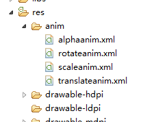

## 二、scale 标签——调节尺寸
### 1、自有属性
scale 标签是缩放动画，可以实现动态调控件尺寸的效果，有下面几个属性：

- android:fromXScale    起始的 X 方向上相对自身的缩放比例，浮点值，比如 1.0 代表自身无变化，0.5 代表起始时缩小一倍，2.0 代表放大一倍；
- android:toXScale        结尾的 X 方向上相对自身的缩放比例，浮点值；
- android:fromYScale    起始的 Y 方向上相对自身的缩放比例，浮点值，
- android:toYScale        结尾的 Y 方向上相对自身的缩放比例，浮点值；
- android:pivotX            缩放起点 X 轴坐标，可以是数值、百分数、百分数 p 三种样式，比如 50、50%、50%p，当为数值时，表示在当前 View 的左上角，即原点处加上 50px，做为起始缩放点；如果是 50%，表示在当前控件的左上角加上自己宽度的 50%做为起始点；如果是 50%p，那么就是表示在当前的左上角加上父控件宽度的 50%做为起始点 x 轴坐标。（具体意义，后面会举例演示）
- android:pivotY           缩放起点 Y 轴坐标，取值及意义跟 android:pivotX 一样。

下面看一个实例，当 scale 里的属性这样设置时，效果会怎样呢：

```
<?xml version="1.0" encoding="utf-8"?>  
<scale xmlns:android="http://schemas.android.com/apk/res/android"  
    android:fromXScale="0.0"  
    android:toXScale="1.4"  
    android:fromYScale="0.0"  
    android:toYScale="1.4"  
    android:pivotX="50"  
    android:pivotY="50"  
    android:duration="700" />  
```

**（1）、pivotX 取值数值时（50）**

这个控件，宽度和高度都是从 0 放大到 1.4 倍，起始点坐标在控件左上角（坐标原点），向 x 轴正方向和 y 轴正方向都加上 50 像素；
根据 pivotX,pivotY 的意义，控件的左上角即为控件的坐标原点，这里的起始点是在控件的原点的基础上向 X 轴和 Y 轴各加上 50px，做为起始点，如下图中图二所示

图一
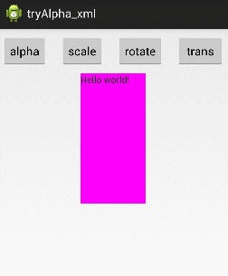

图二
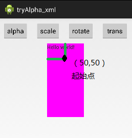

**（2）、pivotX 取值百分数时（50%）**
下面再看看当 pivotX、pivotY 取百分数的时候，起始点又在哪里？

上面我们讲了，pivotX 的值，当取 50%时，表示在原点坐标的基础上加上的自己宽度的 50%，看看效果：

```
<?xml version="1.0" encoding="utf-8"?>  
<scale xmlns:android="http://schemas.android.com/apk/res/android"  
    android:fromXScale="0.0"  
    android:toXScale="1.4"  
    android:fromYScale="0.0"  
    android:toYScale="1.4"  
    android:pivotX="50%"  
    android:pivotY="50%"  
    android:duration="700" />  
```

缩放位置大小仍然从 0-1.4，只改变 pivotX 和 pivotY;起始点位置如下图中图二所示：

图一
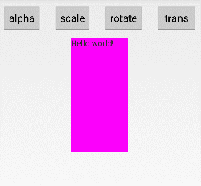

图二
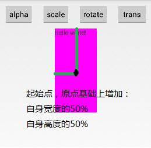

**（3）、pivotX 取值 50%p 时**

前面说过，当取值在百分数后面加上一个字母 p，就表示，取值的基数是父控件，即在原点的基础上增加的值是父标签的百分值。

```
<?xml version="1.0" encoding="utf-8"?>  
<scale xmlns:android="http://schemas.android.com/apk/res/android"  
    android:fromXScale="0.0"  
    android:toXScale="1.4"  
    android:fromYScale="0.0"  
    android:toYScale="1.4"  
    android:pivotX="50%p"  
    android:pivotY="50%p"  
    android:duration="700" />  
```

效果图，及起始点坐标图如下所示：

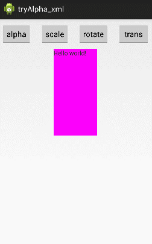

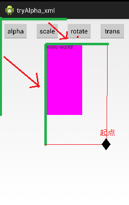

### 2、从 Animation 类继承的属性
Animation 类是所有动画（scale、alpha、translate、rotate）的基类，这里以 scale 标签为例，讲解一下，Animation 类所具有的属性及意义。关于 Animation 类的官方文档位置为：《Animation》
- android:duration        动画持续时间，以毫秒为单位 
- android:fillAfter          如果设置为 true，控件动画结束时，将保持动画最后时的状态
- android:fillBefore       如果设置为 true,控件动画结束时，还原到开始动画前的状态
- android:fillEnabled    与 android:fillBefore 效果相同，都是在动画结束时，将控件还原到初始化状态
- android:repeatCount 重复次数
- android:repeatMode    重复类型，有 reverse 和 restart 两个值，reverse 表示倒序回放，restart 表示重新放一遍，必须与 repeatCount 一起使用才能看到效果。因为这里的意义是重复的类型，即回放时的动作。
- android:interpolator  设定插值器，其实就是指定的动作效果，比如弹跳效果等，不在这小节中讲解，后面会单独列出一单讲解。

对于 android:duration，就不再讲解了，就是动画的持续时长，以毫秒为单位，下面看看 android:fillAfter 和 android:fillBefore

**(1)android:fillAfter:保持动画结束的状态**

```
<?xml version="1.0" encoding="utf-8"?>  
<scale xmlns:android="http://schemas.android.com/apk/res/android"  
    android:fromXScale="0.0"  
    android:toXScale="1.4"  
    android:fromYScale="0.0"  
    android:toYScale="1.4"  
    android:pivotX="50%"  
    android:pivotY="50%"  
    android:duration="700"   
    android:fillAfter="true"  
    />  
```

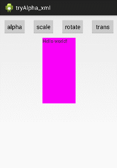

**（2）android:fillBefore  还原初始化状态**

```
<?xml version="1.0" encoding="utf-8"?>  
<scale xmlns:android="http://schemas.android.com/apk/res/android"  
    android:fromXScale="0.0"  
    android:toXScale="1.4"  
    android:fromYScale="0.0"  
    android:toYScale="1.4"  
    android:pivotX="50%"  
    android:pivotY="50%"  
    android:duration="700"   
    android:fillBefore="true"  
    />  
```

android:fillBefore="true" 


android:fillEnable="true"


上面顺便列出了，当仅设定 fillEanble 为 true 时的效果，这两个的标签的效果完全相同。

**（3）、android:repeatMode="restart /reverse"  设定回放类型**

```
<?xml version="1.0" encoding="utf-8"?>  
<scale xmlns:android="http://schemas.android.com/apk/res/android"  
    android:fromXScale="0.0"  
    android:toXScale="1.4"  
    android:fromYScale="0.0"  
    android:toYScale="1.4"  
    android:pivotX="50%"  
    android:pivotY="50%"  
    android:duration="700"   
    android:fillBefore="true"  
    android:repeatCount="1"  
    android:repeatMode="restart"  
/>  
```

androidRepeatMode 设为 restart


androidRepeatMode 设为 reverse
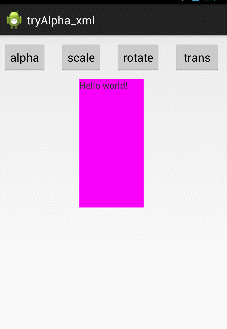

## 三、alpha 标签——调节透明度

### 1、自身属性
- android:fromAlpha   动画开始的透明度，从 0.0 --1.0 ，0.0 表示全透明，1.0 表示完全不透明
- android:toAlpha       动画结束时的透明度，也是从 0.0 --1.0 ，0.0 表示全透明，1.0 表示完全不透明
使用示例：

```
<?xml version="1.0" encoding="utf-8"?>  
<alpha xmlns:android="http://schemas.android.com/apk/res/android"  
    android:fromAlpha="1.0"  
    android:toAlpha="0.1"  
    android:duration="3000"  
    android:fillBefore="true">  
</alpha>  
```


### 2、从 Animation 类继承的属性
- android:duration        动画持续时间，以毫秒为单位 
- android:fillAfter          如果设置为 true，控件动画结束时，将保持动画最后时的状态
- android:fillBefore       如果设置为 true,控件动画结束时，还原到开始动画前的状态
- android:fillEnabled    与 android:fillBefore 效果相同，都是在动画结束时，将控件还原到初始化状态
- android:repeatCount 重复次数
- android:repeatMode    重复类型，有 reverse 和 restart 两个值，reverse 表示倒序回放，restart 表示重新放一遍，必须与 repeatCount 一起使用才能看到效果。因为这里的意义是重复的类型，即回放时的动作。
- android:interpolator  设定插值器，其实就是指定的动作效果，比如弹跳效果等，不在这小节中讲解，后面会单独列出一单讲解。

与 scale 标签意义一样，就不再缀述。

## 四、rotate 标签——旋转
### 1、自身属性
- android:fromDegrees     开始旋转的角度位置，正值代表顺时针方向度数，负值代码逆时针方向度数
- android:toDegrees         结束时旋转到的角度位置，正值代表顺时针方向度数，负值代码逆时针方向度数
- android:pivotX               缩放起点 X 轴坐标，可以是数值、百分数、百分数 p 三种样式，比如 50、50%、50%p，具体意义已在 scale 标签中讲述，这里就不再重讲
- android:pivotY               缩放起点 Y 轴坐标，可以是数值、百分数、百分数 p 三种样式，比如 50、50%、50%p

```
<?xml version="1.0" encoding="utf-8"?>  
<rotate xmlns:android="http://schemas.android.com/apk/res/android"  
    android:fromDegrees="0"  
    android:toDegrees="-650"  
    android:pivotX="50%"  
    android:pivotY="50%"  
    android:duration="3000"  
    android:fillAfter="true">  
      
</rotate>  
```

围绕自身从 0 度逆时针旋转 650 度
android:fromDegrees="0"
android:toDegrees="-650"


围绕自身从 0 度顺时针旋转 650 度
android:fromDegrees="0"
android:toDegrees="650"


### 2、从 Animation 类继承的属性
- android:duration        动画持续时间，以毫秒为单位 
- android:fillAfter          如果设置为 true，控件动画结束时，将保持动画最后时的状态
- android:fillBefore       如果设置为 true,控件动画结束时，还原到开始动画前的状态
- android:fillEnabled    与 android:fillBefore 效果相同，都是在动画结束时，将控件还原到初始化状态
- android:repeatCount 重复次数
- android:repeatMode    重复类型，有 reverse 和 restart 两个值，reverse 表示倒序回放，restart 表示重新放一遍，必须与 repeatCount 一起使用才能看到效果。因为这里的意义是重复的类型，即回放时的动作。
- android:interpolator  设定插值器，其实就是指定的动作效果，比如弹跳效果等，不在这小节中讲解，后面会单独列出一单讲解。

与 scale 标签意义一样，就不再缀述。

## 五、translate 标签 —— 平移

### 1、自身属性
- android:fromXDelta     起始点 X 轴坐标，可以是数值、百分数、百分数 p 三种样式，比如 50、50%、50%p，具体意义已在 scale 标签中讲述，这里就不再重讲
- android:fromYDelta    起始点 Y 轴从标，可以是数值、百分数、百分数 p 三种样式；
- android:toXDelta         结束点 X 轴坐标
- android:toYDelta        结束点 Y 轴坐标

```
<?xml version="1.0" encoding="utf-8"?>  
<translate xmlns:android="http://schemas.android.com/apk/res/android"  
    android:fromXDelta="0"   
    android:toXDelta="-80"  
    android:fromYDelta="0"  
    android:toYDelta="-80"  
    android:duration="2000"  
    android:fillBefore="true">  
</translate>  
```

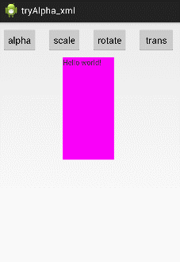

### 2、从 Animation 类继承的属性
- android:duration        动画持续时间，以毫秒为单位 
- android:fillAfter          如果设置为 true，控件动画结束时，将保持动画最后时的状态
- android:fillBefore       如果设置为 true,控件动画结束时，还原到开始动画前的状态
- android:fillEnabled    与 android:fillBefore 效果相同，都是在动画结束时，将控件还原到初始化状态
- android:repeatCount 重复次数
- android:repeatMode    重复类型，有 reverse 和 restart 两个值，reverse 表示倒序回放，restart 表示重新放一遍，必须与 repeatCount 一起使用才能看到效果。因为这里的意义是重复的类型，即回放时的动作。
- android:interpolator  设定插值器，其实就是指定的动作效果，比如弹跳效果等，不在这小节中讲解，后面会单独列出一单讲解。

与 scale 标签意义一样，就不再缀述。

## 六、set 标签——定义动作合集
前面我们讲解了各个标签动画的意义及用法，但他们都是独立对控件起作用，假设我现在想上面的 textView 控件做一个动画——从小到大，旋转出场，而且透明度也要从 0 变成 1，即下面的这个效果，该怎么办？

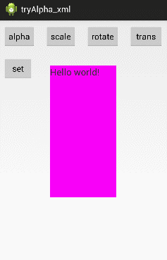

这就需要对指定的控件定义动作合集，Set 标签就可以将几个不同的动作定义成一个组；

**属性：**
set 标签自已是没有属性的，他的属性都是从 Animation 继承而来，但当它们用于 Set 标签时，就会对 Set 标签下的所有子控件都产生作用。

属性有：（从 Animation 类继承的属性）

- android:duration        动画持续时间，以毫秒为单位 
- android:fillAfter          如果设置为 true，控件动画结束时，将保持动画最后时的状态
- android:fillBefore       如果设置为 true,控件动画结束时，还原到开始动画前的状态
- android:fillEnabled    与 android:fillBefore 效果相同，都是在动画结束时，将控件还原到初始化状态
- android:repeatCount 重复次数
- android:repeatMode    重复类型，有 reverse 和 restart 两个值，reverse 表示倒序回放，restart 表示重新放一遍，必须与 repeatCount 一起使用才能看到效果。因为这里的意义是重复的类型，即回放时的动作。
- android:interpolator  设定插值器，其实就是指定的动作效果，比如弹跳效果等，不在这小节中讲解，后面会单独列出一单讲解。

与 scale 标签意义一样，就不再缀述。

上面这个效果，所对应的 XML 代码为：

```
<?xml version="1.0" encoding="utf-8"?>  
<set xmlns:android="http://schemas.android.com/apk/res/android"  
    android:duration="3000"  
    android:fillAfter="true">  
      
  <alpha   
    android:fromAlpha="0.0"  
    android:toAlpha="1.0"/>  
    
  <scale  
    android:fromXScale="0.0"  
    android:toXScale="1.4"  
    android:fromYScale="0.0"  
    android:toYScale="1.4"  
    android:pivotX="50%"  
    android:pivotY="50%"/>  
    
  <rotate  
    android:fromDegrees="0"  
    android:toDegrees="720"  
    android:pivotX="50%"  
    android:pivotY="50%"/>  
         
</set>  
```

## 七、实例——如何将动画 XML 文件应用于控件中
上面我仅仅是列出了每个标签及其属性的意义及应用之后的效果演示，但上面是如何将定义动画的 xml 应用到 textView 控件中的却迟迟没说，这一小节，就以 scale 动画为例，讲述如何将定义好的 scle 动作添加到指定控件中。

**先看最终效果图：**

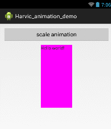

### 1、新建工程、新建 scale 动画文件（scaleanim.xml）
新建一个工程，并且在 res 文件夹下，新建一个 anim 文件夹，然后再新建一个 scaleanim.xml 文件，结构如图所示：

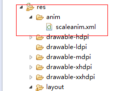

scaleanim.xml 的代码为：（从 TextView 中心点，从 0 放大到 1.4 倍，反复一次，最后还原到初始化状态）

```
<?xml version="1.0" encoding="utf-8"?>  
<scale xmlns:android="http://schemas.android.com/apk/res/android"  
    android:fromXScale="0.0"  
    android:toXScale="1.4"  
    android:fromYScale="0.0"  
    android:toYScale="1.4"  
    android:pivotX="50%"  
    android:pivotY="50%"  
    android:duration="700"   
    android:fillBefore="true"  
    android:repeatCount="1"  
    android:repeatMode="restart"  
/> 
```
 
### 2、XML 布局文件

```
<LinearLayout xmlns:android="http://schemas.android.com/apk/res/android"  
    xmlns:tools="http://schemas.android.com/tools"  
    android:layout_width="match_parent"  
    android:layout_height="match_parent"  
    android:orientation="vertical"  
    tools:context="com.harvic.animation_demo.MainActivity" >  
  
    <Button android:id="@+id/btn_animation"  
        android:layout_width="match_parent"  
        android:layout_height="wrap_content"  
        android:layout_margin="10dip"  
        android:text="scale animation"/>  
    <TextView  
        android:id="@+id/tv"  
        android:layout_width="100dip"  
        android:layout_height="200dip"  
        android:background="#ff00ff"   
        android:text="@string/hello_world"  
        android:layout_gravity="center_horizontal"/>  
  
</LinearLayout>  
```

### 3、JAVA 代码

```
public class MainActivity extends Activity {  
  
    Button scaleBtn ;  
    Animation scaleAnimation;  
      
    TextView tv;  
    @Override  
    protected void onCreate(Bundle savedInstanceState) {  
        super.onCreate(savedInstanceState);  
        setContentView(R.layout.activity_main);  
          
        scaleAnimation = AnimationUtils.loadAnimation(this, R.anim.scaleanim);  
        scaleBtn = (Button)findViewById(R.id.btn_animation);  
        tv =(TextView)findViewById(R.id.tv);  
          
        scaleBtn.setOnClickListener(new View.OnClickListener() {  
              
            @Override  
            public void onClick(View v) {  
                // TODO Auto-generated method stub  
                tv.startAnimation(scaleAnimation);  
            }  
        });  
          
    }  
  
}  
```

（1）通过 scaleAnimation = AnimationUtils.loadAnimation(this, R.anim.scaleanim);从 XML 文件中获取动画
（2）利用 startAnimation 将动画传递给指定控件显示。

至此，本文就结束了，下篇将讲述有关插值器的相关属性及意义。

下面就是源码下载了，源码中包含两部分内容：

1、Harvic_animation_demo 工程：是第七部分的实例源码；

2、tryAlpha_xml 工程：是前六节动作代码的集合，包含了前六小节里的所有代码及动画定义。

源码下载地址：http://download.csdn.net/detail/harvic880925/8032579

请大家尊重原创者版权，转载请标明出处：http://blog.csdn.net/harvic880925/article/details/39996643 谢谢！