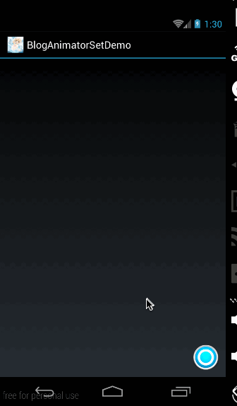
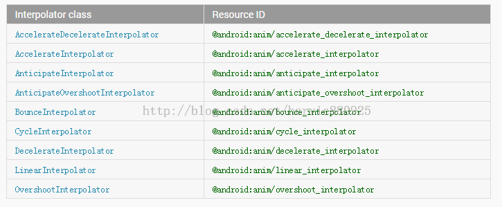
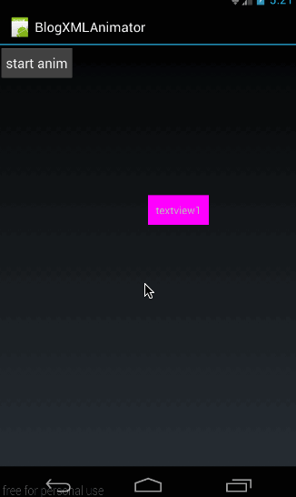
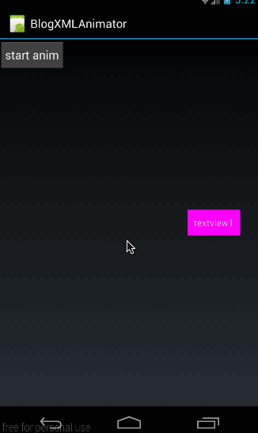
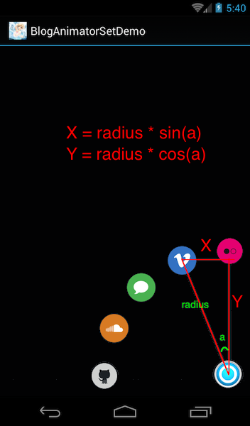
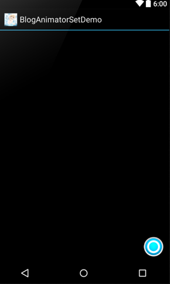

上篇给大家讲了有关 AnimatorSet 的代码实现方法，这篇我们就分别来看看如何利用 xml 来实现 ValueAnimator、ObjectAnimator 和 AnimatorSet; 
在文章最后，将利用 AnimatorSet 来实现一个路径动画，效果图如下： 



（这里实现的是一个动画菜单，在点击菜单按钮时，弹出各个菜单）

## 一、联合动画的 XML 实现

在 xml 中对应 animator 总共有三个标签，分别是

```
<animator />:对应 ValueAnimator
<objectAnimator />:对应 ObjectAnimator
<set />:对应 AnimatorSet
```

下面我们逐个来看各个标签的用法

### 1、animator

**(1)、animator 所有字段及意义**

下面是完整的 animator 所有的字段及取值范围：

```
<animator
    android:duration="int"
    android:valueFrom="float | int | color"
    android:valueTo="float | int | color"
    android:startOffset="int"
    android:repeatCount="int"
    android:repeatMode=["repeat" | "reverse"]
    android:valueType=["intType" | "floatType"]
    android:interpolator=["@android:interpolator/XXX"]/>
```

- **android:duration**:每次动画播放的时长
- **android:valueFrom**:初始动化值；取值范围为 float,int 和 color，如果取值为 float 对应的值样式应该为 89.0，取值为 Int 时，对应的值样式为：89;当取值为 clolor 时，对应的值样式为 #333333;
- **android:valueTo**：动画结束值；取值范围同样是 float,int 和 color 这三种类型的值；
- **android:startOffset**：动画激活延时；对应代码中的 startDelay(long delay)函数；
- **android:repeatCount**：动画重复次数
- **android:repeatMode**：动画重复模式，取值为 repeat 和 reverse；repeat 表示正序重播，reverse 表示倒序重播
- **android:valueType**：表示参数值类型，取值为 intType 和 floatType；与 android:valueFrom、android:valueTo 相对应。如果这里的取值为 intType，那么 android:valueFrom、android:valueTo 的值也就要对应的是 int 类型的数值。如果这里的数值是 floatType，那么 android:valueFrom、android:valueTo 的值也要对应的设置为 float 类型的值。非常注意的是，如果 android:valueFrom、android:valueTo 的值设置为 color 类型的值，那么不需要设置这个参数；
- **android:interpolator**:设置加速器；有关系统加速器所对应的 xml 值对照表如下： 



**（2）、将 xml 加载到程序中**

在定义了一个 xml 后，我们需要将其加载到程序中，使用的方法如下：

```
ValueAnimator valueAnimator = (ValueAnimator) AnimatorInflater.loadAnimator(MyActivity.this,R.animator.animator);
valueAnimator.start();
```

通过 loadAnimator 将 animator 动画的 xml 文件，加载进来，根据类型进行强转。

**（3）、简单示例**

下面我们就举个例子来看看如何来使用 xml 生成对应的 animator 动画 
先看看整体效果图： 



在效果图中可以看到，我们生成了一个动画，动态了改变了当前控件的坐标位置。 
我们先在 res/animator 文件夹下生成一个动画的 xml 文件：

```
<?xml version="1.0" encoding="utf-8"?>
<animator xmlns:android="http://schemas.android.com/apk/res/android"
          android:valueFrom="0"
          android:valueTo="300"
          android:duration="1000"
          android:valueType="intType"
          android:interpolator="@android:anim/bounce_interpolator"/>
```

在这里，我们将 valueType 设置为 intType，所以对应的 android:valueFrom、android:valueTo 都必须是 int 类型的值；插值器使用 bounce 回弹插值器 
然后看看加载到程序中过程：

```
ValueAnimator valueAnimator = (ValueAnimator) AnimatorInflater.loadAnimator(MyActivity.this,
       R.animator.animator);
valueAnimator.addUpdateListener(new ValueAnimator.AnimatorUpdateListener() {
   @Override
   public void onAnimationUpdate(ValueAnimator animation) {
       int offset = (int)animation.getAnimatedValue();
       mTv1.layout( offset,offset,mTv1.getWidth()+offset,mTv1.getHeight() + offset);
   }
});
valueAnimator.start();
```

由于我们 xml 中根属性是<animator/>所以它对应的是 ValueAnimator，所以在加载后，将其强转为 valueAnimator；然后对其添加控件监听。在监听时，动态改变当前 textview 的位置。有关这些代码就不再细讲了，如果看到前面的文章，这段代码应该是无比熟悉的。 
最后的效果就是开头时所演示的效果。 
源码在文章底部给出 
有关 android:valueFrom、android:valueTo 取值为 color 属性时的用法，这里就不讲了，因为在 xml 中使用 color 属性，我也不会用；尝试了下，不成功，也不想尝试了，没什么太大意义，下面我们会讲如何在 objectanimator 中使用 color 属性；

### 2、objectAnimator

**（1）字段意义及使用方法**

同样，我们先来看看它的所有标签的意义：

```
<objectAnimator
    android:propertyName="string"
    android:duration="int"
    android:valueFrom="float | int | color"
    android:valueTo="float | int | color"
    android:startOffset="int"
    android:repeatCount="int"
    android:repeatMode=["repeat" | "reverse"]
    android:valueType=["intType" | "floatType"]
    android:interpolator=["@android:interpolator/XXX"]/>
```

意义： 
- **android:propertyName**：对应属性名，即 ObjectAnimator 所需要操作的属性名。 
其它字段的意义与 animator 的意义与取值是一样的，下面再重新列举一下。 
- **android:duration**:每次动画播放的时长 
- **android:valueFrom**:初始动化值；取值范围为 float,int 和 color； 
- **android:valueTo**：动画结束值；取值范围同样是 float,int 和 color 这三种类型的值； 
- **android:startOffset**：动画激活延时；对应代码中的 startDelay(long delay)函数； 
- **android:repeatCount**：动画重复次数 
- **android:repeatMode**：动画重复模式，取值为 repeat 和 reverse；repeat 表示正序重播，reverse 表示倒序重播 
- **android:valueType**：表示参数值类型，取值为 intType 和 floatType；与 android:valueFrom、android:valueTo 相对应。如果这里的取值为 intType，那么 android:valueFrom、android:valueTo 的值也就要对应的是 int 类型的数值。如果这里的数值是 floatType，那么 android:valueFrom、android:valueTo 的值也要对应的设置为 float 类型的值。非常注意的是，如果 android:valueFrom、android:valueTo 的值设置为 color 类型的值，那么不需要设置这个参数； 
- **android:interpolator**:设置加速器；

下面我们就看看如何使用：

```
ObjectAnimator animator = (ObjectAnimator) AnimatorInflater.loadAnimator(MyActivity.this,
        R.animator.object_animator);
animator.setTarget(mTv1);
animator.start();
```

同样是使用 loadAnimator 加载对应的 xml 动画。然后使用 animator.setTarget(mTv1);绑定上动画目标。因为在 xml 中，没有设置目标的参数，所以我们必须通过代码将目标控件与动画绑定。

**（2）、使用示例**

我们先写一个动画的 xml：

```
<?xml version="1.0" encoding="utf-8"?>
<objectAnimator xmlns:android="http://schemas.android.com/apk/res/android"
                android:propertyName="TranslationY"
                android:duration="2000"
                android:valueFrom="0.0"
                android:valueTo="400.0"
                android:interpolator="@android:anim/accelerate_interpolator"
                android:valueType="floatType"
                android:repeatCount="1"
                android:repeatMode="reverse"
                android:startOffset="2000"/>
```

在这个 xml 中，我们定义了更改属性为 TranslationY，即改变纵坐标；时长为 2000 毫秒。从 0 变到 400；使用的插值器是加速插值器，对应的值类型为 float 类型。 
有些同学可能会问，为什么是 float 类型，因为 setTranslationY 函数的参数是 float 类型的，声明如下：

```
public void setTranslationY(float translationY)
```

最后是设置重复次数和重复模式。将动画激活延时设置为 2000 毫秒； 
然后是加载动画：

```
ObjectAnimator animator = (ObjectAnimator) AnimatorInflater.loadAnimator(MyActivity.this,
        R.animator.object_animator);
animator.setTarget(mTv1);
animator.start();
```

效果图如下： 



在点击后，延时 2000 毫秒后，开始运行。逆序重复运行一次。 
**源码在文章底部给出**

**（3）、使用 color 属性示例**

这里我们就演示一下如何使用 android:valueFrom、android:valueTo 的 color 属性用法， 
我们建立一个 objectAnimator 的动画文件：

```
<?xml version="1.0" encoding="utf-8"?>
<objectAnimator xmlns:android="http://schemas.android.com/apk/res/android"
                android:propertyName="BackgroundColor"
                android:duration="5000"
                android:valueFrom="#ffff00ff"
                android:valueTo="#ffffff00"/>
```

设置属性名为 BackgroundColor，即对应的 set 函数为 setBackgroundColor(int color); 
android:valueFrom 和 android:valueTo 的取值都为颜色值，即#开头的八位数值；即 ARGB 值； 
使用方法不变：

```
ObjectAnimator animator = (ObjectAnimator) AnimatorInflater.loadAnimator(MyActivity.this,
        R.animator.color_animator);
animator.setTarget(mTv1);
animator.start();
```

效果图如下： 


从效果图中可以看到，虽然实现了颜色变化，但会一直闪；所以直接利用 xml 实现的动画效果并不怎么好，所以如果想要实现颜色变化，还是利用代码来实现吧。前面的文章中，我们已经讲过如何利用 ValueAnimator 和 ObjectAnimator 来实现颜色过渡和原理了。大家可以翻看下。 
**源码在文章底部给出**

### 3、set

**（1）字段意义及使用方法**

这个是 AnimatorSet 所对应的标签。它只有一个属性：

```
<set
  android:ordering=["together" | "sequentially"]>
```

android:ordering：表示动画开始顺序。together 表示同时开始动画，sequentially 表示逐个开始动画； 
加载方式为：

```
AnimatorSet set = (AnimatorSet) AnimatorInflater.loadAnimator(MyActivity.this,
        R.animator.set_animator);
set.setTarget(mTv1);
set.start();
```

同样是通过 loadAnimator 加载动画，然后将其强转为 AnimatorSet；

**（2）、示例**

在 res/animator 文件夹下新建一个文件（set_animator.xml）:

```
<?xml version="1.0" encoding="utf-8"?>
<set xmlns:android="http://schemas.android.com/apk/res/android"
     android:ordering="together">
    <objectAnimator
            android:propertyName="x"
            android:duration="500"
            android:valueFrom="0"
            android:valueTo="400"
            android:valueType="floatType"/>
    <objectAnimator
            android:propertyName="y"
            android:duration="500"
            android:valueFrom="0"
            android:valueTo="300"
            android:valueType="floatType"/>
</set>
```

这里有两个 objectAnimator 动画，一个改变值 x 坐标，一个改变值 y 坐标；取值分别为 0-400 和 0-300； 
然后在代码中加载：

```
AnimatorSet set = (AnimatorSet) AnimatorInflater.loadAnimator(MyActivity.this,
        R.animator.set_animator);
set.setTarget(mTv1);
set.start();
```

动画效果如下： 


**源码在文章底部给出**

### 4、总结

**最后总结一下，所有 animator 标签及取值范围如下：**

```
<set
  android:ordering=["together" | "sequentially"]>

    <objectAnimator
        android:propertyName="string"
        android:duration="int"
        android:valueFrom="float | int | color"
        android:valueTo="float | int | color"
        android:startOffset="int"
        android:repeatCount="int"
        android:repeatMode=["repeat" | "reverse"]
        android:valueType=["intType" | "floatType"]/>

    <animator
        android:duration="int"
        android:valueFrom="float | int | color"
        android:valueTo="float | int | color"
        android:startOffset="int"
        android:repeatCount="int"
        android:repeatMode=["repeat" | "reverse"]
        android:valueType=["intType" | "floatType"]/>

    <set>
        ...
    </set>
</set>
```

各字段的取值意义在上面讲解时已经给出，大家可以翻回去看看。

## 二、开篇示例——AnimatorSet 应用

在讲完了 XML 使用方法之后，AnimatorSet 的部分就完全结束了，下面我们就利用学到的知识来看一下开篇时的那个效果是如何实现的吧。 


我们先来分析下这个效果，在用户点击按钮时，把菜单弹出来；弹出来的时候，动画一点从小变到大，一边透明度从 0 变到 1.关键问题是，怎么样实现各个菜单以当前点击按钮为圆心排列在圆形上；

### 1、原理

在开始写代码之前，我们先讲讲，如何根据圆半径来定位每个图片的位置，先看下图： 



在上面的图中，我们可以清晰的看到，假如当前菜单与 Y 轴的夹角是 a 度，那么这个菜单所移动的 X 轴距离为 radius * sin(a);Y 轴的移动距离为 radius * cos(a); 
这是非常简单的三角函数的计算。想必这块大家理解起来是没有问题的。 
**那么第一个问题来了，这个夹角 a 是多少度呢？** 
很显然，这里所有的菜单的夹角之和是 90 度。我们总共有五个菜单项，把 90 度夹角做了 4 等分。所以夹角 a 的度数为 90/4 = 22;所以这五个菜单，第一个菜单的夹角是 0 度，第二个菜单的夹角是 22 度，第三个菜单的夹角是 22*2 度，第四个夹角是 22*3 度，第五个的夹角是 22*4 度. 
我们假设 index 表示当前菜单的位置索引，从 0 开始，即第一个菜单的索引是 0，第二个菜单的索引是 1，第三个菜单的索引是 2……，而当前的菜单与 y 轴的夹角恰好占了 22 度的 index 份；所以当前菜单与 Y 轴的夹角为 22 * index;这个公式非常重要，大家在这里一定要理解，下面代码中会用到。 
**第二个问题来了，如何求对应角度的 sin,cos 值 **
想必很多同学都知道，JAVA 中有一个 Math 类，它其中有四个函数:

```
/**
 * 求对应弧度的正弦值
 */
double sin(double d)
/**
 * 求对应弧度的余弦值
 */
double cos(double d)
/**
 * 求对应弧度的正切值
 */
double tan(double d)
```

这里要非常注意的是，这三个函数的输入参数不是度数，而是对应的度数的弧度值！ 
角度与其对应的弧度值对应关系如下： 


在 Math 中有两种方法可以得到弧度值： 
**第一种方法：**在 Math 中，Math.PI 不仅代表圆周率π，也代表 180 度角所对应的弧度值。所以 Math.sin(Math.PI)就表示 180 度的正弦值，Math.sin(Math.PI/2)就表示 90 度的正弦值。 
**第二种方法：**根据度数获得弧度值 
在 Math 中也提供了一个方法

```
/**
 * Math 中根据度数得到弧度值的函数
 */
double toRadians(double angdeg)
```

这个函数就是 Math 中根据度数得到弧度值的函数，参数 angdeg 指度数，返回值是对应的弧度值。 
所以比如我们要求 22 度对应的弧度值就是 Math.toRadians(22)；所以如果我们要求 22 度所对应的正弦值就是 Math.sin(Math.toRadians(22)) 
在讲了如何根据半径求得每个菜单项的位置之后，我们来看看示例工程的代码。

### 2、布局代码（main.xml）

布局代码很简单，就是利用 FrameLayout 将所有的菜单都盖在按钮的下面，效果图如下： 



对应代码为：

```
<?xml version="1.0" encoding="utf-8"?>
<FrameLayout xmlns:android="http://schemas.android.com/apk/res/android"
             android:layout_width="match_parent"
             android:layout_height="match_parent"
             android:layout_marginBottom="10dp"
             android:layout_marginRight="10dp">

    <Button
            android:id="@+id/menu"
            style="@style/MenuStyle"
            android:background="@drawable/menu"/>

    <Button
            android:id="@+id/item1"
            style="@style/MenuItemStyle"
            android:background="@drawable/circle1"
            android:visibility="gone"/>

    <Button
            android:id="@+id/item2"
            style="@style/MenuItemStyle"
            android:background="@drawable/circle2"
            android:visibility="gone"/>

    <Button
            android:id="@+id/item3"
            style="@style/MenuItemStyle"
            android:background="@drawable/circle3"
            android:visibility="gone"/>

    <Button
            android:id="@+id/item4"
            style="@style/MenuItemStyle"
            android:background="@drawable/circle4"
            android:visibility="gone"/>

    <Button
            android:id="@+id/item5"
            style="@style/MenuItemStyle"
            android:background="@drawable/circle5"
            android:visibility="gone"/>

</FrameLayout>
```

其中的 style 代码为：

```
<resources>
    <style name="MenuStyle">
        <item name="android:layout_width">50dp</item>
        <item name="android:layout_height">50dp</item>
        <item name="android:layout_gravity">right|bottom</item>
    </style>

    <style name="MenuItemStyle">
        <item name="android:layout_width">45dp</item>
        <item name="android:layout_height">45dp</item>
        <item name="android:layout_gravity">right|bottom</item>
    </style>
</resources>
```

布局是没什么难度的，下面我们就来看看 MyActivity 中的处理。

### 3、MyActivity.java

**(1)、先看看框架部分：**

```
public class MyActivity extends Activity implements View.OnClickListener{
    private static final String TAG = "MainActivity";

    private Button mMenuButton;
    private Button mItemButton1;
    private Button mItemButton2;
    private Button mItemButton3;
    private Button mItemButton4;
    private Button mItemButton5;

    private boolean mIsMenuOpen = false;
    @Override
    public void onCreate(Bundle savedInstanceState) {
        super.onCreate(savedInstanceState);
        setContentView(R.layout.main);
        initView();
    }

    private void initView() {
        mMenuButton = (Button) findViewById(R.id.menu);
        mMenuButton.setOnClickListener(this);

        mItemButton1 = (Button) findViewById(R.id.item1);
        mItemButton1.setOnClickListener(this);

        mItemButton2 = (Button) findViewById(R.id.item2);
        mItemButton2.setOnClickListener(this);

        mItemButton3 = (Button) findViewById(R.id.item3);
        mItemButton3.setOnClickListener(this);

        mItemButton4 = (Button) findViewById(R.id.item4);
        mItemButton4.setOnClickListener(this);

        mItemButton5 = (Button) findViewById(R.id.item5);
        mItemButton5.setOnClickListener(this);
    }

    @Override
    public void onClick(View v) {
        if (v == mMenuButton) {
            if (!mIsMenuOpen) {
                mIsMenuOpen = true;
                doAnimateOpen(mItemButton1, 0, 5, 300);
                doAnimateOpen(mItemButton2, 1, 5, 300);
                doAnimateOpen(mItemButton3, 2, 5, 300);
                doAnimateOpen(mItemButton4, 3, 5, 300);
                doAnimateOpen(mItemButton5, 4, 5, 300);
            } else {
                mIsMenuOpen = false;
                doAnimateClose(mItemButton1, 0, 5, 300);
                doAnimateClose(mItemButton2, 1, 5, 300);
                doAnimateClose(mItemButton3, 2, 5, 300);
                doAnimateClose(mItemButton4, 3, 5, 300);
                doAnimateClose(mItemButton5, 4, 5, 300);
            }
        } else {
            Toast.makeText(this, "你点击了" + v, Toast.LENGTH_SHORT).show();
        }
    }
    ………………
}    
```

这部分代码很简单，就是利用 findviewById 来找到每个菜单的实例，然后对他们添加点击响应：

```
public void onClick(View v) {
    if (v == mMenuButton) {
        if (!mIsMenuOpen) {
            mIsMenuOpen = true;
            doAnimateOpen(mItemButton1, 0, 5, 300);
            …………
        } else {
            mIsMenuOpen = false;
            doAnimateClose(mItemButton1, 0, 5, 300);
            …………
        }
    } else {
        Toast.makeText(this, "你点击了" + v, Toast.LENGTH_SHORT).show();
    }
}
```

其中弹出主菜单的按钮是 mMenuButton，当点击 mMenuButton 时，利用 mIsMenuOpen 来标识当前是否已经弹出菜单；如果没有弹出，则利用 doAnimateOpen(mItemButton1, 0, 5, 300)将 mItemButton1 弹出来；其它按钮类似。如果已经弹出来，则利用 doAnimateClose(mItemButton1, 0, 5, 300);将 mItemButton1 收回。 
下面我们就分别来看看 doAnimateOpen()和 doAnimateClose()的代码；

**(2)、doAnimateOpen()——弹出菜单**

先贴出完整代码：

```
private void doAnimateOpen(View view, int index, int total, int radius) {
    if (view.getVisibility() != View.VISIBLE) {
        view.setVisibility(View.VISIBLE);
    }
    double degree = Math.toRadians(90)/(total - 1) * index;
    int translationX = -(int) (radius * Math.sin(degree));
    int translationY = -(int) (radius * Math.cos(degree));

    AnimatorSet set = new AnimatorSet();
    //包含平移、缩放和透明度动画
    set.playTogether(
            ObjectAnimator.ofFloat(view, "translationX", 0, translationX),
            ObjectAnimator.ofFloat(view, "translationY", 0, translationY),
            ObjectAnimator.ofFloat(view, "scaleX", 0f, 1f),
            ObjectAnimator.ofFloat(view, "scaleY", 0f, 1f),
            ObjectAnimator.ofFloat(view, "alpha", 0f, 1));
    //动画周期为 500ms
    set.setDuration(1 * 500).start();
}
```

我们倒过来看，先看动画部分：

```
set.playTogether(
        ObjectAnimator.ofFloat(view, "translationX", 0, translationX),
        ObjectAnimator.ofFloat(view, "translationY", 0, translationY),
        ObjectAnimator.ofFloat(view, "scaleX", 0f, 1f),
        ObjectAnimator.ofFloat(view, "scaleY", 0f, 1f),
        ObjectAnimator.ofFloat(view, "alpha", 0f, 1));
```

这里构造的动画是利用 translationX 和 translationY 将控件移动到指定位置。同时，scaleX、scaleY、alpha 都从 0 变到 1；最关键的部分是如何得到 translationX 和 translationY 的值。 
在这部分的开篇，我们首先讲了，如何讲了

```
translationX = radius * sin(a)
translationY = radius * cos(a)
```

我们来看看在代码中如何去做的：

```
double degree = Math.toRadians(90)/(total - 1) * index;
int translationX = -(int) (radius * Math.sin(degree));
int translationY = -(int) (radius * Math.cos(degree));
```

首先，是求得两个菜单的夹角，即公式里的 a 值。Math.toRadians(90)/(total - 1)表示 90 度被分成了 total-1 份，其中每一份的弧度值； 
我们前面讲过，假设每一份的弧度值是 22 度，那么当前菜单与 Y 轴的夹角就是 22 * index 度。这里类似，当前菜单与 y 轴的弧度值就是 Math.toRadians(90)/(total - 1) * index 
在求得夹角以后，直接利用 translationX = radius * sin(a)就可以得到 x 轴的移动距离，但又因为菜单是向左移动了 translationX 距离。所以根据坐标系向下为正，向右为正的原则。这里的移动距离 translationX 应该是负值。我们需要的 translationY，因为是向上移动，所以也是负值：

```
int translationX = -(int) (radius * Math.sin(degree));
int translationY = -(int) (radius * Math.cos(degree));
```

在理解了弹出的部分之后，收回的代码就好理解了

**(3)、doAnimateClose()——收回菜单**

收回菜单就是把弹出菜单的动画反过来，让它从 translateX,translateY 的位置上回到 0 点，scaleX、scaleY、alpha 的值从 1 变到 0 即可：

```
private void doAnimateClose(final View view, int index, int total,
                           int radius) {
   if (view.getVisibility() != View.VISIBLE) {
       view.setVisibility(View.VISIBLE);
   }
   double degree = Math.PI * index / ((total - 1) * 2);
   int translationX = -(int) (radius * Math.sin(degree));
   int translationY = -(int) (radius * Math.cos(degree));
   AnimatorSet set = new AnimatorSet();
   //包含平移、缩放和透明度动画
   set.playTogether(
           ObjectAnimator.ofFloat(view, "translationX", translationX, 0),
           ObjectAnimator.ofFloat(view, "translationY", translationY, 0),
           ObjectAnimator.ofFloat(view, "scaleX", 1f, 0f),
           ObjectAnimator.ofFloat(view, "scaleY", 1f, 0f),
           ObjectAnimator.ofFloat(view, "alpha", 1f, 0f));

   set.setDuration(1 * 500).start();
}
```

这段代码是很容易理解的，但我在这里求 degree 的时候，换了一种方法：

```
 double degree = Math.PI * index / ((total - 1) * 2);
```

其实这句代码与上面的

```
double degree = Math.toRadians(90)/(total - 1) * index;
```

是同一个意思。 
还记得，我们在讲原理的时候，提到过 Math.PI 不仅表示圆周率，也表示 180 度所对应的弧度。 
所以 Math.toRadians(90)就等于 Math.PI/2，这样，这两个公式就是完全一样的了。 
**源码在文章底部给出 **
好了，到这里有关 AnimatorSet 的部分就讲完了，下篇给大家讲讲有关 viewGroup 动画相关的知识。

源码内容： 
1、BlogXMLAnimator：第一部分：联合动画的 XML 实现对应源码 
2、BlogAnimatorSetDemo：第二部分：开篇示例——AnimatorSet 应用对应源码

如果本文有帮到你，记得加关注哦 
源码下载地址： 
csdn:http://download.csdn.net/detail/harvic880925/9448719 
github: 
请大家尊重原创者版权，转载请标明出处：http://blog.csdn.net/harvic880925/article/details/50763286 谢谢