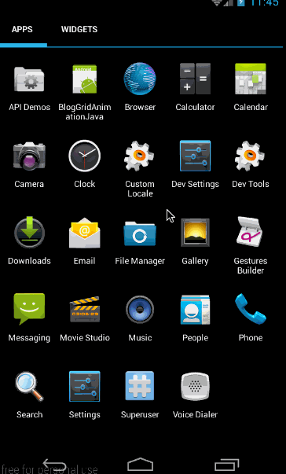

前几篇给大家讲述了如何针对某一个控件应用动画，这篇将给大家讲解如何给容器中的控件应用统一动画。即在容器中控件出现时，不必为每个控件添加进入动画，可以在容器中为其添加统一的进入和退出动画。 


从上面的示例动画也可以看出，listview 中的数据在进入时就加入了统一动画,下面我们就来看看这些是怎么来实现的吧。 
这篇我们将讲述有关普通 viewGroup 添加进入统一动画的 LayoutAnimation 和针对 grideView 添加进入动画的 gridLayoutAnimation； 
LayoutAnimation 和 gridLayoutAnimation 在 API 1 中就有的函数。所有大家不必担心他们的所能使用的 api 等级；也正因为他们是在 API 1 中就引入了，所以他们也只能使用 animtion 来做动画，而不能使用 animator。

## 一、LayoutAnimation 的 xml 实现——layoutAnimation 标签

### 1、概述

这部分，我们就来看看 layoutAnimation 标签的用法，要使用 layoutAnimation 只需要两步： 
**第一：定义一个 layoutAnimation 的 animation 文件，如：(anim/layout_animation.xml)**

```
<?xml version="1.0" encoding="utf-8"?>
<layoutAnimation xmlns:android="http://schemas.android.com/apk/res/android"
                 android:delay="1"
                 android:animationOrder="normal"
                 android:animation="@anim/slide_in_left"/>
```

有关它的具体意义，我们后面会讲。 
**第二步：在 viewGroup 类型的控件中，添加 android:layoutAnimation=”@anim/layout_animation”，如：**

```
<ListView
        android:id="@+id/listview"
        android:layout_width="match_parent"
        android:layout_height="match_parent"
        android:layoutAnimation="@anim/layout_animation"
        />
```

### 2、示例

这部分，我们将要实现的效果图如下： 


从效果图中，可以看出两点： 
- listview 中各个 item 从左至右滑入位置 
- 动画仅在第一次创建时有用，后期加入的数据，将不会再有动画（这个问题最后再讲）

这里添加的 layoutAnimation，与上面的 layout_animation.xml 文件一样：

```
<?xml version="1.0" encoding="utf-8"?>
<layoutAnimation xmlns:android="http://schemas.android.com/apk/res/android"
                 android:delay="1"
                 android:animationOrder="normal"
                 android:animation="@anim/slide_in_left"/>
```

其中的@anim/slide_in_left 对应代码为：

```
<?xml version="1.0" encoding="utf-8"?>
<set xmlns:android="http://schemas.android.com/apk/res/android" android:duration="1000">
    <translate android:fromXDelta="-50%p" android:toXDelta="0"/>
    <alpha android:fromAlpha="0.0" android:toAlpha="1.0"/>
</set>
```

这部分实现的效果是，让控件从左边 50%的位置进入屏幕，同时透明度从 0 变到 1；动画总时长为 1000 毫秒。 
然后看 main.xml 的布局代码，根据效果图中也很容易看出布局代码：

```
<?xml version="1.0" encoding="utf-8"?>
<LinearLayout xmlns:android="http://schemas.android.com/apk/res/android"
              android:layout_width="match_parent"
              android:layout_height="match_parent"
              android:orientation="vertical">

    <Button
            android:layout_width="wrap_content"
            android:layout_height="wrap_content"
            android:text="刷新 list"/>

    <ListView
            android:id="@+id/listview"
            android:layout_width="match_parent"
            android:layout_height="match_parent"
            android:layoutAnimation="@anim/layout_animation"/>
</LinearLayout>
```

这里最重要的是，在 listView 中添加上 android:layoutAnimation=”@anim/layout_animation”来指定创建布局时，其中的子 item 所使用的动画。 
最后是 MyActivity 中填充 listview 的代码：

```
public class MyActivity extends Activity {

    private ListView mListView;
    private ArrayAdapter mAdapter;
    private Button mAddListBtn;

    @Override
    public void onCreate(Bundle savedInstanceState) {
        super.onCreate(savedInstanceState);
        setContentView(R.layout.main);

        mListView = (ListView) findViewById(R.id.listview);
        mAdapter = new ArrayAdapter<String>(this, android.R.layout.simple_expandable_list_item_1, getData());
        mListView.setAdapter(mAdapter);

        mAddListBtn = (Button)findViewById(R.id.addlist);
        mAddListBtn.setOnClickListener(new View.OnClickListener() {
            @Override
            public void onClick(View v) {
                mAdapter.addAll(getData());
            }
        });
    }

    private List<String> getData() {
        List<String> data = new ArrayList<String>();
        data.add("测试数据 1");
        data.add("测试数据 2");
        data.add("测试数据 3");
        data.add("测试数据 4");

        return data;
    }
}
```

这段代码理解起来难度不大，主要就是两个点，第一：填充 listview,第二在点击添加 list 数据按钮时，向 Listview 添加新的数据。 
最终的效果图在本部分开头就已经给出。通过这个例子，**我们可以知道最重要的一点：android:layoutAnimation 只在 viewGroup 创建的时候，才会对其中的 item 添加动画。在创建成功以后，再向其中添加 item 将不会再有动画。** 
我们可以看出，只需要在 viewGroup 控件中添加 android:layoutAnimation="@anim/layout_animation"，就可以实现其容器内部控件创建时的动画。

### 3、layoutAnimation 各字段意义

上面我们讲了 layoutAnimation 的使用方法，下面我们就来看看 layoutAnimation 标签中各个字段的意义。 
在 layoutAnimation 中，只有三个字段是有效的，分别是：android:delay、android:animationOrder 和 android:animation；其它诸如 android:duration、android:interpolator 等针对 animation 的字段都是无效的。下面我们结合上面的 layoutAnimation 代码，来看一下各个字段的具体意义：

```
<?xml version="1.0" encoding="utf-8"?>
<layoutAnimation xmlns:android="http://schemas.android.com/apk/res/android"
                 android:delay="1"
                 android:animationOrder="normal"
                 android:animation="@anim/slide_in_left"/>
```

- **delay**:指每个 Item 的动画开始延时，取值是 android:animation 所指定动画时长的倍数，取值类型可以是 float 类型，也可以是百分数，默认是 0.5;比如我们这里指定的动画是@anim/slide_in_left，而在 slide_in_left.xml 中指定 android:duration=”1000”，即单次动画的时长是 1000 毫秒，而我们在这里的指定 android:delay=”1”，即一个 Item 的动画会在上一个 item 动画完成后延时单次动画时长的一倍时间开始，即延时 1000 毫秒后开始。
- **animationOrder**:指 viewGroup 中的控件动画开始顺序，取值有 normal(正序)、reverse(倒序)、random(随机)
- **animation**：指定每个 item 入场所要应用的动画。仅能指定 res/aim 文件夹下的 animation 定义的动画，不可使用 animator 动画。

这里最难理解的参数应该是 android:delay，它是指 viewGroup 中各个 item 开始动画的时间延迟，取值是 Item 动画时长的倍数。其中 item 动画是通过 android:animation 指定的。 
其次就是 animationOrder 的三种次序，其实也没什么难度，我们就直接通过动画来看看它们的区别吧。上面的效果图中，我们演示的 normal(正序)，下面我们再来看看 reverse 和 random 的效果图： 
**android:animationOrder=”reverse”(倒序)** 


**android:animationOrder=”random”(随机)**


**源码在文章底部给出**

## 二、LayoutAnimation 的代码实现——LayoutAnimationController

### 1、概述

上面我们讲过了 LayoutAnimation 的 xml 实现方式，下面来看看 LayoutAnimation 的代码实现方式。 
首先，xml 中 layoutAnimation 标签所对应的类为 LayoutAnimationController；它有两个构造函数：

```
public LayoutAnimationController(Animation animation)
public LayoutAnimationController(Animation animation, float delay)
```

很容易理解，animation 对应标签中的 android:animation 属性，delay 对应标签中的 android:delay 属性。 
LayoutAnimationController 的函数如下：

```
/**
 * 设置 animation 动画
 */
public void setAnimation(Animation animation)
/**
 * 设置单个 item 开始动画延时
 */
public void setDelay(float delay)
/**
 * 设置 viewGroup 中控件开始动画顺序，取值为 ORDER_NORMAL、ORDER_REVERSE、ORDER_RANDOM
 */
public void setOrder(int order)
```

这些函数都很容易理解，与 xml 中标签的意义完全相同。下面我们就来看看使用方法。

### 2、示例

同样以上面的例子为例，把 xml 实现改成代码实现。由于我们要代码实现 layoutAnimation，所以我们不再需要写 layoutAnimation 的 xml 了，只需要一个动画的 animation:(slide_in_left.xml)

```
<?xml version="1.0" encoding="utf-8"?>
<set xmlns:android="http://schemas.android.com/apk/res/android" android:duration="1000">
    <translate android:fromXDelta="-50%p" android:toXDelta="0"/>
    <alpha android:fromAlpha="0.0" android:toAlpha="1.0"/>
</set>
```

然后是主布局（main.xml）

```
<?xml version="1.0" encoding="utf-8"?>
<LinearLayout xmlns:android="http://schemas.android.com/apk/res/android"
              android:layout_width="match_parent"
              android:layout_height="match_parent"
              android:orientation="vertical">


    <Button
            android:id="@+id/addlist"
            android:layout_width="wrap_content"
            android:layout_height="wrap_content"
            android:text="添加 list 数据"/>

    <ListView
            android:id="@+id/listview"
            android:layout_width="match_parent"
            android:layout_height="match_parent"/>
</LinearLayout>
```

布局与 xml 的实现方式一样，唯一不同的是 Listview 中没有定义 android:layoutAnimation=”@anim/layout_animation”属性，因为所有有关 LayoutAnimation 的部分都是利用代码来实现的； 
最后我们来看看代码(MyActivity.java)

```
public class MyActivity extends Activity {

    private ListView mListView;
    private ArrayAdapter mAdapter;

    private Button mAddListBtn;

    @Override
    public void onCreate(Bundle savedInstanceState) {
        super.onCreate(savedInstanceState);
        setContentView(R.layout.main);

        mListView = (ListView) findViewById(R.id.listview);
        mAdapter = new ArrayAdapter<String>(this, android.R.layout.simple_expandable_list_item_1, getData());
        mListView.setAdapter(mAdapter);

        mAddListBtn = (Button)findViewById(R.id.addlist);
        mAddListBtn.setOnClickListener(new View.OnClickListener() {
            @Override
            public void onClick(View v) {
                mAdapter.addAll(getData());
            }
        });


        //代码设置通过加载 XML 动画设置文件来创建一个 Animation 对象；
        Animation animation= AnimationUtils.loadAnimation(this,R.anim.slide_in_left);   //得到一个 LayoutAnimationController 对象；
        LayoutAnimationController controller = new LayoutAnimationController(animation);   //设置控件显示的顺序；
        controller.setOrder(LayoutAnimationController.ORDER_REVERSE);   //设置控件显示间隔时间；
        controller.setDelay(0.3f);   //为 ListView 设置 LayoutAnimationController 属性；
        mListView.setLayoutAnimation(controller);
        mListView.startLayoutAnimation();
    }

    private List<String> getData() {

        List<String> data = new ArrayList<String>();
        data.add("测试数据 1");
        data.add("测试数据 2");
        data.add("测试数据 3");
        data.add("测试数据 4");

        return data;
    }
}
```

这段代码中，在填充 listview 的代码都是与 xml 的实现方式相同的，关键是填充后，开始给 listview 设置 LayoutAnimationController,代码如下：

```
Animation animation= AnimationUtils.loadAnimation(this,R.anim.slide_in_left);   
//得到一个 LayoutAnimationController 对象；
LayoutAnimationController controller = new LayoutAnimationController(animation);   //设置控件显示的顺序；
controller.setOrder(LayoutAnimationController.ORDER_REVERSE);  
//设置控件显示间隔时间；
controller.setDelay(0.3f);   
//为 ListView 设置 LayoutAnimationController 属性；
mListView.setLayoutAnimation(controller);
mListView.startLayoutAnimation();
```

这段代码就是构造 LayoutAnimationController 变量，然后利用 setLayoutAnimation 将其设置为 listview，最后利用 mListView.startLayoutAnimation();开始动画；难度不大，看一下就明白，没必要细讲了。 
效果与上一部分 xml 实现一样，就不再贴图了 
**源码在文章底部给出**

## 三、GridLayoutAnimation 的 XML 实现——gridLayoutAnimation

### 1、概述

这部分将给大家讲解有关 gridview 给内部子控件添加创建动画的内容。本部分的效果图如下： 


我们先来看一下 gridLayoutAnimation 标签都有哪些属性：

```
<?xml version="1.0" encoding="utf-8"?>
<gridLayoutAnimation xmlns:android="http://schemas.android.com/apk/res/android"
                     android:rowDelay="75%"
                     android:columnDelay="60%"
                     android:directionPriority="none"
                     android:direction="bottom_to_top|right_to_left"
                     android:animation="@android:anim/slide_in_left"/>
```

这是一个写好了的 gridLayoutAnimation 的动画文件。其中各字段的意义如下： 
- **rowDelay**:每一行动画开始的延迟。与 LayoutAnimation 一样，可以取百分数，也可以取浮点数。取值意义为，当前 android:animation 所指动画时长的倍数。 
- **columnDelay**：每一列动画开始的延迟。取值类型及意义与 rowDelay 相同。 
- **directionPriority**：方向优先级。取值为 row,collumn,none，意义分别为：行优先，列优先，和无优先级（同时进行）;具体意义，后面会细讲 
- **direction：**gridview 动画方向。 
取值有四个：left_to_right：列，从左向右开始动画 
right_to_left ：列，从右向左开始动画 
top_to_bottom：行，从上向下开始动画 
bottom_to_top：行，从下向上开始动画 
这四个值之间可以通过“|”连接，从而可以取多个值。很显然 left_to_right 和 right_to_left 是互斥的，top_to_bottom 和 bottom_to_top 是互斥的。如果不指定 direction 字段，默认值为 left_to_right | top_to_bottom；即从上往下，从左往右。 
- **animation**: gridview 内部元素所使用的动画。

### 2、示例

上面，我们简单讲述了 gridLayoutAnimation 标签各字段的意义，下面我们就构建一个动画，看看效果，这部分实现的效果如下： 


第一：gridview 中各个元素的出场顺序为从上往下，从左往右。 
第二：gridLayoutAnimation 仅在 gridview 第一次创建时各个元素才会有出场动画，在创建成功以后，再向其中添加数据就不会再有动画。这一点与 layoutAnimation 相同。 
下面来看看这个实例的实现过程： 
**（1）、首先是 gride_animation.xml**

```
<?xml version="1.0" encoding="utf-8"?>
<gridLayoutAnimation xmlns:android="http://schemas.android.com/apk/res/android"
                     android:rowDelay="75%"
                     android:columnDelay="60%"
                     android:directionPriority="none"
                     android:animation="@anim/slide_in_left"/>
```

这里没有设置 android:direction 属性，采用默认值：left_to_right|top_to_bottom；然后是对应的 animation 动画 slide_in_left.xml:

```
<?xml version="1.0" encoding="utf-8"?>
<set xmlns:android="http://schemas.android.com/apk/res/android" android:duration="1000">
    <translate android:fromXDelta="-50%p" android:toXDelta="0"/>
    <alpha android:fromAlpha="0.0" android:toAlpha="1.0" />
</set>
```

与 LayoutAnimation 所使用的动画一样，也是从左侧 50%的位置移动到初始位置，同时透明度从 0 变到 1； 
**（2）、程序布局 main.xml **
从效果图中也可以很简单的看出布局，布局很简单，一个按钮，一个 gridview，代码如下：

```
<?xml version="1.0" encoding="utf-8"?>
<LinearLayout xmlns:android="http://schemas.android.com/apk/res/android"
              android:layout_width="match_parent"
              android:layout_height="match_parent"
              android:orientation="vertical">


    <Button
            android:id="@+id/add_data"
            android:layout_width="wrap_content"
            android:layout_height="wrap_content"
            android:text="添加 grid 数据"/>


    <GridView
            android:id="@+id/grid"
            android:layout_width="match_parent"
            android:layout_height="match_parent"
            android:columnWidth="60dp"
            android:gravity="center"
            android:horizontalSpacing="10dp"
            android:layoutAnimation="@anim/gride_animation"
            android:numColumns="auto_fit"
            android:stretchMode="columnWidth"
            android:verticalSpacing="10dp"/>

</LinearLayout>
```

布局很简单，就不再细讲，这里最重要的部分，就是给 GridView 添加 android:layoutAnimation=”@anim/gride_animation”这句。以添加 gridLayoutAnimation。 
下面看代码处理部分 
**（3）、代码处理 **
先贴出完整代码，然后再细讲：

```
public class MyActivity extends Activity {
    private GridAdapter mGrideAdapter;
    private List<String> mDatas = new ArrayList<>();

    @Override
    public void onCreate(Bundle savedInstanceState) {
        super.onCreate(savedInstanceState);
        setContentView(R.layout.main);

        /**
         * 填充 gridview
         */
        GridView grid = (GridView) findViewById(R.id.grid);
        mDatas.addAll(getData());
        mGrideAdapter = new GridAdapter();
        grid.setAdapter(mGrideAdapter);

        /**
         * 按钮点击响应
         */
        Button addData = (Button)findViewById(R.id.add_data);
        addData.setOnClickListener(new View.OnClickListener() {
            @Override
            public void onClick(View v) {
                addData();
            }
        });
    }


    private List<String> getData() {

        List<String> data = new ArrayList<String>();
        for (int i = 1;i<35;i++){
            data.add("DATA "+i);
        }
        return data;
    }


    public void addData(){
        mDatas.addAll(mDatas);
        mGrideAdapter.notifyDataSetChanged();
    }


    public class GridAdapter extends BaseAdapter {
        public View getView(int position, View convertView, ViewGroup parent) {
            TextView i = new TextView(MyActivity.this);
            i.setText(mDatas.get(position));
            i.setLayoutParams(new GridView.LayoutParams(GridView.LayoutParams.WRAP_CONTENT, GridView.LayoutParams.WRAP_CONTENT));
            return i;
        }

        public final int getCount() {
            return mDatas.size();
        }

        public final Object getItem(int position) {
            return null;
        }

        public final long getItemId(int position) {
            return position;
        }
    }
}
```

这里主要是完成两个功能，第一：填充 gridview 第二：在点击按钮的时候向 gridview 中新加数据，看它是不是会有进入动画。 
先看第一部分：在 OnCreate 中

```
GridView grid = (GridView) findViewById(R.id.grid);
mDatas.addAll(getData());
mGrideAdapter = new GridAdapter();
grid.setAdapter(mGrideAdapter);
```

首先是构造数据的函数 getData():代码如下，构造出 35 个数据

```
private List<String> getData() {

    List<String> data = new ArrayList<String>();
    for (int i = 1;i<35;i++){
        data.add("DATA "+i);
    }
    return data;
}
```

然后是构造 gridview 的 adapter 的构造：

```
public class GridAdapter extends BaseAdapter {
    public View getView(int position, View convertView, ViewGroup parent) {
        TextView i = new TextView(MyActivity.this);
        i.setText(mDatas.get(position));
        i.setLayoutParams(new GridView.LayoutParams(GridView.LayoutParams.WRAP_CONTENT, GridView.LayoutParams.WRAP_CONTENT));
        return i;
    }

    public final int getCount() {
        return mDatas.size();
    }

    public final Object getItem(int position) {
        return null;
    }

    public final long getItemId(int position) {
        return position;
    }
}
```

在 getView 中，向每一个 item 填充一个 textview，将构造的数据 mDatas 所对应的 String 做为 textview 的内容； 
最后将 Adapter 设置给 gridview 就可以了：

grid.setAdapter(mGrideAdapter);
1
然后是第二部分，当点击按钮的时候，调用 addData()向其中添加数据

```
Button addData = (Button)findViewById(R.id.add_data);
addData.setOnClickListener(new View.OnClickListener() {
    @Override
    public void onClick(View v) {
        addData();
    }
});
```

其中 addData()的实现为：

```
public void addData(){
    mDatas.addAll(mDatas);
    mGrideAdapter.notifyDataSetChanged();
}
```

**到这里，我这个例子就讲完了，通过这个例子大家除了让大家知道 gridLayoutAnimation 的使用方法以外，更要大家知道：gridLayoutAnimation 与 layoutAnimation 一样，都只是在 viewGroup 创建的时候，会对其中的 item 添加进入动画，在创建完成后，再添加数据将不会再有动画！** 
通过上面的示例也可以看到，通过 xml 方式实现 gradview 中 item 创建动画是非常容易的，只需要在 gridview 的 xml 中添加 android:layoutAnimation="@anim/gride_animation"即可。不需要在代码中做任何操作。 
**源码在文章底部给出**

### 3、gridLayoutAnimation 标签各属性详解

在简单看了上面的使用例子以后，我们就详细来看看 gridLayoutAnimation 标签各个属性的意义吧。 
有关 rowDelay、columnDelay 和 animation 字段，想必大家也都已经熟悉了，就不再讲了，这里着重讲一下 directionPriority 和 direction

**（1）、directionPriority**

directionPriority 指 gridview 动画优先级，取值有 row,column,none.意义分别为行优先，列优先，和无优先级（同时进行）。 
还以上面的例子为例，我们使用 direction 的默认值即 left_to_right|top_to_bottom，将 android:directionPriority 分别改变为 row,column,none，看它的效果如何。 
**android:directionPriority=”row” **
对应的 gride_animation.xml 内容为：

```
<gridLayoutAnimation xmlns:android="http://schemas.android.com/apk/res/android"
                     android:rowDelay="75%"
                     android:columnDelay="60%"
                     android:directionPriority="row"
                     android:animation="@anim/slide_in_left"/>
```

效果图为： 


从效果图中可以看出，在优先级改为行以后，gridview 中各个 item 的出场顺序就变为一行一行的出现了。 
**android:directionPriority=”column” **
对应的 gride_animation.xml 内容为：

```
<gridLayoutAnimation xmlns:android="http://schemas.android.com/apk/res/android"
                     android:rowDelay="75%"
                     android:columnDelay="60%"
                     android:directionPriority="column"
                     android:animation="@anim/slide_in_left"/>
```

对应效果图为： 


从效果图中可以看出，在优先级改为列以后，gridview 中各个 item 的出场顺序就改为一列一列的出现了。 
**android:directionPriority=”none”** 
对应的 gride_animation.xml 内容为：

```
<gridLayoutAnimation xmlns:android="http://schemas.android.com/apk/res/android"
                     android:rowDelay="75%"
                     android:columnDelay="60%"
                     android:directionPriority="none"
                     android:animation="@anim/slide_in_left"/>
```

效果图为： 


从效果图中可以看出，在优先给改为 None 以后，gridview 中各个 item 的出场顺序就是行，列一起进行了。 
在知道优先级字段的作用以后，我们来看看 android:direction 字段的意义

**（2）、direction**

direction 表示 gridview 的各个 item 的动画方向，取值如下，可以通过“|”连接多个属性值。 
取值有四个： 
- left_to_right：列，从左向右开始动画 
- right_to_left ：列，从右向左开始动画 
- top_to_bottom：行，从上向下开始动画 
- bottom_to_top：行，从下向上开始动画

为了更好的突显效果，我们将 android:directionPriority 设置为 none 即行列一起进行动画。 
**android:direction=”left_to_right”从左向右开始动画 **
对应的 gride_animation.xml 内容为：

```
<gridLayoutAnimation xmlns:android="http://schemas.android.com/apk/res/android"
                     android:rowDelay="75%"
                     android:columnDelay="60%"
                     android:directionPriority="none"
                     android:direction="left_to_right"
                     android:animation="@anim/slide_in_left"/>
```

效果图为： 


从效果图中，很明显可以看出，入场顺序是从左向右的，由于上下的入场顺序没有指定，默认是从上向下入场 
**android:direction=”right_to_left”从右向左开始动画** 
对应的 gride_animation.xml 内容为：

```
<gridLayoutAnimation xmlns:android="http://schemas.android.com/apk/res/android"
                     android:rowDelay="75%"
                     android:columnDelay="60%"
                     android:directionPriority="none"
                     android:direction="right_to_left"
                     android:animation="@anim/slide_in_left"/>
```

效果图为： 


很明显可以看出，各个 item 是从右向左入场的，同样由于上下的入场顺序没有指定，默认是从上向下入场 
**android:direction=”top_to_bottom”从上向下开始动画** 
对应的 gride_animation.xml 内容为：

```
<gridLayoutAnimation xmlns:android="http://schemas.android.com/apk/res/android"
                     android:rowDelay="75%"
                     android:columnDelay="60%"
                     android:directionPriority="none"
                     android:direction="top_to_bottom"
                     android:animation="@anim/slide_in_left"/>
```

效果图为： 


从效果图中可以看出，各个 item 是从上向下入场的。由于左右入场顺序没有指定，所以默认是从左向右入场。 
**android:direction=”bottom_to_top”从下向上开始动画** 
对应的 gride_animation.xml 内容为：

```
<gridLayoutAnimation xmlns:android="http://schemas.android.com/apk/res/android"
                     android:rowDelay="75%"
                     android:columnDelay="60%"
                     android:directionPriority="none"
                     android:direction="bottom_to_top"
                     android:animation="@anim/slide_in_left"/>
```

效果图为： 


从效果图中可以看出，各个 item 是从下向上入场的。同样由于左右入场顺序没有指定，所以默认是从左向右入场。 
**组合：android:direction=”bottom_to_top|right_to_left” **
前面我们说过，可以通过”|”将多个属性值连接起来，我们这里尝试一下纵向从底向上入场，横向从右向左入场。 
对应的 gride_animation.xml 内容为：

```
<gridLayoutAnimation xmlns:android="http://schemas.android.com/apk/res/android"
                     android:rowDelay="75%"
                     android:columnDelay="60%"
                     android:directionPriority="none"
                     android:direction="bottom_to_top|right_to_left"
                     android:animation="@anim/slide_in_left"/>
```

对应效果图为： 


从效果图中明显可以看出，我们实现了纵向从底向上入场，横向从右向左入场的效果。 
到这里，有关 directionPriority 和 direction 各个取值的意义已经讲解完了，下面我们就来看看如何通过代码来实现 GridLayoutAnimation。

## 四、GridLayoutAnimation 的代码实现——GridLayoutAnimationController

### 1、概述

我们知道 gridLayoutAnimation 标签在代码中对应 GridLayoutAnimationController 类，它的构造方法如下：

```
public GridLayoutAnimationController(Animation animation)
public GridLayoutAnimationController(Animation animation, float columnDelay, float rowDelay)
```

其中 animation 对应标签属性中的 android:animation 
columnDelay 对应标签属性中的 android:columnDelay，取值为 float 类型 
rowDelay 对应标签属性中的 android:rowDelay，取值为 float 类型 
然后是 GridLayoutAnimationController 的几个函数：

```
/**
 * 设置列动画开始延迟
 */
public void setColumnDelay(float columnDelay)
/**
 * 设置行动画开始延迟
 */
 public void setRowDelay(float rowDelay)
 /**
 * 设置 gridview 动画的入场方向。取值有：DIRECTION_BOTTOM_TO_TOP、DIRECTION_TOP_TO_BOTTOM、DIRECTION_LEFT_TO_RIGHT、DIRECTION_RIGHT_TO_LEFT
 */
 public void setDirection(int direction)
 /**
 * 动画开始优先级，取值有 PRIORITY_COLUMN、PRIORITY_NONE、PRIORITY_ROW
 */
 public void setDirectionPriority(int directionPriority)
```

这些函数和意义都与 xml 中的属性相对应，这里就不再多讲了，下面我们就来看看实例中的应用吧

### 2、示例

本部分将实现的效果图如下： 



与 xml 实现的效果类似，只是这里我们将不再写 grideAnimation 的 xml 文件，而是完全通过代码来构造 grideAnimation。 
无论怎样，入场动画还是需要的，所以我们同样要创建一个 slide_in_left.xml 文件：

```
<?xml version="1.0" encoding="utf-8"?>
<set xmlns:android="http://schemas.android.com/apk/res/android" android:duration="1000">
    <translate android:fromXDelta="-50%p" android:toXDelta="0"/>
    <alpha android:fromAlpha="0.0" android:toAlpha="1.0" />
</set>
```

然后是布局文件 main.xml:

```
<?xml version="1.0" encoding="utf-8"?>
<LinearLayout xmlns:android="http://schemas.android.com/apk/res/android"
              android:layout_width="match_parent"
              android:layout_height="match_parent"
              android:orientation="vertical">


    <GridView
            android:id="@+id/grid"
            android:layout_width="match_parent"
            android:layout_height="match_parent"
            android:columnWidth="60dp"
            android:gravity="center"
            android:horizontalSpacing="10dp"
            android:numColumns="auto_fit"
            android:stretchMode="columnWidth"
            android:verticalSpacing="10dp"/>

</LinearLayout>
```

最后是 MyActivity 中的填充部分：

```
public class MyActivity extends Activity {
    private GridAdapter mGrideAdapter;
    private List<String> mDatas = new ArrayList<>();
    @Override
    public void onCreate(Bundle savedInstanceState) {
        super.onCreate(savedInstanceState);
        setContentView(R.layout.main);

        /**
         * 填充 gridview
         */
        GridView grid = (GridView) findViewById(R.id.grid);
        mDatas.addAll(getData());
        mGrideAdapter = new GridAdapter();
        grid.setAdapter(mGrideAdapter);

        Animation animation = AnimationUtils.loadAnimation(MyActivity.this,R.anim.slide_in_left);
        GridLayoutAnimationController controller = new GridLayoutAnimationController(animation);
        controller.setColumnDelay(0.75f);
        controller.setRowDelay(0.5f);
        controller.setDirection(GridLayoutAnimationController.DIRECTION_BOTTOM_TO_TOP|GridLayoutAnimationController.DIRECTION_LEFT_TO_RIGHT);
        controller.setDirectionPriority(GridLayoutAnimationController.PRIORITY_NONE);
        grid.setLayoutAnimation(controller);
        grid.startLayoutAnimation();
    }

    private List<String> getData() {

        List<String> data = new ArrayList<String>();
        for (int i = 1;i<35;i++){
            data.add("DATA "+i);
        }
        return data;
    }


    public void addData(){
        mDatas.addAll(mDatas);
        mGrideAdapter.notifyDataSetChanged();
    }


    public class GridAdapter extends BaseAdapter {
        public View getView(int position, View convertView, ViewGroup parent) {
            TextView i = new TextView(MyActivity.this);
            i.setText(mDatas.get(position));
            i.setLayoutParams(new GridView.LayoutParams(GridView.LayoutParams.WRAP_CONTENT, GridView.LayoutParams.WRAP_CONTENT));
            return i;
        }

        public final int getCount() {
            return mDatas.size();
        }

        public final Object getItem(int position) {
            return null;
        }

        public final long getItemId(int position) {
            return position;
        }
    }
}
```

这部分代码虽然比较长，但填充 grideView 部分与上段实现是一致的。唯一不同的就是设置 GridLayoutAnimationController 的部分：

```
Animation animation = AnimationUtils.loadAnimation(MyActivity.this,R.anim.slide_in_left);
GridLayoutAnimationController controller = new GridLayoutAnimationController(animation);
controller.setColumnDelay(0.75f);
controller.setRowDelay(0.5f);
controller.setDirection(GridLayoutAnimationController.DIRECTION_BOTTOM_TO_TOP|GridLayoutAnimationController.DIRECTION_LEFT_TO_RIGHT);
controller.setDirectionPriority(GridLayoutAnimationController.PRIORITY_NONE);
grid.setLayoutAnimation(controller);
grid.startLayoutAnimation();
```

这部分理解起来难度也不大，无外乎就是构造一个 GridLayoutAnimationController，然后通过它的各个 set 函数把各个属性值设置进去。 
**源码在文章底部给出 **
到这里有关 LayoutAnimationt 和 GridLayoutAnimation 的部分就讲完了，下面对他们的特性做一个总结。

> 总结： 
> 1、LayoutAnimationt 和 GridLayoutAnimation 是在 api1 时就已经引入进来了，所以不用担心 API 不支持的问题 
> 2、gridLayoutAnimation 与 layoutAnimation 一样，都只是在 viewGroup 创建的时候，会对其中的 item 添加进入动画，在创建完成后，再添加数据将不会再有动画！ 
> 3、LayoutAnimationt 和 GridLayoutAnimation 仅支持 Animation 动画，不支持 Animator 动画；正是因为它们在 api 1 就引入进来了，而 Animator 是在 API 11 才引入的，所以它们是不可能支持 Animator 动画的。
这篇文章到这里就结束了，这篇文章实现的效果只有在初次创建时才会有动画，下篇将给大家讲解如何在运行中给 viewGroup 中的 item 使用进入退出动画。

源码内容： 
1、《BlogLayoutAnimation》：第一部分，LayoutAnimation xml 实现与代码实现所对应的代码 
2、《BlogGrideAnimation》：第二部分的第一段，GrideAnimation 的 xml 实现所对应的代码 
3、《BlogGridAnimationJava》：第二部分的第二段，GrideAnimation 的 JAVA 实现所对应的代码。

如果本文有帮到你，记得加关注哦 
源码下载地址：http://download.csdn.net/detail/harvic880925/9451324 
请大家尊重原创者版权，转载请标明出处：http://blog.csdn.net/harvic880925/article/details/50785786 谢谢