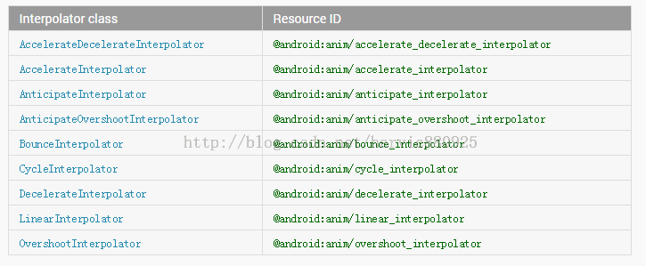
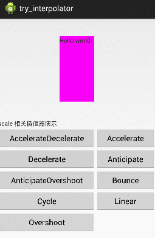
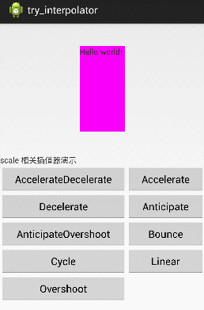
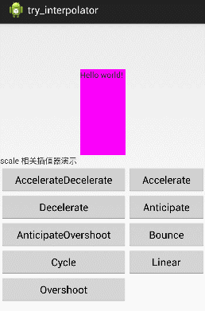

## 一、概述
Interpolator 属性是 Animation 类的一个 XML 属性，所以 alpha、scale、rotate、translate、set 都会继承得到这个属性。Interpolator 被译为插值器，其实我不大能从字面上理解为什么会这样译，其实他是一个指定动画如何变化的东东，跟 PS 里的动作有点类似：随便拿来一张图片，应用一个动作，图片就会指定变化。

Interpolator 的系统值有下面几个：



意义如下：

- AccelerateDecelerateInterpolator   在动画开始与介绍的地方速率改变比较慢，在中间的时候加速
- AccelerateInterpolator                     在动画开始的地方速率改变比较慢，然后开始加速
- AnticipateInterpolator                      开始的时候向后然后向前甩
- AnticipateOvershootInterpolator     开始的时候向后然后向前甩一定值后返回最后的值
- BounceInterpolator                          动画结束的时候弹起
- CycleInterpolator                             动画循环播放特定的次数，速率改变沿着正弦曲线
- DecelerateInterpolator                    在动画开始的地方快然后慢
- LinearInterpolator                            以常量速率改变
- OvershootInterpolator                      向前甩一定值后再回到原来位置

下面看看各个标签在应用上面的每个插值器后会运动轨迹会怎样。

## 二、scale 标签
下面先看看 Scale 标签应用插值器后，都会变成什么样。

先看下 XML 代码：（从控件中心点，从 0 放大到 1.4 倍，保持结束时的状态）

```
<?xml version="1.0" encoding="utf-8"?>  
<scale xmlns:android="http://schemas.android.com/apk/res/android"  
    android:interpolator="@android:anim/accelerate_decelerate_interpolator"  
    android:fromXScale="0.0"  
    android:toXScale="1.4"  
    android:fromYScale="0.0"  
    android:toYScale="1.4"  
    android:pivotX="50%"  
    android:pivotY="50%"  
    android:duration="700"   
    android:fillAfter="true"  
/>  
```

下面一个个看看，每个 xml 值对应的 scale 动画是怎样的。



AccelerateInterpolator
在动画开始的地方速率改变比较慢，然后开始加速


DecelerateInterpolator
在动画开始的地方快然后慢


AnticipateInterpolator
开始的时候向后然后向前甩 


AnticipateOvershootInterpolator
开始的时候向后然后向前甩一定值后返回最后的值


BounceInterpolator
动画结束的时候弹起


 CycleInterpolator
动画循环播放特定的次数，速率改变沿着正弦曲线


LinearInterpolator
以常量速率改变


OvershootInterpolator
向前甩一定值后再回到原来位置


## 三、rotate 标签
下面先看看 rotate 标签应用插值器后，都会变成什么样。

先看下 XML 代码：（从控件中心点，从 0 放大到 1.4 倍，保持结束时的状态）

[html] view plain
<?xml version="1.0" encoding="utf-8"?>  
<rotate xmlns:android="http://schemas.android.com/apk/res/android"  
    android:interpolator="@android:anim/accelerate_decelerate_interpolator"  
    android:fromDegrees="0"  
    android:toDegrees="360"  
    android:pivotX="50%"  
    android:pivotY="50%"  
    android:duration="700"   
    android:fillAfter="true"  
/>  
AccelerateDecelerateInterpolator   在动画开始与介绍的地方速率改变比较慢，在中间的时候加速



AccelerateInterpolator
在动画开始的地方速率改变比较慢，然后开始加速


DecelerateInterpolator
在动画开始的地方快然后慢


AnticipateInterpolator
开始的时候向后然后向前甩


AnticipateOvershootInterpolator
开始的时候向后然后向前甩一定值后返回最后的值


BounceInterpolator
动画结束的时候弹起


CycleInterpolator
动画循环播放特定的次数，速率改变沿着正弦曲线


LinearInterpolator
以常量速率改变


OvershootInterpolator
向前甩一定值后再回到原来位置


## 四、alpha 标签
下面先看看 alpha 标签应用插值器后，都会变成什么样。

将透明度从 0 变成 1.0，使用不同的插值器看看有什么不同（因为只是透明度的变化，所以基本看不出来有什么不同）
[html] view plain
<?xml version="1.0" encoding="utf-8"?>  
<alpha xmlns:android="http://schemas.android.com/apk/res/android"  
    android:interpolator="@android:anim/accelerate_decelerate_interpolator"  
    android:fromAlpha="0.0"  
    android:toAlpha="1.0"  
    android:duration="3000"   
    android:fillAfter="true"  
/>  
AccelerateDecelerateInterpolator   在动画开始与介绍的地方速率改变比较慢，在中间的时候加速


AccelerateInterpolator
在动画开始的地方速率改变比较慢，然后开始加速


DecelerateInterpolator
在动画开始的地方快然后慢


AnticipateInterpolator
开始的时候向后然后向前甩


AnticipateOvershootInterpolator
开始的时候向后然后向前甩一定值后返回最后的值


BounceInterpolator
动画结束的时候弹起


CycleInterpolator
动画循环播放特定的次数，速率改变沿着正弦曲线


LinearInterpolator
以常量速率改变


OvershootInterpolator
向前甩一定值后再回到原来位置


## 五、translate 标签
下面先看看 translate 标签应用插值器后，都会变成什么样。

把控件从（0，0）平移到（-200，-200）的位置，保持结束时状态不变，使用不同插值器。
[html] view plain
<?xml version="1.0" encoding="utf-8"?>  
<translate xmlns:android="http://schemas.android.com/apk/res/android"  
    android:interpolator="@android:anim/accelerate_decelerate_interpolator"  
    android:fromXDelta="0"     
    android:toXDelta="-200"    
    android:fromYDelta="0"    
    android:toYDelta="-200"    
    android:duration="2000"    
    android:fillAfter="true"  
/>  
AccelerateDecelerateInterpolator   在动画开始与介绍的地方速率改变比较慢，在中间的时候加速



AccelerateInterpolator
在动画开始的地方速率改变比较慢，然后开始加速


DecelerateInterpolator
在动画开始的地方快然后慢


AnticipateInterpolator
开始的时候向后然后向前甩


AnticipateOvershootInterpolator
开始的时候向后然后向前甩一定值后返回最后的值


BounceInterpolator
动画结束的时候弹起


CycleInterpolator
动画循环播放特定的次数，速率改变沿着正弦曲线


LinearInterpolator
以常量速率改变


OvershootInterpolator
向前甩一定值后再回到原来位置


这篇文章到这就结束了，因为动画比较多，可能看的会有点晕，下面我会给出上面效果所对应的源码，大家可以运行一下。

如果我的文章能帮到您，请加关注，谢谢。

源码下载地址：http://download.csdn.net/detail/harvic880925/8038491

请大家尊重原创者版权，转载请标明出处：http://blog.csdn.net/harvic880925/article/details/40049763 谢谢！