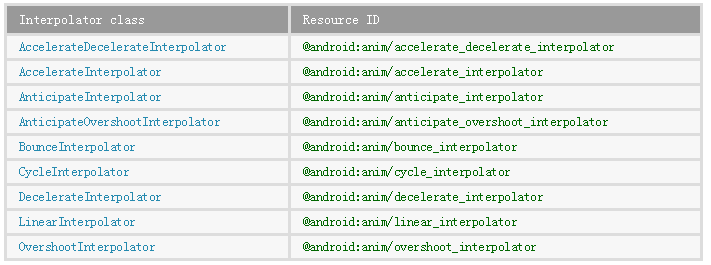
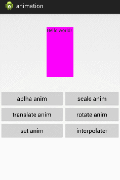

## 一、概述

前两篇，我为大家讲述了利用 XML 来定义动画及插值器，但在代码中，我们常常是动态生成动画的，所以，这篇将为大家讲述如何用代码生成动态生成动画及插值器。

先简单写出各个标签对应的类，方便大家理解：

- scale —— ScaleAnimation
- alpha —— AlphaAnimation
- rotate —— RotateAnimation
- translate —— TranslateAnimation
- set —— AnimationSet

## 二、Animation 公共类

官方 SDK 讲解页面为：[《Animation》](http://developer.android.com/reference/android/view/animation/Animation.html#setRepeatMode(int))

第一篇中我们提到过，Animation 类是所有动画（scale、alpha、translate、rotate）的基类，它所具有的标签及对应函数为：

- android:duration                  setDuration(long)     动画持续时间，以毫秒为单位 
- android:fillAfter                    setFillAfter(boolean)    如果设置为 true，控件动画结束时，将保持动画最后时的状态
- android:fillBefore                 setFillBefore(boolean)    如果设置为 true,控件动画结束时，还原到开始动画前的状态
- android:fillEnabled              setFillEnabled(boolean)    与 android:fillBefore 效果相同，都是在动画结束时，将控件还原到初始化状态
- android:repeatCount           setRepeatCount(int)    重复次数
- android:repeatMode            setRepeatMode(int)    重复类型，有 reverse 和 restart 两个值，取值为 RESTART 或 REVERSE，必须与 repeatCount 一起使用才能看到效果。因为这里的意义是重复的类型，即回放时的动作。
- android:interpolator            setInterpolator(Interpolator) 设定插值器，其实就是指定的动作效果，比如弹跳效果等

在第一篇《 Animation 动画详解（一）——alpha、scale、translate、rotate、set 的 
xml 属性及用法》 我们已经讲解了每个标签具体所具有的功能，这里就不再细讲，对于使用方法会在下面的各标签中使用。

## 三、ScaleAnimation

这是 scale 标签对应的类，官方 SDK 页面为：《ScaleAnimation》

在 Scale 标签中，我们提到过它的自有属性有下面几条，先列一下：

- android:fromXScale    起始的 X 方向上相对自身的缩放比例，浮点值，比如 1.0 代表自身无变化，0.5 代表起始时缩小一倍，2.0 代表放大一倍；
- android:toXScale        结尾的 X 方向上相对自身的缩放比例，浮点值；
- android:fromYScale    起始的 Y 方向上相对自身的缩放比例，浮点值，
- android:toYScale        结尾的 Y 方向上相对自身的缩放比例，浮点值；
- android:pivotX            缩放起点 X 轴坐标，可以是数值、百分数、百分数 p 三种样式，比如 50、50%、50%p，当为数值时，表示在当前 View 的左上角，即原点处加上 50px，做为起始缩放点；如果是 50%，表示在当前控件的左上角加上自己宽度的 50%做为起始点；如果是 50%p，那么就是表示在当前的左上角加上父控件宽度的 50%做为起始点 x 轴坐标。（具体意义，后面会举例演示）
- android:pivotY           缩放起点 Y 轴坐标，取值及意义跟 android:pivotX 一样。
放到代码中，ScaleAnimation 有下面几个构造函数：
- ScaleAnimation(Context context, AttributeSet attrs)  从 XML 文件加载动画，基本用不到
- ScaleAnimation(float fromX, float toX, float fromY, float toY)
- ScaleAnimation(float fromX, float toX, float fromY, float toY, float pivotX, float pivotY)
- ScaleAnimation(float fromX, float toX, float fromY, float toY, int pivotXType, float pivotXValue, int pivotYType, float pivotYValue)

第一个构造函数是从本地 XML 文件加载动画，基本用不到的，我们主要看下面三个构造函数。
在标签属性 android:pivotX 中有三种取值，数，百分数，百分数 p；体现在构造函数中，就是最后一个构造函数的 pivotXType,它的取值有三个，Animation.ABSOLUTE、Animation.RELATIVE_TO_SELF 和 Animation.RELATIVE_TO_PARENT；

这三个构造函数难度不大，就不再细讲，举个例子说明：

在第一篇中 Scale 的例子的 XML 代码为：

```
<?xml version="1.0" encoding="utf-8"?>  
<scale xmlns:android="http://schemas.android.com/apk/res/android"  
    android:fromXScale="0.0"  
    android:toXScale="1.4"  
    android:fromYScale="0.0"  
    android:toYScale="1.4"  
    android:pivotX="50"  
    android:pivotY="50"  
    android:duration="700" />  
```

对应的代码构造代码为：

```
scaleAnim = new ScaleAnimation(0.0f,1.4f,0.0f,1.4f,Animation.RELATIVE_TO_SELF,0.5f,Animation.RELATIVE_TO_SELF,0.5f);  
scaleAnim.setDuration(700);  
```

在控件使用的时候，同样是使用：

```
tv.startAnimation(scaleAnim);  
```

## 四、AlphaAnimation

这是 alpha 标签对就的类，官方 SDK 文档地址是：《AlphaAnimation》
同样 alpha 标签自有的属性有：
- android:fromAlpha   动画开始的透明度，从 0.0 --1.0 ，0.0 表示全透明，1.0 表示完全不透明
- android:toAlpha       动画结束时的透明度，也是从 0.0 --1.0 ，0.0 表示全透明，1.0 表示完全不透明
所对应的构造函数为：
- AlphaAnimation(Context context, AttributeSet attrs)  同样，从本地 XML 加载动画，基本不用
- AlphaAnimation(float fromAlpha, float toAlpha)
这里只剩最后一个构造函数，难度不大，下面举个例子说明下用法。
在第一篇文章中，我们构造的 XML 代码为：

```
<?xml version="1.0" encoding="utf-8"?>  
<alpha xmlns:android="http://schemas.android.com/apk/res/android"  
    android:fromAlpha="1.0"  
    android:toAlpha="0.1"  
    android:duration="3000"  
    android:fillBefore="true">  
</alpha> 
```
 
如果用代码构造同样的效果，它所对应的代码为：

```
alphaAnim = new AlphaAnimation(1.0f,0.1f);  
alphaAnim.setDuration(3000);  
alphaAnim.setFillBefore(true);  
```

## 五、RotateAnimation

RotateAnimation 类对应 Rotate 标签，SDK 文档地址：[《RotateAnimation》](http://developer.android.com/reference/android/view/animation/RotateAnimation.html)

Rotate 标签所具有的 XML 属性有：

- android:fromDegrees     开始旋转的角度位置，正值代表顺时针方向度数，负值代码逆时针方向度数
- android:toDegrees         结束时旋转到的角度位置，正值代表顺时针方向度数，负值代码逆时针方向度数
- android:pivotX               缩放起点 X 轴坐标，可以是数值、百分数、百分数 p 三种样式，比如 50、50%、50%p，具体意义已在 scale 标签中讲述，这里就不再重讲
- android:pivotY               缩放起点 Y 轴坐标，可以是数值、百分数、百分数 p 三种样式，比如 50、50%、50%p
对应的构造函数有：
- RotateAnimation(Context context, AttributeSet attrs)　　从本地 XML 文档加载动画，同样，基本不用
- RotateAnimation(float fromDegrees, float toDegrees)
- RotateAnimation(float fromDegrees, float toDegrees, float pivotX, float pivotY)
- RotateAnimation(float fromDegrees, float toDegrees, int pivotXType, float pivotXValue, int pivotYType, float pivotYValue)
RotateAnimation 跟 ScaleAnimation 差不多，关键问题同样是 pivotXType 和 pivotYType 的选择，同样有三个取值：Animation.ABSOLUTE、Animation.RELATIVE_TO_SELF 和 Animation.RELATIVE_TO_PARENT；

根据每一篇中的 XML 写出对应的 JAVA 构造代码：

XML 为：

```
<?xml version="1.0" encoding="utf-8"?>  
<rotate xmlns:android="http://schemas.android.com/apk/res/android"  
    android:fromDegrees="0"  
    android:toDegrees="-650"  
    android:pivotX="50%"  
    android:pivotY="50%"  
    android:duration="3000"  
    android:fillAfter="true">  
      
</rotate>  
```

对应 JAVA 构造代码为：

```
rotateAnim = new RotateAnimation(0, -650, Animation.RELATIVE_TO_SELF, 0.5f, Animation.RELATIVE_TO_SELF, 0.5f);  
rotateAnim.setDuration(3000);  
rotateAnim.setFillAfter(true);  
```

## 六、TranslateAnimation

很显示 TranslateAnimation 类对应 translate 标签，它的 SDK 官方文档地址为：《TranslateAnimation》
translate 标签所具有的属性为：

- android:fromXDelta     起始点 X 轴坐标，可以是数值、百分数、百分数 p 三种样式，比如 50、50%、50%p，具体意义已在 scale 标签中讲述，这里就不再重讲
- android:fromYDelta    起始点 Y 轴从标，可以是数值、百分数、百分数 p 三种样式；
- android:toXDelta         结束点 X 轴坐标
- android:toYDelta        结束点 Y 轴坐标
这些属性所对应的构造函数为：
- TranslateAnimation(Context context, AttributeSet attrs)  同样，基本不用
- TranslateAnimation(float fromXDelta, float toXDelta, float fromYDelta, float toYDelta)
- TranslateAnimation(int fromXType, float fromXValue, int toXType, float toXValue, int fromYType, float fromYValue, int toYType, float toYValue)
由于 fromXDelta、fromYDelta、toXDelta、toYDelta 这三个属性都具有三种状态，所以在构造函数中，最理想的状态就是第三个构造函数，能够指定每个值的类型，第二个构造函数：TranslateAnimation (float fromXDelta, float toXDelta, float fromYDelta, float toYDelta)使用是绝对数值。只有最后一个构造函数可以指定百分数和相对父控件的百分数。

下面以第一篇中的 XML 代码为例，用 JAVA 代码构造同样的效果：

XML 代码：

```
<?xml version="1.0" encoding="utf-8"?>  
<translate xmlns:android="http://schemas.android.com/apk/res/android"  
    android:fromXDelta="0"   
    android:toXDelta="-80"  
    android:fromYDelta="0"  
    android:toYDelta="-80"  
    android:duration="2000"  
    android:fillBefore="true">  
</translate>  
```

对应的 JAVA 代码为：

```
translateAnim = new TranslateAnimation(Animation.ABSOLUTE, 0, Animation.ABSOLUTE, -80,   
        Animation.ABSOLUTE, 0, Animation.ABSOLUTE, -80);  
translateAnim.setDuration(2000);  
translateAnim.setFillBefore(true);
```
  
## 七：AnimationSet

AnimationSet 类对应 set 标签，定义动作类的集合，对应的 SDK 文档地址为：[《AnimationSet》](http://developer.android.com/reference/android/view/animation/AnimationSet.html#AnimationSet(boolean))
它自己是没有 XML 属性的，所以我们直接说它的构造函数：
- AnimationSet(Context context, AttributeSet attrs)  同样，基本不用
- AnimationSet(boolean shareInterpolator)  shareInterpolator 取值 true 或 false，取 true 时，指在 AnimationSet 中定义一个插值器（interpolater），它下面的所有动画共同。如果设为 false，则表示它下面的动画自己定义各自的插值器。
增加动画的函数为：（更多函数，请参看 SDK 文档）

- public void addAnimation (Animation a)
下面在第一篇中的 XML 代码为例写出能构造同样效果的 JAVA 代码：

XML 代码为：

```
<?xml version="1.0" encoding="utf-8"?>  
<set xmlns:android="http://schemas.android.com/apk/res/android"  
    android:duration="3000"  
    android:fillAfter="true">  
      
  <alpha   
    android:fromAlpha="0.0"  
    android:toAlpha="1.0"/>  
    
  <scale  
    android:fromXScale="0.0"  
    android:toXScale="1.4"  
    android:fromYScale="0.0"  
    android:toYScale="1.4"  
    android:pivotX="50%"  
    android:pivotY="50%"/>  
    
  <rotate  
    android:fromDegrees="0"  
    android:toDegrees="720"  
    android:pivotX="50%"  
    android:pivotY="50%"/>  
         
</set> 
```
 
对应的 JAVA 代码为：

```
alphaAnim = new AlphaAnimation(1.0f,0.1f);  
scaleAnim = new ScaleAnimation(0.0f,1.4f,0.0f,1.4f,Animation.RELATIVE_TO_SELF,0.5f,Animation.RELATIVE_TO_SELF,0.5f);  
rotateAnim = new RotateAnimation(0, 720, Animation.RELATIVE_TO_SELF, 0.5f, Animation.RELATIVE_TO_SELF, 0.5f);  
  
setAnim=new AnimationSet(true);  
setAnim.addAnimation(alphaAnim);  
setAnim.addAnimation(scaleAnim);  
setAnim.addAnimation(rotateAnim);  
  
setAnim.setDuration(3000);  
setAnim.setFillAfter(true); 
```
 
## 八、Interpolater 插值器

关于插值器的效果及应用，我们专门开了一篇来讲，看这里：《Animation 动画详解（二）——Interpolator 插值器》
关于插值器的 SDK 讲解见[《Animation Resources》](http://developer.android.com/guide/topics/resources/animation-resource.html)中的 Interpolators 部分；

插值器 XML 属性及对应的类如下表所示：



使用方法：（为 sacleAnimation 增加 bounce 插值器）

```
ScaleAnimation interpolateScaleAnim=new ScaleAnimation(0.0f,1.4f,0.0f,1.4f,Animation.RELATIVE_TO_SELF,0.5f,Animation.RELATIVE_TO_SELF,0.5f);  
interpolateScaleAnim.setInterpolator(new BounceInterpolator());  
interpolateScaleAnim.setDuration(3000);  
```

## 九、示例，源码

下面我把上面所有的代码集合到一个例子中，供大家下载；
效果图如下：




源码下载地址：http://download.csdn.net/detail/harvic880925/8047669

请大家尊重原创者版权，转载请标明出处：http://blog.csdn.net/harvic880925/article/details/40117115 谢谢！