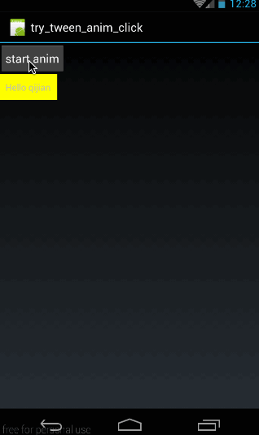
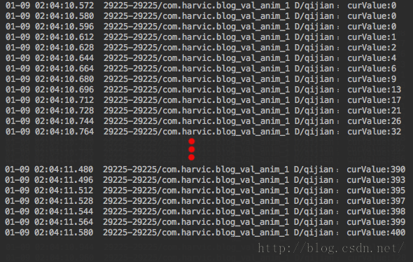
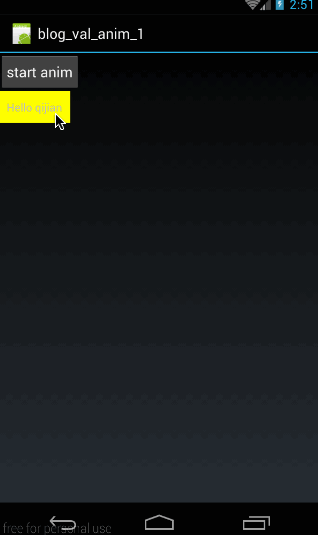
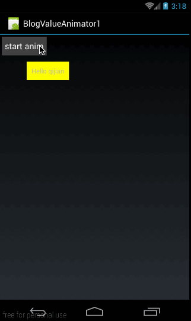
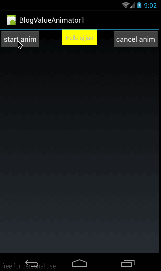
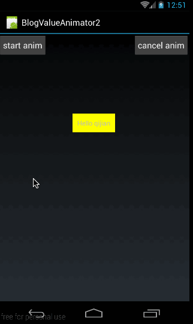
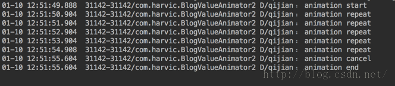
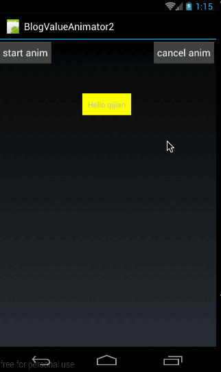
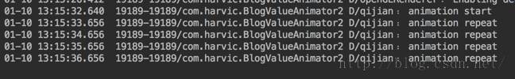
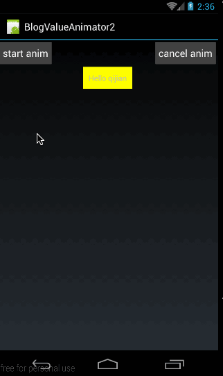

## 一、概述
long long ago，我写过几篇有关 Animation 的文章，讲解了传统的 alpha、scale、translate、rotate 的用法及代码生成方法。其实这三篇文章讲的所有动画效果叫做 Tween Animation（补间动画） 
在 Android 动画中，总共有两种类型的动画 View Animation(视图动画)和 Property Animator(属性动画)；

其中 

- View Animation 包括 Tween Animation（补间动画）和 Frame Animation(逐帧动画)； 
- Property Animator 包括 ValueAnimator 和 ObjectAnimation；

首先，直观上，他们有如下三点不同： 
**1、引入时间不同：**View Animation 是 API Level 1 就引入的。Property Animation 是 API Level 11 引入的，即 Android 3.0 才开始有 Property Animation 相关的 API。 
**2、所在包名不同：**View Animation 在包 android.view.animation 中。而 Property Animation API 在包 android.animation 中。 
**3、动画类的命名不同：**View Animation 中动画类取名都叫 XXXXAnimation,而在 Property Animator 中动画类的取名则叫 XXXXAnimator

大家都知道逐帧动画主要是用来实现动画的，而补间动画才能实现控件的渐入渐出、移动、旋转和缩放的；而 Property Animator 是在 Android 3.0 版本才引入的，之前是没有的。大家可能会觉得补间动画和逐帧动画已经很全了，为什么还要引入 Property Animator 呢？

### 1、为什么引入 Property Animator(属性动画)
我提出一个假设：请问大家，如何利用补间动画来将一个控件的背景色在一分钟内从绿色变为红色？这个效果想必没办法仅仅通过改变控件的渐入渐出、移动、旋转和缩放来实现吧，而这个效果是可以通过 Property Animator 完美实现的 
**这就是第一个原因：Property Animator 能实现补间动画无法实现的功能** 
大家都知道，补间动画和逐帧动画统称为 View Animation，也就是说这两个动画只能对派生自 View 的控件实例起作用；而 Property Animator 则不同，从名字中可以看出属性动画，应该是作用于控件属性的！正因为属性动画能够只针对控件的某一个属性来做动画，所以也就造就了他能单独改变控件的某一个属性的值！比如颜色！这就是 Property Animator 能实现补间动画无法实现的功能的最重要原因。 
**我们得到了第二点不同：View Animation 仅能对指定的控件做动画，而 Property Animator 是通过改变控件某一属性值来做动画的。** 
假设我们将一个按钮从左上角利用补间动画将其移动到右下角，在移动过程中和移动后，这个按钮都是不会响应点击事件的。这是为什么呢？因为补间动画仅仅转变的是控件的显示位置而已，并没有改变控件本身的值。View Animation 的动画实现是通过其 Parent View 实现的，在 View 被 drawn 时 Parents View 改变它的绘制参数，这样虽然 View 的大小或旋转角度等改变了，但 View 的实际属性没变，所以有效区域还是应用动画之前的区域；我们看到的效果仅仅是系统作用在按钮上的显示效果，利用动画把按钮从原来的位置移到了右下角，但按钮内部的任何值是没有变化的，所以按钮所捕捉的点击区域仍是原来的点击区域。（下面会举例来说明这个问题） 
**这就得到了第三点不同：补间动画虽能对控件做动画，但并没有改变控件内部的属性值。而 Property Animator 则是恰恰相反，Property Animator 是通过改变控件内部的属性值来达到动画效果的**

### 2、举例说明补间动画的点击区域问题
下面我们就利用 TranslateAnimation 来做一个移动动画的例子，看它的点击区域是否会变。
我们先来看看效果： 



在效果图中，首先，我给 textview 添加了点击响应，当点击 textview 时，会弹出 Toast。 
然后，当我点击按钮的时候，textview 开始向右下角移动。 
从结果中可以看出，在移动前，点击 textview 是可以弹出 toast 的的，在移动后，点击 textview 时则没有响应，相反，点击 textview 的原来所在区域则会弹出 toast. 
这就论证了不同第三点：补间动画虽能对控件做动画，但并没有改变控件内部的属性值 
下面简单看看这个动画的实现代码吧： 

**（1）、看布局（main.xml）**
从效果图中也可以看出，布局很简单，一个 button,一个 textview，垂直排列，布局代码如下：

```
<?xml version="1.0" encoding="utf-8"?>  
<LinearLayout xmlns:android="http://schemas.android.com/apk/res/android"  
              android:orientation="vertical"  
              android:layout_width="fill_parent"  
              android:layout_height="fill_parent">  
  
    <Button  
            android:id="@+id/btn"  
            android:layout_width="wrap_content"  
            android:layout_height="wrap_content"  
            android:padding="10dp"  
            android:text="start anim"  
            />  
    <TextView  
            android:id="@+id/tv"  
            android:layout_width="wrap_content"  
            android:layout_height="wrap_content"  
            android:padding="10dp"  
            android:background="#ffff00"  
            android:text="Hello qijian"/>  
</LinearLayout> 
```
 
**(2)JAVA 代码（MyActivity.java）**
接下来是操作代码，就是分别给 button 和 textview 添加上点击响应，当点击 textview 时弹出 toast,点击 button 时，textview 使用移动。 
代码如下：

```
public class MyActivity extends Activity {  
    @Override  
    public void onCreate(Bundle savedInstanceState) {  
        super.onCreate(savedInstanceState);  
        setContentView(R.layout.main);  
  
        final TextView tv  = (TextView) findViewById(R.id.tv);  
        Button btn  = (Button)findViewById(R.id.btn);  
  
        btn.setOnClickListener(new View.OnClickListener() {  
            @Override  
            public void onClick(View v) {  
                final TranslateAnimation animation = new TranslateAnimation(Animation.ABSOLUTE, 0, Animation.ABSOLUTE, 400,  
                        Animation.ABSOLUTE, 0, Animation.ABSOLUTE, 400);  
                animation.setFillAfter(true);  
                animation.setDuration(1000);  
                tv.startAnimation(animation);  
            }  
        });  
  
  
        tv.setOnClickListener(new View.OnClickListener() {  
            @Override  
            public void onClick(View v) {  
                Toast.makeText(MyActivity.this,"clicked me",Toast.LENGTH_SHORT).show();  
            }  
        });  
  
    }  
}  
```

这段代码很容易理解，这里就不再细讲了。 
源码在文章底部给出

## 二、ValueAnimator 简单使用
我们前面讲了 Property Animator 包括 ValueAnimator 和 ObjectAnimator；这篇文章就主要来看看 ValueAnimator 的使用方法吧。 
我觉得谷歌那帮老头是最会起名字的人，单从命名上，就能看出来这个东东的含义。ValueAnimator 从名字可以看出，这个 Animation 是针对值的！ValueAnimator 不会对控件做任何操作，我们可以给它设定从哪个值运动到哪个值，通过监听这些值的渐变过程来自己操作控件。以前我们曾讲过 Scroller 类，Scroller 类也是不会对控件操作的，也是通过给他设定滚动值和时长，它会自己计算滚动过程，然后我们需要监听它的动画过程来自己操作控件，ValueAnimator 的原理与 Scroller 类相似。有关 Scroller 的知识，大家可以参考：[《 ListView 滑动删除实现之四——Scroller 类与 listview 缓慢滑动》](http://blog.csdn.net/harvic880925/article/details/45317951)

### 1、初步使用 ValueAnimator
要使用 ValueAnimaiton，总共有两步： 
**第一步：创建 ValueAnimator 实例**

```
ValueAnimator animator = ValueAnimator.ofInt(0,400);  
animator.setDuration(1000);  
animator.start(); 
```
 
在这里我们利用 ValueAnimator.ofInt 创建了一个值从 0 到 400 的动画，动画时长是 1s，然后让动画开始。从这段代码中可以看出，ValueAnimator 没有跟任何的控件相关联，那也正好说明 ValueAnimator 只是对值做动画运算，而不是针对控件的，我们需要监听 ValueAnimator 的动画过程来自己对控件做操作。 

**第二步：添加监听**
上面的三行代码，我们已经实现了动画，下面我们就添加监听：

```
ValueAnimator animator = ValueAnimator.ofInt(0,400);  
animator.setDuration(1000);  
  
animator.addUpdateListener(new ValueAnimator.AnimatorUpdateListener() {  
    @Override  
    public void onAnimationUpdate(ValueAnimator animation) {  
        int curValue = (int)animation.getAnimatedValue();  
        Log.d("qijian","curValue:"+curValue);  
    }  
});  
animator.start(); 
```
 
在上面的代码中，我们通过 addUpdateListener 添加了一个监听，在监听传回的结果中，是表示当前状态的 ValueAnimator 实例，我们通过 animation.getAnimatedValue()得到当前值。然后通过 Log 打印出来，结果如下： 



这就是 ValueAnimator 的功能：ValueAnimator 对指定值区间做动画运算，我们通过对运算过程做监听来自己操作控件。 
总而言之就是两点：

- ValueAnimator 只负责对指定的数字区间进行动画运算
- 我们需要对运算过程进行监听，然后自己对控件做动画操作

### 2、实例使用 ValueAnimator
这段，我们就使用上面我们讲到的 ValueAnimator 做一个动画: 
我们先看看效果图： 



首先这个动画的布局与上一个实例是一样的。但实现的效果确不大相同：

- 首先，点击按钮后,textview 从屏幕（0,0）点运动到(400,400)点
- 运动前后，textview 都是可以响应点击事件的 

下面我们就来看看这里如何利用 ValueAnimator 来实现这个效果的。 
**1、布局（main.xml）**
布局代码与上个例子相同：垂直布局按钮控件和 textview

```
<?xml version="1.0" encoding="utf-8"?>  
<LinearLayout xmlns:android="http://schemas.android.com/apk/res/android"  
              android:orientation="vertical"  
              android:layout_width="fill_parent"  
              android:layout_height="fill_parent">  
  
    <Button  
            android:id="@+id/btn"  
            android:layout_width="wrap_content"  
            android:layout_height="wrap_content"  
            android:padding="10dp"  
            android:text="start anim"  
            />  
    <TextView  
            android:id="@+id/tv"  
            android:layout_width="wrap_content"  
            android:layout_height="wrap_content"  
            android:padding="10dp"  
            android:background="#ffff00"  
            android:text="Hello qijian"/>  
</LinearLayout>  
```

**2、JAVA 操作**
首先，是对 textview 和 btn 添加点击响应，当点击 textview 时，弹出 toast；点击 btn 时，textview 开始做动画

```
public class MyActivity extends Activity {  
    private TextView tv;  
    private Button btn;  
  
    @Override  
    public void onCreate(Bundle savedInstanceState) {  
        super.onCreate(savedInstanceState);  
        setContentView(R.layout.main);  
        tv = (TextView) findViewById(R.id.tv);  
  
        btn = (Button) findViewById(R.id.btn);  
        btn.setOnClickListener(new View.OnClickListener() {  
            @Override  
            public void onClick(View v) {  
                doAnimation();  
            }  
        });  
  
        tv.setOnClickListener(new View.OnClickListener() {  
            @Override  
            public void onClick(View v) {  
                Toast.makeText(MyActivity.this, "clicked me", Toast.LENGTH_SHORT).show();  
            }  
        });  
    }  
    …………  
}  
```

这段代码很简单，在点击 btn 的时候执行 doAnimation()来执行动画操作，在点击 tv 的时候，弹出 toast; 
下面来看看 doAnimation()的具体实现：

```
private void doAnimation(){  
    ValueAnimator animator = ValueAnimator.ofInt(0,400);  
    animator.setDuration(1000);  
  
    animator.addUpdateListener(new ValueAnimator.AnimatorUpdateListener() {  
        @Override  
        public void onAnimationUpdate(ValueAnimator animation) {  
            int curValue = (int)animation.getAnimatedValue();  
            tv.layout(curValue,curValue,curValue+tv.getWidth(),curValue+tv.getHeight());  
        }  
    });  
    animator.start();  
}  
```

首先，我们构造一个 ValueAnimator 实例，让其计算的值是从 0 到 400； 
然后添加对计算过程进行监听：

```
animator.addUpdateListener(new ValueAnimator.AnimatorUpdateListener() {  
    @Override  
    public void onAnimationUpdate(ValueAnimator animation) {  
        int curValue = (int)animation.getAnimatedValue();  
        tv.layout(curValue,curValue,curValue+tv.getWidth(),curValue+tv.getHeight());  
    }  
});  
```

在监听过程中，通过 layout 函数来改变 textview 的位置。这里注意了，我们是通过 layout 函数来改变位置的，我们知道 layout 函数在改变控件位置时是永久性的，即通过更改控件 left,top,right,bottom 这四个点的坐标来改更改坐标位置的，而不仅仅是从视觉上画在哪个位置，所以通过 layout 函数更改位置后，控件在新位置是可以响应点击事件的。 
大家可能注意到了,layout（）函数中上下左右点的坐标是以屏幕坐标来标准的。所以在效果图中可以看到，textview 的运动轨迹是从屏幕的左上角(0,0)点运行到（400，400）点。 
源码在文章底部给出

## 三、常用方法
经过上面的例子，我们就大概知道 ValueAnimator 要怎么使用了，下面我们就来具体来看看它还有哪些常用的方法吧。
### 1、ofInt 与 ofFloat
在上面的例子中，我们使用了 ofInt 函数，与它同样功能的还有一个函数叫 ofFloat,下面我们先看看他们的具体声明：

```
public static ValueAnimator ofInt(int... values)  
public static ValueAnimator ofFloat(float... values) 
```
 
他们的参数类型都是可变参数长参数，所以我们可以传入任何数量的值；传进去的值列表，就表示动画时的变化范围；比如 ofInt(2,90,45)就表示从数值 2 变化到数字 90 再变化到数字 45；所以我们传进去的数字越多，动画变化就越复杂。从参数类型也可以看出 ofInt 与 ofFloat 的唯一区别就是传入的数字类型不一样，ofInt 需要传入 Int 类型的参数，而 ofFloat 则表示需要传入 Float 类型的参数。 
下面我们还在上面例子的基础上，使用 ofFloat 函数来举个例子：

```
ValueAnimator animator = ValueAnimator.ofFloat(0f,400f,50f,300f);  
animator.setDuration(3000);  
  
animator.addUpdateListener(new ValueAnimator.AnimatorUpdateListener() {  
    @Override  
    public void onAnimationUpdate(ValueAnimator animation) {  
        Float curValueFloat = (Float)animation.getAnimatedValue();  
        int curValue = curValueFloat.intValue();  
        tv.layout(curValue,curValue,curValue+tv.getWidth(),curValue+tv.getHeight());  
    }  
});  
animator.start();
```
  
先看看效果： 



在效果图中，我们可以看到，在点击按钮之后，textview 先向右下运动然后再回来，然后再向右下运动过去
在这个例子中，我们使用 ValueAnimator.ofFloat(0f,400f,50f,300f)构造了一个比较复杂的动画渐变，值是 0 变到 400 再回到 50 最后变成 300；
所以我们在监听时，首先得到当前动画的值：

```
Float curValueFloat = (Float)animation.getAnimatedValue();  
```

通过 getAnimatedValue()来获取当前运动点的值，大家可能会疑问为什么要转成 Float 类型，我们先来看看 getAnimatedValue()的声明：

```
Object getAnimatedValue(); 
```
 
它返回的类型是一个 Object 原始类型，那我们怎么知道我们要将它强转成什么类型呢。注意，我们在设定动画初始值时用的是 ofFloat()函数，所以每个值的类型必定是 Float 类型，所以我们获取出来的类型也必然是 Float 类型的。同样，如果我们使用 ofInt 设定的初始值，那么通过 getAnimatedValue()获取到的值就应该强转为 Int 类型。 
在得到当前运动的值以后，通过 layout 函数将 textview 移动到指定位置即可。 

源码在文章底部给出

### 2、常用函数
先做个汇总，这部分将讲述的方法有：

```
/** 
 * 设置动画时长，单位是毫秒 
 */  
ValueAnimator setDuration(long duration)  
/** 
 * 获取 ValueAnimator 在运动时，当前运动点的值 
 */  
Object getAnimatedValue();  
/** 
 * 开始动画 
 */  
void start()  
/** 
 * 设置循环次数,设置为 INFINITE 表示无限循环 
 */  
void setRepeatCount(int value)  
/** 
 * 设置循环模式 
 * value 取值有 RESTART，REVERSE， 
 */  
void setRepeatMode(int value)  
/** 
 * 取消动画 
 */  
void cancel() 
```
 
**1、setDuration()、getAnimatedValue()、start()**
这三个函数在上面的实例中已经使用过，setDuration(long duration)是设置一次动画的时长，单位是毫秒，start()是开始动画，唯一有点难度的是 Object getAnimatedValue()，它的声明为：

```
Object getAnimatedValue(); 
```
 
它的意义就是获取动画在当前运动点的值，所以这个对象只能用于在动画运动中。返回的值是 Object,上面我们说过，通过 getAnimatedValue()得到的值的实际类型与初始设置的值相同，如果我们利用 ofInt（）设置的动画，那通过 getAnimatedValue()得到的值为类型就是 Int 类型。如果我们利用 ofFloat（）设置的动画，通过 getAnimatedValue()得到的值类型就是 Float 类型。 
**总而言之，通过 getAnimatedValue()值类型与初始设置动画时的值类型相同** 
上面我们已经用过这些函数了，这里就不再举例了。 

**2、setRepeatCount()、setRepeatMode()、cancel（）**
setRepeatCount(int value)用于设置动画循环次数,设置为 0 表示不循环，设置为 ValueAnimation.INFINITE 表示无限循环。 
cancel()用于取消动画 
我们着重说一下 setRepeatMode：

```
/** 
 * 设置循环模式 
 * value 取值有 RESTART，REVERSE 
 */  
void setRepeatMode(int value) 
```
 
setRepeatMode(int value)用于设置循环模式，取值为 ValueAnimation.RESTART 时,表示正序重新开始，当取值为 ValueAnimation.REVERSE 表示倒序重新开始。 
下面我们使用这三个函数来举个例子，先看下动画效果： 



在这里，有两个按钮，当点击 start anim 时，textview 垂直向下运动，我定义的运动初始值为 ofInt(0,400)；所以从效果图中也可以看出我们定义它为无限循环，而且每次循环时都是使用 ValueAnimation.REVERSE 让其倒序重新开始循环。当我们点击 cancel anim 时，取消动画。 
下面我们来看看代码 
首先是布局代码，布局代码时，采用 RelativeLayout 布局，将两个按钮放两边，textview 放中间，代码如下：

```
<?xml version="1.0" encoding="utf-8"?>  
<RelativeLayout xmlns:android="http://schemas.android.com/apk/res/android"  
              android:orientation="vertical"  
              android:layout_width="fill_parent"  
              android:layout_height="fill_parent">  
  
    <Button  
        android:id="@+id/btn"  
        android:layout_width="wrap_content"  
        android:layout_height="wrap_content"  
        android:layout_alignParentLeft="true"  
        android:padding="10dp"  
        android:text="start anim"  
        />  
  
    <Button  
            android:id="@+id/btn_cancel"  
            android:layout_width="wrap_content"  
            android:layout_height="wrap_content"  
            android:layout_alignParentRight="true"  
            android:padding="10dp"  
            android:text="cancel anim"  
            />  
    <TextView  
            android:id="@+id/tv"  
            android:layout_width="wrap_content"  
            android:layout_height="wrap_content"  
            android:layout_centerHorizontal="true"  
            android:padding="10dp"  
            android:background="#ffff00"  
            android:text="Hello qijian"/>  
</RelativeLayout>  
```

这个布局代码没什么难度就不讲了。 
下面来看看两个按钮的操作代码：

```
private Button btnStart,btnCancel;  
private ValueAnimator repeatAnimator;  
  
@Override  
public void onCreate(Bundle savedInstanceState) {  
    super.onCreate(savedInstanceState);  
    setContentView(R.layout.main);  
    tv = (TextView) findViewById(R.id.tv);  
  
    btnStart = (Button) findViewById(R.id.btn);  
    btnCancel = (Button)findViewById(R.id.btn_cancel);  
  
    btnStart.setOnClickListener(new View.OnClickListener() {  
        @Override  
        public void onClick(View v) {  
            repeatAnimator = doRepeatAnim();  
        }  
    });  
  
    btnCancel.setOnClickListener(new View.OnClickListener() {  
        @Override  
        public void onClick(View v) {  
  
            repeatAnimator.cancel();  
        }  
    });  
}
```
   
这段代码也没什么难度，当我们点击 btnStart 的时候，执行 doRepeatAnim()函数，这个函数返回它构造的 ValueAnimator 对象，将其赋值给 repeatAnimator 变量。当点击 btnCancel 时，调用 repeatAnimator.cancel()取消当前动画。 
下面我们来看看 doRepeatAnim()函数都做了哪些工作：

```
private ValueAnimator doRepeatAnim(){  
   ValueAnimator animator = ValueAnimator.ofInt(0,400);  
   animator.addUpdateListener(new ValueAnimator.AnimatorUpdateListener() {  
       @Override  
       public void onAnimationUpdate(ValueAnimator animation) {  
           int curValue = (int)animation.getAnimatedValue();  
           tv.layout(tv.getLeft(),curValue,tv.getRight(),curValue+tv.getHeight());  
       }  
   });  
   animator.setRepeatMode(ValueAnimator.REVERSE);  
   animator.setRepeatCount(ValueAnimator.INFINITE);  
   animator.setDuration(1000);  
   animator.start();  
   return animator;  
} 
```
 
在这里我们构造了一个 ValueAnimator,动画范围是 0-400,设置重复次数为无限循环。循环模式为倒序。在 animator.setDuration(1000)表示动画一次的时长为 1000 毫秒。最后，由于我们在取消动画时还需要我们构造的这个 ValueAnimator 实例，所以将 animator 返回。 
源码在文章底部给出

### 3、两个监听器
**(1)、添加监听器**
前面，我们讲过一个添加监听器 animator.addUpdateListener，以监听动画过程中值的实时变化，其实在 ValueAnimator 中共有两个监听器：

```
/** 
 * 监听器一：监听动画变化时的实时值 
 */  
public static interface AnimatorUpdateListener {  
    void onAnimationUpdate(ValueAnimator animation);  
}  
//添加方法为：public void addUpdateListener(AnimatorUpdateListener listener)  
/** 
 * 监听器二：监听动画变化时四个状态 
 */  
public static interface AnimatorListener {  
    void onAnimationStart(Animator animation);  
    void onAnimationEnd(Animator animation);  
    void onAnimationCancel(Animator animation);  
    void onAnimationRepeat(Animator animation);  
}  
//添加方法为：public void addListener(AnimatorListener listener)  
```
 
关于监听器一：AnimatorUpdateListener 就是监听动画的实时变化状态，在 onAnimationUpdate(ValueAnimator animation)中的 animation 表示当前状态动画的实例。这里就不再细讲这个监听器了，这里我们主要讲讲监听器 AnimatorListener； 
在 AnimatorListener 中，主要是监听 Animation 的四个状态，start、end、cancel、repeat；当动画开始时，会调用 onAnimationStart(Animator animation)方法，当动画结束时调用 onAnimationEnd(Animator animation)，当动画取消时，调用 onAnimationCancel(Animator animation)函数，当动画重复时，会调用 onAnimationRepeat(Animator animation)函数。 
添加 AnimatorListener 的方法是 addListener(AnimatorListener listener) ； 
下面我们就举个例子来看一下 AnimatorListener 的使用方法。 
我们在上面 doRepeatAnim()函数的基础上，添加上 AnimatorListener，代码如下： 
代码如下：

```
private ValueAnimator doAnimatorListener(){  
    ValueAnimator animator = ValueAnimator.ofInt(0,400);  
  
    animator.addUpdateListener(new ValueAnimator.AnimatorUpdateListener() {  
        @Override  
        public void onAnimationUpdate(ValueAnimator animation) {  
            int curValue = (int)animation.getAnimatedValue();  
            tv.layout(tv.getLeft(),curValue,tv.getRight(),curValue+tv.getHeight());  
        }  
    });  
    animator.addListener(new Animator.AnimatorListener() {  
        @Override  
        public void onAnimationStart(Animator animation) {  
            Log.d("qijian","animation start");  
        }  
  
        @Override  
        public void onAnimationEnd(Animator animation) {  
            Log.d("qijian","animation end");  
        }  
  
        @Override  
        public void onAnimationCancel(Animator animation) {  
            Log.d("qijian","animation cancel");  
        }  
  
        @Override  
        public void onAnimationRepeat(Animator animation) {  
            Log.d("qijian","animation repeat");  
        }  
    });  
    animator.setRepeatMode(ValueAnimator.REVERSE);  
    animator.setRepeatCount(ValueAnimator.INFINITE);  
    animator.setDuration(1000);  
    animator.start();  
    return animator;  
} 
```
 
在上面的代码中，我们是在 doRepeatAnim()函数的基础上，又添加了 AnimatorListener()以监听它的状态，并把这些状态打印出来。 
我们来看看动画效果： 



打印出来结果如下：



**（2）、取消监听**
上面我们讲了如何添加监听函数，下面我们来看看如何移除监听器：

```
/** 
 * 移除 AnimatorUpdateListener 
 */  
void removeUpdateListener(AnimatorUpdateListener listener);  
void removeAllUpdateListeners();  
 /** 
  * 移除 AnimatorListener 
  */  
void removeListener(AnimatorListener listener);  
void removeAllListeners();
```
  
针对 AnimatorUpdateListener 和 AnimatorListener，每个监听器都有两个方法来移除；我们就以移除 AnimatorListener 来简单讲一下，removeListener(AnimatorListener listener)用于在 animator 中移除指定的监听器，而 removeAllListeners()用于移除 animator 中所有的 AnimatorListener 监听器； 
下面上在添加监听器的例子基础上，不改变 doAnimatorListener()的代码，仍然是 textview 做动画时添加 AnimatorListener 的状态监听。然后点击 cancelAnim 时，移除 AnimatorListener，代码如下： 
AnimatorListener 的代码：

```
public void onCreate(Bundle savedInstanceState) {  
    super.onCreate(savedInstanceState);  
    setContentView(R.layout.main);  
  
    …………  
    btnStart.setOnClickListener(new View.OnClickListener() {  
        @Override  
        public void onClick(View v) {  
            repeatAnimator = doAnimatorListener();  
        }  
    });  
  
    btnCancel.setOnClickListener(new View.OnClickListener() {  
        @Override  
        public void onClick(View v) {  
            repeatAnimator.removeAllListeners();  
        }  
    });  
} 
```
 
doAnimatorListener 的代码与上面的一样，就不再重复贴了，当点击 btnCancel 时移除 animator 中所有的 AnimatorListener，但注意的是，我们在移除 AnimatorListener 后，并没有 cancel 动画效果，所以动画会一直不停的运动下去。但移除 AnimatorListener 之后，Log 应该就不会再打印了。 
效果如下： 



在效果图中，在动画循环了三次之后，我们点击 btnCancel 移除所有的 AnimatorListener；打印 tag 如下： 



可见只打印了循环三次以前的 log,在移除我们添加的 AnimatorListener 之后，我们打印 log 的代码就不会再执行了，所以也就不会再有 log 了。 
好了，有关监听器的部分，我们就到这里了 

源码在文章底部给出

### 4、其它函数
上面我们讲了 ValueAnimator 中常用的一些函数，但是还有一些函数虽然不常用，但我们还是简单讲一下，他们分别是：

```
/** 
 * 延时多久时间开始，单位是毫秒 
 */  
public void setStartDelay(long startDelay)  
/** 
 * 完全克隆一个 ValueAnimator 实例，包括它所有的设置以及所有对监听器代码的处理 
 */  
public ValueAnimator clone() 
```
 
setStartDelay(long startDelay)非常容易理解，就是设置多久后动画才开始。 
但 clone()这个函数就有点难度了；首先是什么叫克隆。就是完全一样！注意是完全一样！就是复制出来一个完全一样的新的 ValueAnimator 实例出来。对原来的那个 ValueAnimator 是怎么处理的，在这个新的实例中也是全部一样的。 
我们来看一个例子来看一下，什么叫全部一样： 
首先，我们定义一个函数 doRepeatAnim()：

```
private ValueAnimator doRepeatAnim(){  
    ValueAnimator animator = ValueAnimator.ofInt(0,400);  
  
    animator.addUpdateListener(new ValueAnimator.AnimatorUpdateListener() {  
        @Override  
        public void onAnimationUpdate(ValueAnimator animation) {  
            int curValue = (int)animation.getAnimatedValue();  
            tv.layout(tv.getLeft(),curValue,tv.getRight(),curValue+tv.getHeight());  
        }  
    });  
    animator.setDuration(1000);  
    animator.setRepeatMode(ValueAnimator.REVERSE);  
    animator.setRepeatCount(ValueAnimator.INFINITE);  
    return animator;  
}  
```

这个函数其实与上面在讲循环函数时的 doRepeatAnim()函数是一样的；在这个函数中，我们定义一个 ValueAnimator，设置为无限循环，然后添加 AnimatorUpdateListener 监听；在动画在运动时，向下移动 textview.这里要非常注意的一点是我们只是定义了一个 ValueAnimator 对象，并没有调用 start()让动画开始！！！！ 
然后我们再看看点击 btnStart 和 btnCancel 时的代码处理：

```
public void onCreate(Bundle savedInstanceState) {  
    super.onCreate(savedInstanceState);  
    setContentView(R.layout.main);  
  
    …………  
    btnStart.setOnClickListener(new View.OnClickListener() {  
        @Override  
        public void onClick(View v) {  
            repeatAnimator = doRepeatAnim();  
            //克隆一个新的 ValueAnimator，然后开始动画  
            ValueAnimator newAnimator = repeatAnimator.clone();  
            newAnimator.setStartDelay(1000);  
            newAnimator.start();  
        }  
    });  
  
    btnCancel.setOnClickListener(new View.OnClickListener() {  
        @Override  
        public void onClick(View v) {  
            repeatAnimator.removeAllUpdateListeners();  
  
            repeatAnimator.cancel();  
        }  
    });  
}  
```

在上面的代码中，我们在点击 btnStart 时：

```
repeatAnimator = doRepeatAnim();  
//克隆一个新的 ValueAnimator，然后开始动画  
ValueAnimator newAnimator = repeatAnimator.clone();  
newAnimator.setStartDelay(1000);  
newAnimator.start();
```
  
我们利用 clone()克隆了一个 doRepeatAnim()生成的对象。然后调用 setStartDelay(1000);将动画开始时间设为 1000 毫秒后开始动画。最后调用 start（）函数开始动画。 
这里有一点非常注意是：我们除了对 newAnimator 设置了动画开始延时 1000 毫秒以后，没有对它进行任何设置，更没有在在它的监听器中对 textview 的处理！！！！那 textview 会动吗？答案是会动的，我们讲了，克隆就是完全一样，在原来的 ValueAnimator 中是如何处理的，克隆过来的 ValueAnimator 也是完全一样的处理方式！ 
在点击 btnCancel 时：

```
repeatAnimator.removeAllUpdateListeners();  
repeatAnimator.cancel(); 
```
 
我们既移除了 repeatAnimator 的监听器又取消了动画。但有用吗？必须当然是没用的，因为我们 start 的动画对象是从 repeatAnimator 克隆来的 newAnimator。这好比是克隆羊，原来的羊和克隆羊什么都是一样的，但你把原来的羊杀了，克隆的羊会死吗？用大脚指头想都知道不会！所以如果要取消当前的动画必须通过 newAnimator.cancel()来取消 
效果图如下： 



从效果图中也可以看出，点击 btnCancel 按钮是没有做用的，并没能取消动画。 

源码在文章底部给出
好了，到这里有关 ValueAnimator 的常用函数基本就讲完了，下篇将更深入的讲解 ValueAnimator 的高级用法。 
源码内容：

1、《try_tween_anim_click》：对应概述中：举例说明补间动画的点击区域问题
2、《BlogValueAnimator1》：对应：《实例使用 ValueAnimator》和《ofInt 与 ofFloat》两部分源码
3、《BlogValueAnimator2》:对应以后所有的源码

如果本文有帮到你，记得加关注哦
源码地址：

csdn:http://download.csdn.net/detail/harvic880925/9405988
github:https://github.com/harvic/BlogResForGitHub 

请大家尊重原创者版权，转载请标明出处：http://blog.csdn.net/harvic880925/article/details/50525521