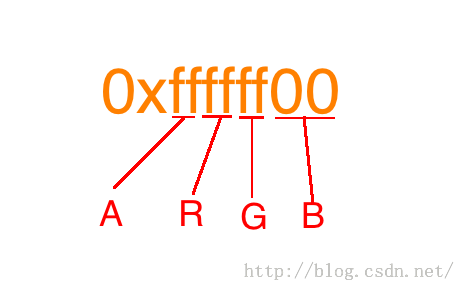

上一篇给大家介绍了 ValueAnimator 的大部分函数的用法，不过还都是些简单的用法，这篇我们带大家来看看有关加速器、animator 和 keyFrame 的知识。

## 一、插值器
插值器，也叫加速器；有关插值器的知识，我在《Animation 动画详解（二）——Interpolator 插值器》中专门讲过，大家可以先看看这篇文章中各个加速器的效果。
这里再讲一下什么是插值器。我们知道，我们通过 ofInt(0,400)定义了动画的区间值是 0 到 400；然后通过添加 AnimatorUpdateListener 来监听动画的实时变化。那么问题来了，0-400 的值是怎么变化的呢？像我们骑自行车，还有的快有的慢呢；这个值是匀速变化的吗？如果是，那我如果想让它先加速再减速的变化该怎么办？ 
这就是插值器的作用！插值器就是用来控制动画区间的值被如何计算出来的。比如 LinearInterpolator 插值器就是匀速返回区间点的值；而 DecelerateInterpolator 则表示开始变化快，后期变化慢；其它都类似，下面我们就看看 ValueAnimator 中插值器的应用方法，然后通过自定义一个插值器来看看插值器到底是什么。

### 1、使用插值器
我们就以 BounceInterpolator（弹跳插值器）为例做一个实验，BounceInterpolator 的解释是动画结束的时候弹起；我们来看一下效果： 


下面我们就来看一下利用 ValueAnimator 是如何实现的。布局和上一篇的都一样，这里就不再细讲了，我们着重来看一下，当点击 start anim 按钮以后是怎么做的，代码如下：

```
ValueAnimator animator = ValueAnimator.ofInt(0,600);  
  
animator.addUpdateListener(new ValueAnimator.AnimatorUpdateListener() {  
    @Override  
    public void onAnimationUpdate(ValueAnimator animation) {  
        int curValue = (int)animation.getAnimatedValue();  
        tv.layout(tv.getLeft(),curValue,tv.getRight(),curValue+tv.getHeight());  
    }  
});  
animator.setDuration(1000);  
animator.setInterpolator(new BounceInterpolator());  
animator.start(); 
```
 
如果大家已经看懂了上篇，这段代码就非常容易理解了，在监听中，我们只改变 textview 的 top 和 bottom 的位置，让它跟着当前动画的值来改变它当前的 top 和 bottom 的位置。然后我们利用 setDuration(1000)给它设置上做一次动画所需要的时长，然后通过 setInterpolator（）给它设置插值器，也就是过渡值变化的规则； 
从效果图中也可以看出，插值器的意义其实就相当于物理公式中的加速度参数，所以这也就是它也叫加速器的原因。 
源码在文章底部给出 
在学会了怎么使用加速器以后，我们来看看如何自定义一个加速器吧

### 2、自定义加速器
**1、概述**
在这段，我们就开始着手自己写一个加速器了，在写加速器之前，先看看人家的加速器是怎么写的吧。 
先看看 LinearInterpolator：

```
public class LinearInterpolator implements Interpolator {  
  
    public LinearInterpolator() {  
    }  
  
    public LinearInterpolator(Context context, AttributeSet attrs) {  
    }  
  
    public float getInterpolation(float input) {  
        return input;  
    }  
}  
public interface Interpolator extends TimeInterpolator {  
}
```
  
LinearInterpolator 实现了 Interpolator 接口；而 Interpolator 接口则直接继承自 TimeInterpolator，而且并没有添加任何其它的方法。 
那我们来看看 TimeInterpolator 接口都有哪些函数吧：

```
/** 
 * A time interpolator defines the rate of change of an animation. This allows animations 
 * to have non-linear motion, such as acceleration and deceleration. 
 */  
public interface TimeInterpolator {  
  
    /** 
     * Maps a value representing the elapsed fraction of an animation to a value that represents 
     * the interpolated fraction. This interpolated value is then multiplied by the change in 
     * value of an animation to derive the animated value at the current elapsed animation time. 
     * 
     * @param input A value between 0 and 1.0 indicating our current point 
     *        in the animation where 0 represents the start and 1.0 represents 
     *        the end 
     * @return The interpolation value. This value can be more than 1.0 for 
     *         interpolators which overshoot their targets, or less than 0 for 
     *         interpolators that undershoot their targets. 
     */  
    float getInterpolation(float input);  
}  
```

这里是 TimeInterpolator 的代码，它里面只有一个函数 float getInterpolation(float input);我们来讲讲这个函数是干什么的。 
**参数 input**:input 参数是一个 float 类型，它取值范围是 0 到 1，表示当前动画的进度，取 0 时表示动画刚开始，取 1 时表示动画结束，取 0.5 时表示动画中间的位置，其它类推。 
**返回值**：表示当前实际想要显示的进度。取值可以超过 1 也可以小于 0，超过 1 表示已经超过目标值，小于 0 表示小于开始位置。 
对于 input 参数，它表示的是当前动画的进度，匀速增加的。什么叫动画的进度，动画的进度就是动画在时间上的进度，与我们的任何设置无关，随着时间的增长，动画的进度自然的增加，从 0 到 1；input 参数相当于时间的概念，我们通过 setDuration()指定了动画的时长，在这个时间范围内，动画进度肯定是一点点增加的；就相当于我们播放一首歌，这首歌的进度是从 0 到 1 是一样的。 
而返回值则表示动画的数值进度，它的对应的数值范围是我们通过 ofInt(),ofFloat()来指定的，这个返回值就表示当前时间所对应的数值的进度。 
我们先看看下面这段代码：

```
ValueAnimator anim = ValueAnimator.ofInt(100, 400);    
anim.setDuration(1000);    
anim.addUpdateListener(new ValueAnimator.AnimatorUpdateListener() {    
    @Override    
    public void onAnimationUpdate(ValueAnimator animation) {    
        float currentValue = (float) animation.getAnimatedValue();    
        Log.d("TAG", "cuurent value is " + currentValue);    
    }    
});    
anim.start();  
```
  
我们知道，在我们添加了 AnimatorUpdateListener 的监听以后，通过在监听函数中调用 animation.getAnimatedValue()就可以得到当前的值； 
那当前的值是怎么来的呢？见下面的计算公式：（目前这么理解，后面会细讲真实情况） 
当前的值 = 100 + （400 - 100）* 显示进度 
其中 100 和 400 就是我们设置的 ofInt(100,400)中的值，这个公式应该是比较容易理解的，就相当于我们做一个应用题： 
小明从 100 的位置开始出发向 400 的位置开始跑去，在走到全程距离 20%位置时，请问小明在哪个数字点上？ 
当前的值 = 100 + （400 -100）* 0.2； 
很简单的应用题，ofInt()中 AnimatorUpdateListener 中的当前值就是这么来的。从这里大家可以看到，显示进度就表示的是当前的值的位置。但由于我们可以通过指定 getInterpolation()的返回值来指定当前的显示值的进度，所以随着时间的增加，我们可以让值随意在我们想让它在的位置。
**再重复一遍，input 参数与任何我们设定的值没关系，只与时间有关，随着时间的增长，动画的进度也自然的增加，input 参数就代表了当前动画的进度。而返回值则表示动画的当前数值进度 **
通过上面我们应该知道了 input 参数 getInterpolation()返回值的关系了，下面我们来看看 LinearInterpolator 是如何重写 TimeInterpolator 的：

```
public class LinearInterpolator implements Interpolator {  
  
    …………  
  
    public float getInterpolation(float input) {  
        return input;  
    }  
}  
```

从上面可以看到，LinearInterpolator 在 getInterpolation 函数中，直接把 input 值返回，即以当前动画的进度做为动画的数值进度，这也就表示当前动画的数值进度与动画的时间进度一致，比如，如果当前动画进度为 0，那动画的数值进度也是 0，那如果动画进度为 0.5，那动画的数值进度也是在 0.5，当动画结束，动画的进度就变成 1 了，而动画的数值进度也是 1 了。 
下面我们就用一个例子来讲一下如何自定义插值器。 
**2、示例**
从上面的讲解中也可以看到，我们自定义插值器，只需要实现 TimeInterpolator 接口就可以了：

```
public class MyInterploator implements TimeInterpolator {  
    @Override  
    public float getInterpolation(float input) {  
        return 1-input;  
    }  
} 
```
 
在 getInterpolation 函数中，我们将进度反转过来，当传 0 的时候，我们让它数值进度在完成的位置，当完成的时候，我们让它在开始的位置 
然后使用我们的插值器：

```
ValueAnimator animator = ValueAnimator.ofInt(0,600);  
  
animator.addUpdateListener(new ValueAnimator.AnimatorUpdateListener() {  
    @Override  
    public void onAnimationUpdate(ValueAnimator animation) {  
        int curValue = (int)animation.getAnimatedValue();  
        tv.layout(tv.getLeft(),curValue,tv.getRight(),curValue+tv.getHeight());  
    }  
});  
animator.setDuration(1000);  
animator.setInterpolator(new MyInterploator());  
animator.start(); 
```
 
这里使用自定义插值器的方法与使用普通插值器的方法是完全一样的，下面来看看效果：


从效果图中可见，我们将数值进度倒序返回——即随着动画进度的推进，动画的数值进度从结束位置进行到起始位置； 
到这里，想必大家应该已经理解了 getInterpolation(float input)函数中 input 参数与返回值的关系，在重写插值器时，需要强有力的数学知识做基础，一般而言，都是通过数学公式来计算插值器的变化趋势的，大家可以再分析分析其它几个插值器的写法；可以把它他们总结成公式，放到公式画图软件里，看看对应的数学图在(0,1)之间的走向，这个走向就是插值器在数值变化时的样子。 

源码在文章底部给出

## 二、Evaluator

### 1、概述
我们先不讲什么是 Evaluator，我们先来看一张图： 


这幅图讲述了从定义动画的数字区间到通过 AnimatorUpdateListener 中得到当前动画所对应数值的整个过程。下面我们对这四个步骤具体讲解一下： 
(1)、ofInt(0,400)表示指定动画的数字区间，是从 0 运动到 400； 
(2)、加速器：上面我们讲了，在动画开始后，通过加速器会返回当前动画进度所对应的数字进度，但这个数字进度是百分制的，以小数表示，如 0.2 
(3)、Evaluator:我们知道我们通过监听器拿到的是当前动画所对应的具体数值，而不是百分制的进度。那么就必须有一个地方会根据当前的数字进度，将其转化为对应的数值，这个地方就是 Evaluator；Evaluator 就是将从加速器返回的数字进度转成对应的数字值。所以上部分中，我们讲到的公式：

[java] view plain
当前的值 = 100 + （400 - 100）* 显示进度  
这个公式就是在 Evaluator 计算的；在拿到当前数字进度所对应的值以后，将其返回 
（4）、监听器：我们通过在 AnimatorUpdateListener 监听器使用 animation.getAnimatedValue()函数拿到 Evaluator 中返回的数字值。 
讲了这么多，Evaluator **其实就是一个转换器，他能把小数进度转换成对应的数值位置**

### 2、各种 Evaluator
首先，加速器返回的小数值，表示的是当前动画的数值进度。无论是利用 ofFloat()还是利用 ofInt()定义的动画都是适用的。因为无论是什么动画，它的进度必然都是在 0 到 1 之间的。0 表示没开始，1 表示数值运动的结束，对于任何动画都是适用的。 
但 Evaluator 则不一样，我们知道 Evaluator 是根据加速器返回的小数进度转换成当前数值进度所对应的值。这问题就来了，如果我们使用 ofInt()来定义动画，动画中的值应该都是 Int 类型，如果我用 ofFloat()来定义动画，那么动画中的值也都是 Float 类型。所以如果我用 ofInt()来定义动画，所对应的 Evaluator 在返回值时，必然要返回 Int 类型的值。同样，我们如果用 ofFloat 来定义动画，那么 Evaluator 在返回值时也必然返回的是 Float 类型的值。 
所以每种定义方式所对应的 Evaluator 必然是它专用的；Evaluator 专用的原因在于动画数值类型不一样，在通过 Evaluator 返回时会报强转错误；所以只有在动画数值类型一样时，所对应的 Evaluator 才能通用。所以 ofInt()对应的 Evaluator 类名叫 IntEvaluator,而 ofFloat()对应的 Evaluator 类名叫 FloatEvaluator； 
在设置 Evaluator 时，是通过 animator.setEvaluator()来设置的，比如：

```
ValueAnimator animator = ValueAnimator.ofInt(0,600);  
  
animator.addUpdateListener(new ValueAnimator.AnimatorUpdateListener() {  
    @Override  
    public void onAnimationUpdate(ValueAnimator animation) {  
        int curValue = (int)animation.getAnimatedValue();  
        tv.layout(tv.getLeft(),curValue,tv.getRight(),curValue+tv.getHeight());  
    }  
});  
animator.setDuration(1000);  
animator.setEvaluator(new IntEvaluator());  
animator.setInterpolator(new BounceInterpolator());  
animator.start(); 
```
 
但大家会说了，在此之前，我们在使用 ofInt()时，从来没有给它定义过使用 IntEvaluator 来转换值啊，那怎么也能正常运行呢？因为 ofInt 和 ofFloat 都是系统直接提供的函数，所以在使用时都会有默认的加速器和 Evaluator 来使用的，不指定则使用默认的；对于 Evaluator 而言，ofInt()的默认 Evaluator 当然是 IntEvaluator;而 FloatEvalutar 默认的则是 FloatEvalutor; 
上面，我们已经弄清楚 Evaluator 定义和使用方法，下面我们就来看看 IntEvaluator 内部是怎么实现的吧：

```
/** 
 * This evaluator can be used to perform type interpolation between <code>int</code> values. 
 */  
public class IntEvaluator implements TypeEvaluator<Integer> {  
  
    /** 
     * This function returns the result of linearly interpolating the start and end values, with 
     * <code>fraction</code> representing the proportion between the start and end values. The 
     * calculation is a simple parametric calculation: <code>result = x0 + t * (v1 - v0)</code>, 
     * where <code>x0</code> is <code>startValue</code>, <code>x1</code> is <code>endValue</code>, 
     * and <code>t</code> is <code>fraction</code>. 
     * 
     * @param fraction   The fraction from the starting to the ending values 
     * @param startValue The start value; should be of type <code>int</code> or 
     *                   <code>Integer</code> 
     * @param endValue   The end value; should be of type <code>int</code> or <code>Integer</code> 
     * @return A linear interpolation between the start and end values, given the 
     *         <code>fraction</code> parameter. 
     */  
    public Integer evaluate(float fraction, Integer startValue, Integer endValue) {  
        int startInt = startValue;  
        return (int)(startInt + fraction * (endValue - startInt));  
    }  
} 
```
 
可以看到在 IntEvaluator 中只有一个函数(float fraction, Integer startValue, Integer endValue) ； 
其中 fraction 就是加速器中的返回值，表示当前动画的数值进度，百分制的小数表示。 
startValue 和 endValue 分别对应 ofInt(int start,int end)中的 start 和 end 的数值； 
比如我们假设当我们定义的动画 ofInt(100,400)进行到数值进度 20%的时候，那么此时在 evaluate 函数中，fraction 的值就是 0.2，startValue 的值是 100，endValue 的值是 400；理解上应该没什么难度。 
下面我们就来看看 evaluate(float fraction, Integer startValue, Integer endValue) 是如何根据进度小数值来计算出具体数字的：

```
return (int)(startInt + fraction * (endValue - startInt));
```
  
大家对这个公式是否似曾相识？我们前面提到的公式：

```
当前的值 = 100 + （400 - 100）* 显示进度  
```

是不是与这个公式完全一样？是的，绝逼完全一样啊，计算原理我们在上面已经讲过了，而且根据进度来计算当前数字值本来就是这么算的…… 
在我们看懂了 IntEvalutor 以后，下面我们尝试自己写一个 Evalutor

### 3、自定义 Evalutor
**（1）、简单实现 MyEvalutor**
前面我们看了 IntEvalutor 的代码，我们仿照 IntEvalutor 的实现方法，我们自定义一个 MyEvalutor: 
首先是实现 TypeEvaluator 接口：

```
public class MyEvaluator implements TypeEvaluator<Integer> {  
    @Override  
    public Integer evaluate(float fraction, Integer startValue, Integer endValue) {  
        return null;  
    }  
}  
```

这里涉及到泛型的概念，不理解的同学可以去看看《夯实 JAVA 基本之一 —— 泛型详解(1):基本使用》 
在实现 TypeEvaluator，我们给它指定它的返回是 Integer 类型，这样我们就可以在 ofInt()中使用这个 Evaluator 了。再说一遍原因：只有定义动画时的数值类型与 Evalutor 的返回值类型一样时，才能使用这个 Evalutor；很显然 ofInt()定义的数值类型是 Integer 而我们定义的 MyEvaluator，它的返回值类型也是 Integer；所以我们定义的 MyEvaluator 可以给 ofInt（）来用。同理，如果我们把实现的 TypeEvaluator 填充为为 Float 类型，那么这个 Evalutor 也就只能给 FloatEvalutor 用了。 
屁话了那么多，现在转入正题，我们来简单实现 evaluate 函数，代码如下：

```
public class MyEvaluator implements TypeEvaluator<Integer> {  
    @Override  
    public Integer evaluate(float fraction, Integer startValue, Integer endValue) {  
        int startInt = startValue;  
        return (int)(200+startInt + fraction * (endValue - startInt));  
    }  
}  
```

我们在 IntEvaluator 的基础上修改了下，让它返回值时增加了 200；所以当我们定义的区间是 ofInt(0,400)时，它的实际返回值区间应该是(200,600) 
我们看看 MyEvaluator 的使用：

```
ValueAnimator animator = ValueAnimator.ofInt(0,400);  
  
animator.addUpdateListener(new ValueAnimator.AnimatorUpdateListener() {  
    @Override  
    public void onAnimationUpdate(ValueAnimator animation) {  
        int curValue = (int)animation.getAnimatedValue();  
        tv.layout(tv.getLeft(),curValue,tv.getRight(),curValue+tv.getHeight());  
    }  
});  
animator.setDuration(1000);  
animator.setEvaluator(new MyEvaluator());  
animator.start(); 
```
 
设置 MyEvaluator 前的动画效果： 


然后再看看我们设置了 MyEvaluator 以后的效果：


很明显，textview 的动画位置都向下移动了 200 个点； 
再重新看一下下面的这个流程图：


在加速器中，我们可以通过自定义加速器的返回的数值进度来改变返回数值的位置。比如上面我们实现的倒序动画 
在 Evaluator 中，我们又可以通过改变进度值所对应的具体数字来改变数值的位置。 
所以，结论来了： 
**我们可以通过重写加速器改变数值进度来改变数值位置，也可以通过改变 Evaluator 中进度所对应的数值来改变数值位置。 **

源码在文章底部给出 

下面我们就只通过重写 Evaluator 来实现数值的倒序输出； 
**（2）、实现倒序输出实例**
我们自定义一个 ReverseEvaluator:

```
public class ReverseEvaluator implements TypeEvaluator<Integer> {  
    @Override  
    public Integer evaluate(float fraction, Integer startValue, Integer endValue) {  
        int startInt = startValue;  
        return (int) (endValue - fraction * (endValue - startInt));  
    }  
} 
```
 
其中 fraction * (endValue - startInt)表示动画实际运动的距离，我们用 endValue 减去实际运动的距离就表示随着运动距离的增加，离终点越来越远，这也就实现了从终点出发，最终运动到起点的效果了。 
使用方法：

```
ValueAnimator animator = ValueAnimator.ofInt(0,400);  
  
animator.addUpdateListener(new ValueAnimator.AnimatorUpdateListener() {  
    @Override  
    public void onAnimationUpdate(ValueAnimator animation) {  
        int curValue = (int)animation.getAnimatedValue();  
        tv.layout(tv.getLeft(),curValue,tv.getRight(),curValue+tv.getHeight());  
    }  
});  
animator.setDuration(1000);  
animator.setEvaluator(new ReverseEvaluator());  
animator.start(); 
```
 
效果图： 


源码在文章底部给出

### 4、关于 ArgbEvalutor
**1、使用 ArgbEvalutor**
我们上面讲了 IntEvaluator 和 FloatEvalutor，还说了 Evalutor 一般来讲不能通用，会报强转错误，也就是说，只有在数值类型相同的情况下，Evalutor 才能共用。 
其实除了 IntEvaluator 和 FloatEvalutor，在 android.animation 包下，还有另外一个 Evalutor 叫 ArgbEvalutor。 
ArgbEvalutor 是用来做颜色值过渡转换的。可能是谷歌的开发人员觉得大家对颜色值变换可能并不知道要怎么做，所以特地给我们提供了这么一个过渡 Evalutor； 
我们先来简单看一下 ArgbEvalutor 的源码：（这里先不做具体讲解原理，最后会讲原理，这里先会用）

```
public class ArgbEvaluator implements TypeEvaluator {  
    public Object evaluate(float fraction, Object startValue, Object endValue) {  
        int startInt = (Integer) startValue;  
        int startA = (startInt >> 24);  
        int startR = (startInt >> 16) & 0xff;  
        int startG = (startInt >> 8) & 0xff;  
        int startB = startInt & 0xff;  
  
        int endInt = (Integer) endValue;  
        int endA = (endInt >> 24);  
        int endR = (endInt >> 16) & 0xff;  
        int endG = (endInt >> 8) & 0xff;  
        int endB = endInt & 0xff;  
  
        return (int)((startA + (int)(fraction * (endA - startA))) << 24) |  
                (int)((startR + (int)(fraction * (endR - startR))) << 16) |  
                (int)((startG + (int)(fraction * (endG - startG))) << 8) |  
                (int)((startB + (int)(fraction * (endB - startB))));  
    }  
}
```
  
我们在这里关注两个地方，第一返回值是 int 类型，这说明我们可以使用 ofInt()来初始化动画数值范围。第二：颜色值包括 A,R,G,B 四个值，每个值是 8 位所以用 16 进制表示一个颜色值应该是 0xffff0000（纯红色） 
下面我们就使用一下 ArgbEvaluator，并看看效果：

```
ValueAnimator animator = ValueAnimator.ofInt(0xffffff00,0xff0000ff);  
animator.setEvaluator(new ArgbEvaluator());  
animator.setDuration(3000);  
  
animator.addUpdateListener(new ValueAnimator.AnimatorUpdateListener() {  
    @Override  
    public void onAnimationUpdate(ValueAnimator animation) {  
        int curValue = (int)animation.getAnimatedValue();  
        tv.setBackgroundColor(curValue);  
  
    }  
});  
  
animator.start(); 
```
 
在这段代码中，我们将动画的数据范围定义为(0xffffff00,0xff0000ff)，即从黄色，变为蓝色。 
在监听中，我们根据当前传回来的颜色值，将其设置为 textview 的背景色 
我们来看一下效果： 


源码在文章底部给出 
到这里，我们就已经知道 ArgbEvalutor 的使用方法和效果了，下面我们再来回头看看 ArgbEvalutor 的实现方法 

**2、ArgbEvalutor 的实现原理**
先重新看源码：

```
/** 
 * This evaluator can be used to perform type interpolation between integer 
 * values that represent ARGB colors. 
 */  
public class ArgbEvaluator implements TypeEvaluator {  
  
    /** 
     * This function returns the calculated in-between value for a color 
     * given integers that represent the start and end values in the four 
     * bytes of the 32-bit int. Each channel is separately linearly interpolated 
     * and the resulting calculated values are recombined into the return value. 
     * 
     * @param fraction The fraction from the starting to the ending values 
     * @param startValue A 32-bit int value representing colors in the 
     * separate bytes of the parameter 
     * @param endValue A 32-bit int value representing colors in the 
     * separate bytes of the parameter 
     * @return A value that is calculated to be the linearly interpolated 
     * result, derived by separating the start and end values into separate 
     * color channels and interpolating each one separately, recombining the 
     * resulting values in the same way. 
     */  
    public Object evaluate(float fraction, Object startValue, Object endValue) {  
        int startInt = (Integer) startValue;  
        int startA = (startInt >> 24);  
        int startR = (startInt >> 16) & 0xff;  
        int startG = (startInt >> 8) & 0xff;  
        int startB = startInt & 0xff;  
  
        int endInt = (Integer) endValue;  
        int endA = (endInt >> 24);  
        int endR = (endInt >> 16) & 0xff;  
        int endG = (endInt >> 8) & 0xff;  
        int endB = endInt & 0xff;  
  
        return (int)((startA + (int)(fraction * (endA - startA))) << 24) |  
                (int)((startR + (int)(fraction * (endR - startR))) << 16) |  
                (int)((startG + (int)(fraction * (endG - startG))) << 8) |  
                (int)((startB + (int)(fraction * (endB - startB))));  
    }  
}  
```

英文注释的那一坨大家有兴趣，可以看已看看，我这里就直接讲代码了 
这段代码分为三部分，第一部分根据 startValue 求出其中 A,R,G,B 中各个色彩的初始值；第二部分根据 endValue 求出其中 A,R,G,B 中各个色彩的结束值，最后是根据当前动画的百分比进度求出对应的数值 
我们先来看第一部分：根据 startValue 求出其中 A,R,G,B 中各个色彩的初始值

```
int startInt = (Integer) startValue;  
int startA = (startInt >> 24);  
int startR = (startInt >> 16) & 0xff;  
int startG = (startInt >> 8) & 0xff;  
int startB = startInt & 0xff;
```
  
这段代码就是根据位移和与运算求出颜色值中 A,R,G,B 各个部分对应的值;颜色值与 ARGB 值的对应关系如下： 



所以我们的初始值是 0xffffff00,那么求出来的 startA = 0xff,startR = oxff,startG = 0xff,startB = 0x00; 
关于通过位移和与运算如何得到指定位的值的问题，我就不再讲了，大家如果不理解，可以搜一下相关运算符使用方法的文章。 
同样，我们看看第二部分根据 endValue 求出其中 A,R,G,B 中各个色彩的结束值：

```
int endInt = (Integer) endValue;  
int endA = (endInt >> 24);  
int endR = (endInt >> 16) & 0xff;  
int endG = (endInt >> 8) & 0xff;  
int endB = endInt & 0xff;  
```

原理与 startValue 求 A,R,G,B 对应值的一样，所以对于我们上面例子中初始值 ofInt(0xffffff00,0xff0000ff)中的 endValue:0xff0000ff 所对应的 endA = 0xff,endR = ox00;endG = 0x00;endB = 0xff; 
最后一部分到了，就是如何根据进度来求得变化的值，我们先看看下面这句是什么意思：

```
startA + (int)(fraction * (endA - startA)))  
```

对于这个公式大家应该很容易理解，与 IntEvaluator 中的计算公式一样，就是根据透明度 A 的初始值、结束值求得当前进度下透明度 A 应该的数值。 
同理 
startR + (int)(fraction * (endR - startR)表示当前进度下的红色值 
startG + (int)(fraction * (endG - startG))表示当前进度下的绿色值 
startB + (int)(fraction * (endB - startB))表示当前进度下的蓝色值 
然后通过位移和或运算将当前进度下的 A,R,G,B 组合起来就是当前的颜色值了。

好了，到这里，有关加速器和 Evaluator 的知识就讲完了，对于 ValueAnimator 还有一些知识没来得及讲，这篇文章已经很长了，就另开一篇来讲解吧

如果本文有帮到你，记得加关注哦

源码下载地址：

csdn:http://download.csdn.net/detail/u013210620/9420356
github:https://github.com/harvic/BlogResForGitHub

请大家尊重原创者版权，转载请标明出处： http://blog.csdn.net/harvic880925/article/details/50546884 谢谢