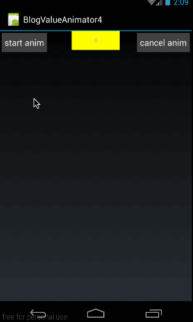
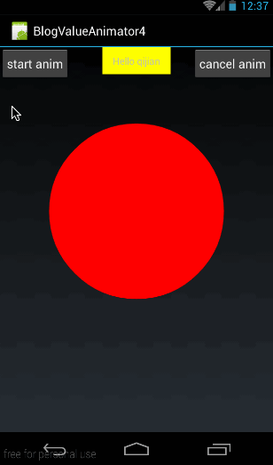

通过上两篇的讲解，我们对 ValueAnimator 的动画的整个过程应该都已经有较深入的理解，不过还有两个概念我们还没有讲解关键帧和 ofObject()，关键帧的部分涉及问题比较多，我们将其放在系列的末尾再讲，这篇着重讲一下 ofObject 函数的使用

## 一、ofObject()概述
前面我们讲了 ofInt()和 ofFloat()来定义动画，但 ofInt()只能传入 Integer 类型的值，而 ofFloat（）则只能传入 Float 类型的值。那如果我们需要操作其它类型的变量要怎么办呢？其实 ValueAnimator 还有一个函数 ofObject(),可以传进去任何类型的变量，定义如下：

```
public static ValueAnimator ofObject(TypeEvaluator evaluator, Object... values);  
```

它有两个参数，第一个是自定义的 Evaluator，第二个是可变长参数，Object 类型的； 
大家可能会疑问，为什么要强制传进去自定义的 Evaluator？首先，大家知道 Evaluator 的作用是根据当前动画的显示进度，计算出当前进度下把对应的值。那既然 Object 对象是我们自定的，那必然从进度到值的转换过程也必须由我们来做，不然系统哪知道你要转成个什么鬼。 
好了，现在我们先简单看一下 ofObject 这个怎么用。 
我们先来看看我们要实现的效果： 



从效果图中可以看到，按钮上的字母从 A 变化到 Z,刚开始变的慢，后来逐渐加速；

```
ValueAnimator animator = ValueAnimator.ofObject(new CharEvaluator(),new Character('A'),new Character('Z'));  
animator.addUpdateListener(new ValueAnimator.AnimatorUpdateListener() {  
    @Override  
    public void onAnimationUpdate(ValueAnimator animation) {  
        char text = (char)animation.getAnimatedValue();  
        tv.setText(String.valueOf(text));  
    }  
});  
animator.setDuration(10000);  
animator.setInterpolator(new AccelerateInterpolator());  
animator.start();  
```

这里注意三点： 
**第一，构造时：**

```
ValueAnimator animator = ValueAnimator.ofObject(new CharEvaluator(),new Character('A'),new Character('Z')); 
```
 
我们自定义的一个 CharEvaluator，这个类实现，后面会讲；在初始化动画时，传进去的是 Character 对象，一个是字母 A,一个是字母 Z; 
我们这里要实现的效果是，对 Character 对象来做动画，利用动画自动从字母 A 变到字母 Z，具体怎么实现就是 CharEvaluator 的事了，这里我们只需要知道，在构造时传进去的是两个 Character 对象 
**第二：看监听：**

```
char text = (char)animation.getAnimatedValue();  
tv.setText(String.valueOf(text));  
```

通过 animation.getAnimatedValue()得到当前动画的字符，然后把字符设置给 textview；大家知道我们构造时传进去的值类型是 Character 对象，所以在动画过程中通过 Evaluator 返回的值类型必然跟构造时的类型是一致的，也是 Character 
**第三：插值器**

```
animator.setInterpolator(new AccelerateInterpolator());  
```

我们使用的是加速插值器，加速插值器的特点就是随着动画的进行，速度会越来越快，这点跟我们上面的效果图是一致的。 
下面最关键的就是看 CharEvaluator 是怎么实现的了，先抛开的代码，我们先讲一个点，ASCII 码中数值与字符的转换方法。 
我们知道在 ASCII 码表中，每个字符都是有数字跟他一一对应的，字母 A 到字母 Z 之间的所有字母对应的数字区间为 65 到 90； 
而且在程序中，我们能通过数字强转成对应的字符。 
比如： 
**数字转字符:**

```
char  temp = (char)65;//得到的 temp 的值就是大写字母 A  
```

**字符转数字：**

```
char temp = 'A';  
int num = (int)temp; 
```
 
在这里得到的 num 值就是对应的 ASCII 码值 65； 
好了，在我们理解了 ASCII 码数值与对应字符的转换原理之后，再来看看 CharEvaluator 的实现：

```
public class CharEvaluator implements TypeEvaluator<Character> {  
    @Override  
    public Character evaluate(float fraction, Character startValue, Character endValue) {  
        int startInt  = (int)startValue;  
        int endInt = (int)endValue;  
        int curInt = (int)(startInt + fraction *(endInt - startInt));  
        char result = (char)curInt;  
        return result;  
    }  
}  
```

在这里，我们就利用 A-Z 字符在 ASCII 码表中对应数字是连续且递增的原理，先求出来对应字符的数字值，然后再转换成对应的字符。代码难度不大，就不再细讲了。 
源码在文章底部给出 
好了，到这里，有关 ofObject()的使用大家应该就会了，上面我们说过，ofObject()能够初始化任何对象，下面我们就稍微加深些难度， 我们自定义一个类对象，然后利用 ofObject()来构造这个对象的动画。

## 二、ofObject 之自定义对象示例
我们先看看这部分，我们将实现的效果： 



在这里，我们自定义了一个 View，在这个 view 上画一个圆，但这个圆是有动画效果的。从效果中可以看出使用的插值器应该是回弹插值器（BounceInterpolator） 
下面就来看看这个动画是怎么做出来的

### 1、首先，我们自定义一个类 Point:

```
public class Point {  
    private int radius;  
  
    public Point(int radius){  
        this.radius = radius;  
    }  
  
    public int getRadius() {  
        return radius;  
    }  
  
    public void setRadius(int radius) {  
        this.radius = radius;  
    }  
} 
```
 
point 类内容很简单，只有一个成员变量：radius 表示当前 point 的半径。

### 2、然后我们自定义一个 View:MyPointView

```
public class MyPointView extends View {  
    private Point mCurPoint;  
    public MyPointView(Context context, AttributeSet attrs) {  
        super(context, attrs);  
    }  
  
    @Override  
    protected void onDraw(Canvas canvas) {  
        super.onDraw(canvas);  
        if (mCurPoint != null){  
            Paint paint = new Paint();  
            paint.setAntiAlias(true);  
            paint.setColor(Color.RED);  
            paint.setStyle(Paint.Style.FILL);  
            canvas.drawCircle(300,300,mCurPoint.getRadius(),paint);  
        }  
    }  
  
    public void doPointAnim(){  
        ValueAnimator animator = ValueAnimator.ofObject(new PointEvaluator(),new Point(20),new Point(200));  
        animator.addUpdateListener(new ValueAnimator.AnimatorUpdateListener() {  
            @Override  
            public void onAnimationUpdate(ValueAnimator animation) {  
                mCurPoint = (Point)animation.getAnimatedValue();  
                invalidate();  
            }  
        });  
        animator.setDuration(1000);  
        animator.setInterpolator(new BounceInterpolator());  
        animator.start();  
    }  
}
```
  
**（1）、doPointAnim()函数**
在这段代码中，首先来看看供外部调用开始动画的 doPointAnim()函数：

```
public void doPointAnim(){  
    ValueAnimator animator = ValueAnimator.ofObject(new PointEvaluator(),new Point(20),new Point(200));  
    animator.addUpdateListener(new ValueAnimator.AnimatorUpdateListener() {  
        @Override  
        public void onAnimationUpdate(ValueAnimator animation) {  
            mCurPoint = (Point)animation.getAnimatedValue();  
            invalidate();  
        }  
    });  
    animator.setDuration(1000);  
    animator.setInterpolator(new BounceInterpolator());  
    animator.start();  
}  
```

同样，先来看 ofObject 的构造动画的方法：

```
ValueAnimator animator = ValueAnimator.ofObject(new PointEvaluator(),new Point(20),new Point(200));  
```

在构造动画时，动画所对应的值的类型是 Point 对象，那说明我们自定义的 PointEvaluator 中的返回值也必然是 Point 了。有关 PointEvaluator 的实现后面再讲 
然后再来看看动画过程监听：

```
animator.addUpdateListener(new ValueAnimator.AnimatorUpdateListener() {  
    @Override  
    public void onAnimationUpdate(ValueAnimator animation) {  
        mCurPoint = (Point)animation.getAnimatedValue();  
        invalidate();  
    }  
});  
```

在监听过程中，先根据 animation.getAnimatedValue()得到当前动画进度所对应的 Point 实例，保存在 mCurPoint 中，然后强制刷新 
**（2）、OnDraw()函数**
在强制刷新之后，就会走到 OnDraw()函数下面：

```
protected void onDraw(Canvas canvas) {  
    super.onDraw(canvas);  
    if (mCurPoint != null){  
        Paint paint = new Paint();  
        paint.setAntiAlias(true);  
        paint.setColor(Color.RED);  
        paint.setStyle(Paint.Style.FILL);  
        canvas.drawCircle(300,300,mCurPoint.getRadius(),paint);  
    }  
} 
```
 
onDraw 函数没什么难度，就是根据 mCurPoint 的半径在（300,300）的位置画出来圆形，有关绘图的知识大家可以参考另一个系列《android Graphics（一）：概述及基本几何图形绘制》 
**(3)、PointEvaluator**
在构造 ofObject 中，我们也可以知道，初始值和动画中间值的类型都是 Point 类型，所以 PointEvaluator 输入的返回类型都应该是 Point 类型的，先看看 PointEvaluator 的完整代码：

```
public class PointEvaluator implements TypeEvaluator<Point> {  
    @Override  
    public Point evaluate(float fraction, Point startValue, Point endValue) {  
        int start = startValue.getRadius();  
        int end  = endValue.getRadius();  
        int curValue = (int)(start + fraction * (end - start));  
        return new Point(curValue);  
    }  
} 
```
 
这段代码其实比较容易理解，就是根据初始半径和最终半径求出当前动画进程所对应的半径值，然后新建一个 Point 对象返回。

## 3、使用 MyPointView
首先在 main.xml 中添加对应的控件布局：从效果图中也可以看到，我们将 MyPointView 是布局在最下方的，布局代码如下：

```
<?xml version="1.0" encoding="utf-8"?>  
<RelativeLayout xmlns:android="http://schemas.android.com/apk/res/android"  
                android:orientation="vertical"  
                android:layout_width="fill_parent"  
                android:layout_height="fill_parent">  
  
    <Button  
            android:id="@+id/btn"  
            android:layout_width="wrap_content"  
            android:layout_height="wrap_content"  
            android:layout_alignParentLeft="true"  
            android:padding="10dp"  
            android:text="start anim"  
            />  
  
    <Button  
            android:id="@+id/btn_cancel"  
            android:layout_width="wrap_content"  
            android:layout_height="wrap_content"  
            android:layout_alignParentRight="true"  
            android:padding="10dp"  
            android:text="cancel anim"  
            />  
    <TextView  
            android:id="@+id/tv"  
            android:layout_width="100dp"  
            android:layout_height="wrap_content"  
            android:layout_centerHorizontal="true"  
            android:gravity="center"  
            android:padding="10dp"  
            android:background="#ffff00"  
            android:text="Hello qijian"/>  
  
    <com.harvic.BlogValueAnimator4.MyPointView  
            android:id="@+id/pointview"  
            android:layout_below="@id/tv"  
            android:layout_width="match_parent"  
            android:layout_height="match_parent"/>  
</RelativeLayout> 
```
 
其实也没什么难度，就是在原来的布局代码下面加一个 MyPointView 控件，难度不大，不再细讲了 
然后我们来看看在 MyActivity.java 中是怎么来用的吧

```
public class MyActivity extends Activity {  
    private Button btnStart;  
    private MyPointView mPointView;  
  
    @Override  
    public void onCreate(Bundle savedInstanceState) {  
        super.onCreate(savedInstanceState);  
        setContentView(R.layout.main);  
  
        btnStart = (Button) findViewById(R.id.btn);  
        mPointView = (MyPointView)findViewById(R.id.pointview);  
  
        btnStart.setOnClickListener(new View.OnClickListener() {  
            @Override  
            public void onClick(View v) {  
                mPointView.doPointAnim();  
            }  
        });  
    }  
} 
```
 
这段代码没什么难度，就是在点击 start anim 按钮的时候，调用 mPointView.doPointAnim()方法开始动画。 

源码在文章底部给出 

好了，这篇到这里就结束了，其实没想再开这一篇单独来讲 ofObject 的，但上篇实在是太长了，所以只能再开一篇，这篇讲了两个实例，确实有些唠叨，毕竟开了一篇还是要多写点，不然也太辜负这一篇文章的地了。就此，有关 VauleAnimator 的所有问题我们都讲完了，下一篇讲会讲述有关 ObjectAnimator 系列的知识。

如果本文有帮到你，记得加关注哦

源码下载地址：

csdn:http://download.csdn.net/detail/u013210620/9420359

github:https://github.com/harvic/BlogResForGitHub

请大家尊重原创者版权，转载请标明出处：http://blog.csdn.net/harvic880925/article/details/50549385 谢谢