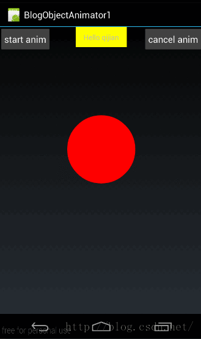

## 一、概述

### 1、引入
上几篇给大家讲了 ValueAnimator，但 ValueAnimator 有个缺点，就是只能对数值对动画计算。我们要想对哪个控件操作，需要监听动画过程，在监听中对控件操作。这样使用起来相比补间动画而言就相对比较麻烦。 
为了能让动画直接与对应控件相关联，以使我们从监听动画过程中解放出来，谷歌的开发人员在 ValueAnimator 的基础上，又派生了一个类 ObjectAnimator; 
由于 ObjectAnimator 是派生自 ValueAnimator 的，所以 ValueAnimator 中所能使用的方法，在 ObjectAnimator 中都可以正常使用。 
但 ObjectAnimator 也重写了几个方法，比如 ofInt(),ofFloat()等。我们先看看利用 ObjectAnimator 重写的 ofFloat 方法如何实现一个动画：（改变透明度）

```
ObjectAnimator animator = ObjectAnimator.ofFloat(tv,"alpha",1,0,1);  
animator.setDuration(2000);  
animator.start(); 
```
 
效果图如下：


我们这里还是直接使用上一篇的框架代码;（当点击 start anim 时执行动画）从上面的代码中可以看到构造 ObjectAnimator 的方法非常简单：

```
public static ObjectAnimator ofFloat(Object target, String propertyName, float... values) 
```
  
- 第一个参数用于指定这个动画要操作的是哪个控件
- 第二个参数用于指定这个动画要操作这个控件的哪个属性
- 第三个参数是可变长参数，这个就跟 ValueAnimator 中的可变长参数的意义一样了，就是指这个属性值是从哪变到哪。像我们上面的代码中指定的就是将 textview 的 alpha 属性从 0 变到 1 再变到 0；
下面我们再来看一下如何实现旋转效果：

```
ObjectAnimator animator = ObjectAnimator.ofFloat(tv,"rotation",0,180,0);  
animator.setDuration(2000);  
animator.start();
```
  
效果图如下：


从代码中可以看到，我们只需要改变 ofFloat()的第二个参数的值就可以实现对应的动画； 
那么问题来了，我们怎么知道第二个参数的值是啥呢？

### 2、setter 函数
我们再回来看构造改变 rotation 值的 ObjectAnimator 的方法

```
ObjectAnimator animator = ObjectAnimator.ofFloat(tv,"rotation",0,180,0);
```
  
TextView 控件有 rotation 这个属性吗？没有，不光 TextView 没有，连它的父类 View 中也没有这个属性。那它是怎么来改变这个值的呢？其实，ObjectAnimator 做动画，并不是根据控件 xml 中的属性来改变的，而是通过指定属性所对应的 set 方法来改变的。比如，我们上面指定的改变 rotation 的属性值，ObjectAnimator 在做动画时就会到指定控件（TextView）中去找对应的 setRotation()方法来改变控件中对应的值。同样的道理，当我们在最开始的示例代码中，指定改变”alpha”属性值的时候，ObjectAnimator 也会到 TextView 中去找对应的 setAlpha()方法。那 TextView 中都有这些方法吗，有的，这些方法都是从 View 中继承过来的，在 View 中有关动画，总共有下面几组 set 方法：

```
//1、透明度：alpha  
public void setAlpha(float alpha)  
  
//2、旋转度数：rotation、rotationX、rotationY  
public void setRotation(float rotation)  
public void setRotationX(float rotationX)  
public void setRotationY(float rotationY)  
  
//3、平移：translationX、translationY  
public void setTranslationX(float translationX)   
public void setTranslationY(float translationY)  
  
//缩放：scaleX、scaleY  
public void setScaleX(float scaleX)  
public void setScaleY(float scaleY) 
```
 
可以看到在 View 中已经实现了有关 alpha,rotaion,translate,scale 相关的 set 方法。所以我们在构造 ObjectAnimator 时可以直接使用。 
在开始逐个看这些函数的使用方法前，我们先做一个总结： 
1、要使用 ObjectAnimator 来构造对画，要操作的控件中，必须存在对应的属性的 set 方法 
2、setter 方法的命名必须以骆驼拼写法命名，即 set 后每个单词首字母大写，其余字母小写，即类似于 setPropertyName 所对应的属性为 propertyName 
下面我们就来看一下上面中各个方法的使用方法及作用。 
有关 alpha 的用法，上面已经讲过了，下面我们来看看其它的 

**(1)、setRotationX、setRotationY 与 setRotation**
- setRotationX(float rotationX)：表示围绕 X 轴旋转，rotationX 表示旋转度数 
- setRotationY(rotationY):表示围绕 Y 轴旋转，rotationY 表示旋转度数 
- setRotation(float rotation):表示围绕 Z 旋转,rotation 表示旋转度数 

先来看看 setRotationX 的效果：

```
ObjectAnimator animator = ObjectAnimator.ofFloat(tv,"rotationX",0,270,0);  
animator.setDuration(2000);  
animator.start();
```
  
效果图如下： 


从效果图中明显看出，textview 的旋转方法是围绕 X 轴旋转的，我们设定为从 0 度旋转到 270 度再返回 0 度。 
然后再来看看 setRotationY 的使用方法与效果：

```
ObjectAnimator animator = ObjectAnimator.ofFloat(tv,"rotationY",0,180,0);  
animator.setDuration(2000);  
animator.start();
```
  
效果图如下： 


从效果图中明显可以看出围绕 Y 轴旋转的。 
我们再来看看 setRotation 的用法与效果：

```
ObjectAnimator animator = ObjectAnimator.ofFloat(tv,"rotation",0,270,0);  
animator.setDuration(2000);  
animator.start();  
```


我们上面说了，setRotation 是围绕 Z 轴旋转的，可能有些同学不理解什么是 Z 轴，我们来看一张图： 


从这张图中，绿色框部分表示手机屏幕，很明显可以看出 Z 轴就是从屏幕左上角原点向外伸出的一条轴。这样，我们也就可以理解围绕 Z 轴旋转，为什么是这样子转了。 

**（2）、setTranslationX 与 setTranslationY**
- setTranslationX(float translationX) :表示在 X 轴上的平移距离,以当前控件为原点，向右为正方向，参数 translationX 表示移动的距离。 
- setTranslationY(float translationY) :表示在 Y 轴上的平移距离，以当前控件为原点，向下为正方向，参数 translationY 表示移动的距离。 
我们先看看 setTranslationX 的用法：

```
ObjectAnimator animator = ObjectAnimator.ofFloat(tv, "translationX", 0, 200, -200,0);  
animator.setDuration(2000);  
animator.start();  
```

效果图如下： 


所以，我们上面在构造动画时，指定的移动距离是（0, 200, -200,0），所以控件会从自身所有位置向右移动 200 像素，然后再移动到距离原点-200 的位置，最后回到原点； 
然后我们来看看 setTranslateY 的用法：

```
ObjectAnimator animator = ObjectAnimator.ofFloat(tv, "translationY", 0, 200, -100,0);  
animator.setDuration(2000);  
animator.start(); 
```
 
效果图如下：（为了方便看到效果，将 textview 垂直居中） 


同样，移动位置的坐标也都是以当前控件所在位置为中心点的。所以对应的移动位置从原点移动向下移动 200 像素，然后再移动到向下到距原点 200 像素的位置，最后再回到(0,0)从效果图中很明显可以看出来。 
从上面可以看出：每次移动距离的计算都是以原点为中心的；比如初始动画为 ObjectAnimator.ofFloat(tv, “translationY”, 0, 200, -100,0)表示首先从 0 移动到正方向 200 的位置，然后再移动到负方向 100 的位置，最后移动到原点。 

**(3)、setScaleX 与 setScaleY**
- setScaleX(float scaleX):在 X 轴上缩放，scaleX 表示缩放倍数 
- setScaleY(float scaleY):在 Y 轴上缩放，scaleY 表示缩放倍数 
我们来看看 setScaleX 的用法：

```
ObjectAnimator animator = ObjectAnimator.ofFloat(tv, "scaleX", 0, 3, 1);  
animator.setDuration(2000);  
animator.start();
```
  
效果图如下： 


在效果图中，从 0 倍放大到 3 倍，然后再还原到 1 倍的原始状态。 
然后再来看看 setScaleY 的用法

```
ObjectAnimator animator = ObjectAnimator.ofFloat(tv, "scaleY", 0, 3, 1);  
animator.setDuration(2000);  
animator.start(); 
```
 
为了更好的看到效果，我把 textview 垂直居中了，效果图如下： 


源码在文章底部给出 
好了，到这里有关 View 中自带的 set 函数讲完了，我们来看看 ObjectAnimator 是如何实现控件动画效果的。

## 3、ObjectAnimator 动画原理
我们先来看张图： 


在这张图中，将 ValueAnimator 的动画流程与 ObjectAnimator 的动画流程做了个对比。 
可以看到 ObjectAnimator 的动画流程中，也是首先通过加速器产生当前进度的百分比，然后再经过 Evaluator 生成对应百分比所对应的数字值。这两步与 ValueAnimator 是完全一样的，唯一不同的是最后一步，在 ValueAnimator 中，我们要通过添加监听器来监听当前数字值。而在 ObjectAnimator 中，则是先根据属性值拼装成对应的 set 函数的名字，比如这里的 scaleY 的拼装方法就是将属性的第一个字母强制大写后，与 set 拼接，所以就是 setScaleY。然后通过反射找到对应控件的 setScaleY(float scaleY)函数，将当前数字值做为 setScaleY(float scale)的参数将其传入。 
这里在找到控件的 set 函数以后，是通过反射来调用这个函数的，有关反射的使用大家可以参考《夯实 JAVA 基本之二 —— 反射（1）：基本类周边信息获取》 
这就是 ObjectAnimator 的流程，最后一步总结起来就是调用对应属性的 set 方法，将动画当前数字值做为参数传进去。 

**根据上面的流程，这里有几个注意事项：** 
**(1)、拼接 set 函数的方法：**上面我们也说了是首先是强制将属性的第一个字母大写，然后与 set 拼接，就是对应的 set 函数的名字。注意，只是强制将属性的第一个字母大写，后面的部分是保持不变的。反过来，如果我们的函数名命名为 setScalePointX(float ),那我们在写属性时可以写成”scalePointX”或者写成“ScalePointX”都是可以的，即第一个字母大小写可以随意，但后面的部分必须与 set 方法后的大小写保持一致。 
**(2)、如何确定函数的参数类型：**上面我们知道了如何找到对应的函数名，那对应的参数方法的参数类型如何确定呢？我们在讲 ValueAnimator 的时候说过，动画过程中产生的数字值与构造时传入的值类型是一样的。由于 ObjectAnimator 与 ValueAnimator 在插值器和 Evaluator 这两步是完全一样的，而当前动画数值的产生是在 Evaluator 这一步产生的，所以 ObjectAnimator 的动画中产生的数值类型也是与构造时的类型一样的。那么问题来了，像我们的构造方法。

```
ObjectAnimator animator = ObjectAnimator.ofFloat(tv, "scaleY", 0, 3, 1);
```
  
由于构造时使用的是 ofFloat 函数，所以中间值的类型应该是 Float 类型的，所以在最后一步拼装出来的 set 函数应该是 setScaleY(float xxx)的样式；这时，系统就会利用反射来找到 setScaleY(float xxx)函数，并把当前的动画数值做为参数传进去。 
那问题来了，如果没有类似 setScaleY(float xxx)的函数，我们只实现了一个 setScaleY(int xxx)的函数怎么办？这里虽然函数名一样，但参数类型是不一样的，那么系统就会报一个错误： 


意思就是对应函数的指定参数类型没有找到。 
**（3）、调用 set 函数以后怎么办？**从 ObjectAnimator 的流程可以看到，ObjectAnimator 只负责把动画过程中的数值传到对应属性的 set 函数中就结束了，注意传给 set 函数以后就结束了！set 函数就相当我们在 ValueAnimator 中添加的监听的作用，set 函数中的对控件的操作还是需要我们自己来写的。

那我们来看看 View 中的 setScaleY 是怎么实现的吧：

```
/** 
 * Sets the amount that the view is scaled in Y around the pivot point, as a proportion of 
 * the view's unscaled width. A value of 1 means that no scaling is applied. 
 * 
 * @param scaleY The scaling factor. 
 * @see #getPivotX() 
 * @see #getPivotY() 
 * 
 * @attr ref android.R.styleable#View_scaleY 
 */  
public void setScaleY(float scaleY) {  
    ensureTransformationInfo();  
    final TransformationInfo info = mTransformationInfo;  
    if (info.mScaleY != scaleY) {  
        invalidateParentCaches();  
        // Double-invalidation is necessary to capture view's old and new areas  
        invalidate(false);  
        info.mScaleY = scaleY;  
        info.mMatrixDirty = true;  
        mPrivateFlags |= DRAWN; // force another invalidation with the new orientation  
        invalidate(false);  
    }  
} 
```
 
大家不必理解这一坨代码的意义，因为这些代码是需要读懂 View 的整体流程以后才能看得懂的，只需要跟着我的步骤来理解就行。这段代码总共分为两部分：第一步重新设置当前控件的参数，第二步调用 Invalidate()强制重绘； 
所以在重绘时，控件就会根据最新的控件参数来绘制了，所以我们就看到当前控件被缩放了。 
**(4)、set 函数调用频率是多少**：由于我们知道动画在进行时，每隔十几毫秒会刷新一次，所以我们的 set 函数也会每隔十几毫秒会被调用一次。 
讲了这么多，就是为了强调一点：ObjectAnimator 只负责把当前运动动画的数值传给 set 函数。至于 set 函数里面怎么来做，是我们自己的事了。 
好了，在知道了 ObjectAnimator 的原理以后，下面就来看看如何自定义一个 ObjectAnimator 的属性吧。

## 二、自定义 ObjectAnimator 属性
上面我们已经看了使用 View 自带的 set 函数所对应属性的方法，而且理解了 ObjectAnimator 的动画实现原理，下面我们来自定义一个属性来看看实现效果吧。 
我们在开始之前再来捋一下 ObjectAnimator 的动画设置流程:ObjectAnimator 需要指定操作的控件对象，在开始动画时，到控件类中去寻找设置属性所对应的 set 函数，然后把动画中间值做为参数传给这个 set 函数并执行它。 
所以，我们说了，控件类中必须所要设置属性所要对应的 set 函数。所以为了自由控制控件的实现，我们这里自定义一个控件。大家知道在这个自定义控件中，肯定存在一个 set 函数与我们自定义的属性相对应。 
我们先来看看这段要实现的效果：


这个效果图与我们上篇自定义控件实现的效果差不多，这个控件中存在一个圆形，也是在动画时先将这个圆形放大，然后再将圆形还原。

### 1、保存圆形信息类——Point
为了，保存圆形的信息，我们先定义一个类：(Point.java)

```
public class Point {  
    private int mRadius;  
  
    public Point(int radius){  
        mRadius = radius;  
    }  
  
    public int getRadius() {  
        return mRadius;  
    }  
  
    public void setRadius(int radius) {  
        mRadius = radius;  
    }  
}  
```

这个类很好理解，只有一个成员变量 mRadius,表示圆的半径。

### 2、自定义控件——MyPointView
然后我们自定义一个控件 MyPointView,完整代码如下：

```
public class MyPointView extends View {  
    private Point mPoint = new Point(100);  
  
    public MyPointView(Context context, AttributeSet attrs) {  
        super(context, attrs);  
    }  
  
    @Override  
    protected void onDraw(Canvas canvas) {  
        if (mPoint != null){  
            Paint paint = new Paint();  
            paint.setAntiAlias(true);  
            paint.setColor(Color.RED);  
            paint.setStyle(Paint.Style.FILL);  
            canvas.drawCircle(300,300,mPoint.getRadius(),paint);  
        }  
        super.onDraw(canvas);  
    }  
  
    void setPointRadius(int radius){  
        mPoint.setRadius(radius);  
        invalidate();  
    }  
  
}  
```

在这段代码中，首先来看我们前面讲到的 set 函数：

```
void setPointRadius(int radius){  
    mPoint.setRadius(radius);  
    invalidate();  
}  
```

第一点，这个 set 函数所对应的属性应该是 pointRadius 或者 PointRadius。前面我们已经讲了第一个字母大小写无所谓，后面的字母必须保持与 set 函数完全一致。 
第二点，在 setPointRadius 中，先将当前动画传过来的值保存到 mPoint 中，做为当前圆形的半径。然后强制界面刷新 
在界面刷新后，就开始执行 onDraw()函数：

```
@Override  
protected void onDraw(Canvas canvas) {  
    if (mPoint != null){  
        Paint paint = new Paint();  
        paint.setAntiAlias(true);  
        paint.setColor(Color.RED);  
        paint.setStyle(Paint.Style.FILL);  
        canvas.drawCircle(300,300,mPoint.getRadius(),paint);  
    }  
    super.onDraw(canvas);  
}  
```

在 onDraw 函数中，就是根据当前 mPoint 的半径值在(300,300)点外画一个圆；有关画圆的知识，大家可以参考[《android Graphics（一）：概述及基本几何图形绘制》](http://blog.csdn.net/harvic880925/article/details/38875149)

### 3、使用 MyPointView
首先，在 MyActivity 的布局中添加 MyPointView 的使用(main.xml)：

```
<?xml version="1.0" encoding="utf-8"?>  
<RelativeLayout xmlns:android="http://schemas.android.com/apk/res/android"  
                android:orientation="vertical"  
                android:layout_width="fill_parent"  
                android:layout_height="fill_parent">  
  
    <Button  
            android:id="@+id/btn"  
            android:layout_width="wrap_content"  
            android:layout_height="wrap_content"  
            android:layout_alignParentLeft="true"  
            android:padding="10dp"  
            android:text="start anim"  
            />  
  
    <Button  
            android:id="@+id/btn_cancel"  
            android:layout_width="wrap_content"  
            android:layout_height="wrap_content"  
            android:layout_alignParentRight="true"  
            android:padding="10dp"  
            android:text="cancel anim"  
            />  
    <TextView  
            android:id="@+id/tv"  
            android:layout_width="100dp"  
            android:layout_height="wrap_content"  
            android:layout_centerHorizontal="true"  
            android:gravity="center"  
            android:padding="10dp"  
            android:background="#ffff00"  
            android:text="Hello qijian"/>  
  
    <com.example.BlogObjectAnimator1.MyPointView  
            android:id="@+id/pointview"  
            android:layout_width="match_parent"  
            android:layout_height="match_parent"  
            android:layout_below="@id/tv"/>  
  
</RelativeLayout> 
```
 
布局代码很好理解，根据效果图中的布局效果来理解，非常容易，就不再多讲 
然后看看在 MyActivity 中，点击 start anim 后的处理方法：

```
public class MyActivity extends Activity {  
    private Button btnStart;  
    private MyPointView mPointView;  
  
    @Override  
    public void onCreate(Bundle savedInstanceState) {  
        super.onCreate(savedInstanceState);  
        setContentView(R.layout.main);  
  
        btnStart = (Button) findViewById(R.id.btn);  
        mPointView = (MyPointView)findViewById(R.id.pointview);  
  
        btnStart.setOnClickListener(new View.OnClickListener() {  
            @Override  
            public void onClick(View v) {  
                doPointViewAnimation();  
            }  
        });  
    }  
  …………  
} 
```
      
在点击 start anim 按钮后，开始执行 doPointViewAnimation()函数，doPointViewAnimation()函数代码如下：

```
private void doPointViewAnimation(){  
     ObjectAnimator animator = ObjectAnimator.ofInt(mPointView, "pointRadius", 0, 300, 100);  
      animator.setDuration(2000);  
      animator.start();  
}  
```

在这段代码中，着重看 ObjectAnimator 的构造方法，首先要操作的控件对象是 mPointView，然后对应的属性是 pointRadius，然后值是从 0 到 300 再到 100； 
所以在动画开始以后，ObjectAnimator 就会实时地把动画中产生的值做为参数传给 MyPointView 类中的 setPointRadius(int radius)函数，然后调用 setPointRadius(int radius)。由于我们在 setPointRadius(int radius)中实时地设置圆形的半径值然后强制重绘当前界面，所以可以看到圆形的半径会随着动画的进行而改变。 
源码在文章底部给出

## 四、注意——何时需要实现对应属性的 get 函数
我们再来看一下 ObjectAinimator 的下面三个构造方法：

```
public static ObjectAnimator ofFloat(Object target, String propertyName, float... values)  
public static ObjectAnimator ofInt(Object target, String propertyName, int... values)  
public static ObjectAnimator ofObject(Object target, String propertyName,TypeEvaluator evaluator, Object... values) 
```
 
前面我们已经分别讲过三个函数的使用方法，在上面的三个构造方法中最后一个参数都是可变长参数。我们也讲了，他们的意义就是从哪个值变到哪个值的。
那么问题来了：前面我们都是定义多个值，即至少两个值之间的变化，那如果我们只定义一个值呢，如下面的方式：(同样以 MyPointView 为例)

```
ObjectAnimator animator = ObjectAnimator.ofInt(mPointView, "pointRadius",100);
```
  
我们在这里只传递了一个变化值 100；那它从哪里开始变化呢？我们来看一下效果：
代码如下：

```
ObjectAnimator animator = ObjectAnimator.ofInt(mPointView, "pointRadius",100);  
animator.setDuration(2000);  
animator.start();  
```

效果图如下：


从效果图中看起来是从 0 开始的，但是看 log 可以看出来已经在出警告了：


我们点了三次 start anim 按钮，所以这里也报了三次，意思就是没找到 pointRadius 属性所对应的 getPointRadius()函数；
仅且仅当我们只给动画设置一个值时，程序才会调用属性对应的 get 函数来得到动画初始值。如果动画没有初始值，那么就会使用系统默认值。比如 ofInt（）中使用的参数类型是 int 类型的，而系统的 Int 值的默认值是 0，所以动画就会从 0 运动到 100；也就是系统虽然在找到不到属性对应的 get 函数时，会给出警告，但同时会用系统默认值做为动画初始值。
如果通过给自定义控件 MyPointView 设置了 get 函数，那么将会以 get 函数的返回值做为初始值：

```
public class MyPointView extends View {  
    private Point mPoint = new Point(100);  
  
    public MyPointView(Context context, AttributeSet attrs) {  
        super(context, attrs);  
    }  
  
    @Override  
    protected void onDraw(Canvas canvas) {  
        if (mPoint != null){  
            Paint paint = new Paint();  
            paint.setAntiAlias(true);  
            paint.setColor(Color.RED);  
            paint.setStyle(Paint.Style.FILL);  
            canvas.drawCircle(300,300,mPoint.getRadius(),paint);  
        }  
        super.onDraw(canvas);  
    }  
  
    public int getPointRadius(){  
        return 50;  
    }  
  
    public void setPointRadius(int radius){  
        mPoint.setRadius(radius);  
        invalidate();  
    }  
  
} 
```
 
我们在这里添加了 getPointRadius 函数，返回值是 Int.有些同学可能会疑惑：我怎么知道这里要返回 int 值呢？
我们前面说过当且仅当我们在创建 ObjectAnimator 时，只给他传递了一个过渡值的时候，系统才会调用属性对应的 get 函数来得到动画的初始值！所以做为动画的初始值，那么在创建动画时过渡值传的什么类型，这里的 get 函数就要返回类型

```
public static ObjectAnimator ofObject(Object target, String propertyName,TypeEvaluator evaluator, Object... values)
```
  
比如上面的 ofObject,get 函数所返回的类型就是与最后一个参数 Object... values，相同类型的。
在我们在 MyPointView 添加上 PointRadius 所对应的 get 函数以后重新执行动画：

```
ObjectAnimator animator = ObjectAnimator.ofInt(mPointView, "pointRadius",100);  
animator.setDuration(2000);  
animator.start();  
```

此时的效果图如下：



从动画中可以看出，半径已经不是从 0 开始的了，而是从 50 开始的。
**最后我们总结一下：当且仅当动画的只有一个过渡值时，系统才会调用对应属性的 get 函数来得到动画的初始值。**

源码在文章底部给出

## 三、常用函数
有关常用函数这一节其实没有太多讲的必要。因为 ObjectAnimator 的函数都是从 ValueAnimator 中继承而来的，所以用法和效果与 ValueAnimator 是完全一样的。我们这里只讲解一下 Evaluator 的用法，其它的也就不再讲了。

### 1、使用 ArgbEvaluator
我们搜一下 TextView 所有的函数发现，TextView 有一个 set 函数能够改变背景色：

```
public void setBackgroundColor(int color);  
```

大家可以回想到，我们在 ValueAnimator 中也曾改变过背景色，使用的是 ArgbEvaluator。在这里我们再回顾下 ArgbEvaluator，它的实现代码如下：

```
public class ArgbEvaluator implements TypeEvaluator {  
    public Object evaluate(float fraction, Object startValue, Object endValue) {  
        int startInt = (Integer) startValue;  
        int startA = (startInt >> 24);  
        int startR = (startInt >> 16) & 0xff;  
        int startG = (startInt >> 8) & 0xff;  
        int startB = startInt & 0xff;  
  
        int endInt = (Integer) endValue;  
        int endA = (endInt >> 24);  
        int endR = (endInt >> 16) & 0xff;  
        int endG = (endInt >> 8) & 0xff;  
        int endB = endInt & 0xff;  
  
        return (int)((startA + (int)(fraction * (endA - startA))) << 24) |  
                (int)((startR + (int)(fraction * (endR - startR))) << 16) |  
                (int)((startG + (int)(fraction * (endG - startG))) << 8) |  
                (int)((startB + (int)(fraction * (endB - startB))));  
    }  
}  
```

有关它具体实现的原理，前面篇章中我们已经讲过了，这里主要说一点，ArgbEvaluator 的返回值是 Integer 类型，所以我们要使用 ArgbEvaluator 的话，构造 ObjectAnimator 时必须使用 ofInt() 
下面我们来看看使用 ArgbEvaluator 的代码：

```
ObjectAnimator animator = ObjectAnimator.ofInt(tv, "BackgroundColor", 0xffff00ff, 0xffffff00, 0xffff00ff);  
animator.setDuration(8000);  
animator.setEvaluator(new ArgbEvaluator());  
animator.start();
```
  
然后我们来看下代码效果： 


源码在文章底部给出

### 2、其它函数
下面把其它所涉及到的函数的列表列在下面，大家可以参考 ValueAnimator 的使用方法来使用。有关自定义插值器和 Evaluator 的部分，可以参考《Animation 动画详解(五)——高级进阶（一）》 
**（1）、常用函数**

```
/** 
 * 设置动画时长，单位是毫秒 
 */  
ValueAnimator setDuration(long duration)  
/** 
 * 获取 ValueAnimator 在运动时，当前运动点的值 
 */  
Object getAnimatedValue();  
/** 
 * 开始动画 
 */  
void start()  
/** 
 * 设置循环次数,设置为 INFINITE 表示无限循环 
 */  
void setRepeatCount(int value)  
/** 
 * 设置循环模式 
 * value 取值有 RESTART，REVERSE， 
 */  
void setRepeatMode(int value)  
/** 
 * 取消动画 
 */  
void cancel()  
（2）、监听器相关
[java] view plain
/** 
 * 监听器一：监听动画变化时的实时值 
 */  
public static interface AnimatorUpdateListener {  
    void onAnimationUpdate(ValueAnimator animation);  
}  
//添加方法为：public void addUpdateListener(AnimatorUpdateListener listener)  
/** 
 * 监听器二：监听动画变化时四个状态 
 */  
public static interface AnimatorListener {  
    void onAnimationStart(Animator animation);  
    void onAnimationEnd(Animator animation);  
    void onAnimationCancel(Animator animation);  
    void onAnimationRepeat(Animator animation);  
}  
//添加方法为：public void addListener(AnimatorListener listener)
```
   
**（3）、插值器与 Evaluator**

```
/** 
 * 设置插值器 
 */  
public void setInterpolator(TimeInterpolator value)  
/** 
 * 设置 Evaluator 
 */  
public void setEvaluator(TypeEvaluator value) 
```
 
到这里，有关 ObjectAnimator 的知识就讲完了，下篇再讲讲联合动画和 xml 中实现动画的方法。

如果本文有帮到你，记得加关注哦
源码下载地址：

csdn:http://download.csdn.net/detail/harvic880925/9445785

github:https://github.com/harvic/BlogResForGitHub

请大家尊重原创者版权，转载请标明出处，谢谢