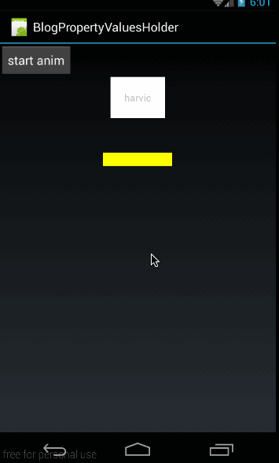

前几篇给大家讲了 ValueAnimator、ObjectAnimator 的知识，讲解了它们 ofInt(),ofFloat(),ofObject()函数的用法。细心的同学可能会注意到，ValueAnimator、ObjectAnimator 除了这些创建 Animator 实例的方法以外，都还有一个方法：

```
/** 
 * valueAnimator 的 
 */  
public static ValueAnimator ofPropertyValuesHolder(PropertyValuesHolder... values)   
/** 
 * ObjectAnimator 的 
 */  
public static ObjectAnimator ofPropertyValuesHolder(Object target,PropertyValuesHolder... values)  
```

也就是说 ValueAnimator 和 ObjectAnimator 除了通过 ofInt(),ofFloat(),ofObject()创建实例外，还都有一个 ofPropertyValuesHolder（）方法来创建实例，这篇文章我就带大家来看看如何通过 ofPropertyValuesHolder（）来创建实例的。 
由于 ValueAnimator 和 ObjectAnimator 都具有 ofPropertyValuesHolder（）函数，使用方法也差不多，相比而言，ValueAnimator 的使用机会不多，这里我们就只讲 ObjectAnimator 中 ofPropertyValuesHolder（）的用法。相信大家懂了这篇以后，再去看 ValueAnimator 的 ofPropertyValuesHolder（），也应该是会用的。 
在这篇文章的最后，我们通过本篇内容做了一个电话响铃的效果，效果图如下：


（录的图片效果不好，实际显示时抖的是更厉害的，大家可以看源码效果）

## 一、PropertyValuesHolder

### 1、概述
PropertyValuesHolder 这个类的意义就是，它其中保存了动画过程中所需要操作的属性和对应的值。我们通过 ofFloat(Object target, String propertyName, float… values)构造的动画，ofFloat()的内部实现其实就是将传进来的参数封装成 PropertyValuesHolder 实例来保存动画状态。在封装成 PropertyValuesHolder 实例以后，后期的各种操作也是以 PropertyValuesHolder 为主的。 
说到这里，大家就知道这个 PropertyValuesHolder 是有多有用了吧，上面我们也说了，ObjectAnimator 给我们提供了一个口子，让我们自己构造 PropertyValuesHolder 来构造动画。

```
public static ObjectAnimator ofPropertyValuesHolder(Object target,PropertyValuesHolder... values)  
```

PropertyValuesHolder 中有很多函数，有些函数的 api 等级是 11，有些函数的 api 等级是 14 和 21； 
高 api 的函数我们就不讲了，只讲讲 api 11 的函数的用法。有关各个函数的 api 等级，大家可以参考[《Google 文档：PropertyValuesHolder》](http://developer.android.com/reference/android/animation/PropertyValuesHolder.html) 
首先，我们来看看创建实例的函数：

```
public static PropertyValuesHolder ofFloat(String propertyName, float... values)  
public static PropertyValuesHolder ofInt(String propertyName, int... values)   
public static PropertyValuesHolder ofObject(String propertyName, TypeEvaluator evaluator,Object... values)  
public static PropertyValuesHolder ofKeyframe(String propertyName, Keyframe... values)  
```

这里总共有四个创建实例的方法，这一段我们着重讲 ofFloat、ofInt 和 ofObject 的用法，ofKeyframe 我们单独讲。

### 2、PropertyValuesHolder 之 ofFloat()、ofInt()
**（1）ofFloat()、ofInt()**
我们先来看看它们的构造函数：

```
public static PropertyValuesHolder ofFloat(String propertyName, float... values)  
public static PropertyValuesHolder ofInt(String propertyName, int... values) 
```
  
其中：

- **propertyName**：表示 ObjectAnimator 需要操作的属性名。即 ObjectAnimator 需要通过反射查找对应属性的 setProperty()函数的那个 property.
- **values**：属性所对应的参数，同样是可变长参数，可以指定多个，还记得我们在 ObjectAnimator 中讲过，如果只指定了一个，那么 ObjectAnimator 会通过查找 getProperty()方法来获得初始值。不理解的同学请参看《Animation 动画详解(七)——ObjectAnimator 基本使用》 
大家看这些参数是不是很眼熟，让我们看一下 ObjectAnimator 的 ofFloat 是怎么样的：

```
public static ObjectAnimator ofFloat(Object target, String propertyName, float... values);
```
  
看到没，在 ObjectAnimator.ofFloat 中只比 PropertyValuesHolder 的 ofFloat 多了一个 target，其它都是完全一样的！ 
好了，我们在讲完 PropertyValuesHolder 的 ofFloat 函数以后，我们再来看看如何将构造的 PropertyValuesHolder 实例设置进 ObjectAnimator 吧。 

**（2）、ObjectAnimator.ofPropertyValuesHolder()**
在开篇时，我们也讲了 ObjectAnimator 给我们提供了一个设置 PropertyValuesHolder 实例的入口：

```
public static ObjectAnimator ofPropertyValuesHolder(Object target,PropertyValuesHolder... values)
```
   
其中：
- **target**：指需要执行动画的控件
- **values**：是一个可变长参数，可以传进去多个 PropertyValuesHolder 实例，由于每个 PropertyValuesHolder 实例都会针对一个属性做动画，所以如果传进去多个 PropertyValuesHolder 实例，将会对控件的多个属性同时做动画操作。 

**（3）、示例**
下面我们就举个例子来如何通过 PropertyValuesHolder 的 ofFloat、ofInt 来做动画的。 
效果图如下： 


这个动画很简单，就是在点击按钮的时候，给 textView 做动画，框架代码就不再讲了，我们主要来看看操作 textview 动画的代码。
动画代码为：

```
PropertyValuesHolder rotationHolder = PropertyValuesHolder.ofFloat("Rotation", 60f, -60f, 40f, -40f, -20f, 20f, 10f, -10f, 0f);  
PropertyValuesHolder colorHolder = PropertyValuesHolder.ofInt("BackgroundColor", 0xffffffff, 0xffff00ff, 0xffffff00, 0xffffffff);  
ObjectAnimator animator = ObjectAnimator.ofPropertyValuesHolder(mTextView, rotationHolder, colorHolder);  
animator.setDuration(3000);  
animator.setInterpolator(new AccelerateInterpolator());  
animator.start();  
```

在这里，我们创建了两个 PropertyValuesHolder 实例，第一个 rotationHolder：

```
PropertyValuesHolder rotationHolder = PropertyValuesHolder.ofFloat("Rotation", 60f, -60f, 40f, -40f, -20f, 20f, 10f, -10f, 0f);  
```

使用 ofFloat 函数创建，属性值是 Rotation，对应的是 View 类中 SetRotation(float rotation)函数。后面传进去很多值，让其左右摆动。
第二是动画是改变背景色的 colorHolder

```
PropertyValuesHolder colorHolder = PropertyValuesHolder.ofInt("BackgroundColor", 0xffffffff, 0xffff00ff, 0xffffff00, 0xffffffff); 
```
 
这里使用的是 ofInt 函数创建的，它操作的属性是 BackgroundColor，对应的是 View 类中的 setBackgroundColor(int color)函数，后面传进去的 16 进制颜色值让其在这些颜色值间变化。有关颜色值的变化，大家可以参考《Animation 动画详解(七)——ObjectAnimator 基本使用》中第三部分《常用函数》 
最后通过 ObjectAnimator.ofPropertyValuesHolder 将 rotationHolder、colorHolder 设置给 mTextView，构造出 ObjectAnimator 对象。然后开始动画即可

```
ObjectAnimator animator = ObjectAnimator.ofPropertyValuesHolder(mTextView, rotationHolder, colorHolder);  
animator.setDuration(3000);  
animator.setInterpolator(new AccelerateInterpolator());  
animator.start();
```
  
好了，到这里有关 PropertyValuesHolder 的 ofInt 和 ofFloat 函数的用法就讲完了，大家可以看到 PropertyValuesHolder 使用起来也很容易，下面我们再来看看 PropertyValuesHolder 的 ofObject 的使用方法。 
源码在文章底部给出

### 3、PropertyValuesHolder 之 ofObject()
**（1）、概述**
我们先来看一下 ofObject 的构造函数

```
public static PropertyValuesHolder ofObject(String propertyName, TypeEvaluator evaluator,Object... values)  
```

- propertyName:ObjectAnimator 动画操作的属性名;
- evaluator:Evaluator 实例，Evaluator 是将当前动画进度计算出当前值的类，可以使用系统自带的 IntEvaluator、FloatEvaluator 也可以自定义，有关 Evaluator 的知识，大家可以参考《Animation 动画详解(五)——ValueAnimator 高级进阶（一）》
- values：可变长参数，表示操作动画属性的值 
它的各个参数与 ObjectAnimator.ofObject 的类似,只是少了 target 参数而已

```
public static ObjectAnimator ofObject(Object target, String propertyName,TypeEvaluator evaluator, Object... values) 
```
 
**（2）、示例**
下面我们就讲讲 PropertyValuesHolder.ofObject()函数的用法 
本示例的效果图如下：



这里实现的效果与《Animation 动画详解(六)——ValueAnimator 高级进阶（二）》实现的效果相同，即通过自字义的 CharEvaluator 来自动实现字母的改变与计算。 
首先是自定义一个 CharEvaluator,通过进度值来自动计算出当前的字母：

```
public class CharEvaluator implements TypeEvaluator<Character> {  
    @Override  
    public Character evaluate(float fraction, Character startValue, Character endValue) {  
        int startInt  = (int)startValue;  
        int endInt = (int)endValue;  
        int curInt = (int)(startInt + fraction *(endInt - startInt));  
        char result = (char)curInt;  
        return result;  
    }  
} 
```
 
有关数字与字符间转换的原理已经在《Animation 动画详解(六)——ValueAnimator 高级进阶（二）》讲述，就不再细讲。这个 CharEvaluator 也是直接从这篇文章中拿过来的，强烈建议大家对这个系列文章从头开始看。 
从 CharEvaluator 中可以看出，从 CharEvaluator 中产出的动画中间值类型为 Character 类型。TextView 中虽然有 setText(CharSequence text) 函数，但这个函数的参数类型是 CharSequence，而不是 Character 类型。所以我们要自定义一个类派生自 TextView 来改变 TextView 的字符

```
public class MyTextView extends TextView {  
    public MyTextView(Context context, AttributeSet attrs) {  
        super(context, attrs);  
    }  
    public void setCharText(Character character){  
        setText(String.valueOf(character));  
    }  
} 
```
 
在这里，我们定义了一个方法 setCharText(Character character)，参数就是 Character 类型，我们知道这个方法所对应的属性是 CharText； 
最后 MyActivity,在点击按钮的时候开始动画，核心代码为：

```
public class MyActivity extends Activity {  
    private Button btn;  
    private TextView mTextView;  
    private MyTextView mMyTv;  
    @Override  
    public void onCreate(Bundle savedInstanceState) {  
        super.onCreate(savedInstanceState);  
        setContentView(R.layout.main);  
  
        mMyTv = (MyTextView)findViewById(R.id.mytv);  
        btn = (Button) findViewById(R.id.btn);  
        btn.setOnClickListener(new View.OnClickListener() {  
            @Override  
            public void onClick(View v) {  
                doOfObjectAnim();  
            }  
        });  
    }  
  
    private void doOfObjectAnim(){  
        PropertyValuesHolder charHolder = PropertyValuesHolder.ofObject("CharText",new CharEvaluator(),new Character('A'),new Character('Z'));  
        ObjectAnimator animator = ObjectAnimator.ofPropertyValuesHolder(mMyTv, charHolder);  
        animator.setDuration(3000);  
        animator.setInterpolator(new AccelerateInterpolator());  
        animator.start();  
    }  
} 
```
 
这部分代码，很好理解，在点击按钮的时候执行 doOfObjectAnim()方法：

```
PropertyValuesHolder charHolder = PropertyValuesHolder.ofObject("CharText",new CharEvaluator(),new Character('A'),new Character('Z'));  
ObjectAnimator animator = ObjectAnimator.ofPropertyValuesHolder(mMyTv, charHolder);  
animator.setDuration(3000);  
animator.setInterpolator(new AccelerateInterpolator());  
animator.start();  
```

首先是根据 PropertyValuesHolder.ofObject 生成一个 PropertyValuesHolder 实例，注意它的属性就是 CharText，所对应的 set 函数就是 setCharText,由于 CharEvaluator 的中间值是 Character 类型，所以 CharText 属性所对应的完整的函数声明为 setCharText(Character character)；这也就是我们为什么要自定义一个 MyTextView 原因，就是因为 TextView 中没有 setText(Character character)这样的函数。 
然后就是利用 ObjectAnimator.ofPropertyValuesHolder 生成 ObjectAnimator 实例了，最后就是对 animator 设置并 start 了，没什么难度，就不再讲了。 
源码在文章底部给出 
下面就开始最重要的部分了，有关 KeyFrame 的知识。

## 二、Keyframe

### 1、概述
通过前面几篇的讲解，我们知道如果要控制动画速率的变化，我们可以通过自定义插值器，也可以通过自定义 Evaluator 来实现。但如果真的让我们为了速率变化效果而自定义插值器或者 Evaluator 的话，恐怕大部分同学会有一万头草泥马在眼前奔过，因为大部分的同学的数学知识已经还给老师了。 
为了解决方便的控制动画速率的问题，谷歌为了我等屁民定义了一个 KeyFrame 的类，KeyFrame 直译过来就是关键帧。 
关键帧这个概念是从动画里学来的，我们知道视频里，一秒要播放 24 帧图片，对于制作 flash 动画的同学来讲，是不是每一帧都要画出来呢？当然不是了，如果每一帧都画出来，那估计做出来一个动画片都得要一年时间；比如我们要让一个球在 30 秒时间内，从（0,0）点运动到（300，200）点，那 flash 是怎么来做的呢，在 flash 中，我们只需要定义两个关键帧，在动画开始时定义一个，把球的位置放在(0,0)点；在 30 秒后，再定义一个关键帧，把球的位置放在（300，200）点。在动画 开始时，球初始在是（0，0）点，30 秒时间内就 adobe flash 就会自动填充，把球平滑移动到第二个关键帧的位置（300，200）点； 
通过上面分析 flash 动画的制作原理，我们知道，一个关键帧必须包含两个原素，第一时间点，第二位置。即这个关键帧是表示的是某个物体在哪个时间点应该在哪个位置上。 
所以谷歌的 KeyFrame 也不例外，KeyFrame 的生成方式为：

```
Keyframe kf0 = Keyframe.ofFloat(0, 0);  
Keyframe kf1 = Keyframe.ofFloat(0.1f, -20f);  
Keyframe kf2 = Keyframe.ofFloat(1f, 0);
```
  
上面生成了三个 KeyFrame 对象，其中 KeyFrame 的 ofInt 函数的声明为：

```
public static Keyframe ofFloat(float fraction, float value) 
```
 
- **fraction**：表示当前的显示进度，即从加速器中 getInterpolation()函数的返回值；
- **value**：表示当前应该在的位置 
比如 Keyframe.ofFloat(0, 0)表示动画进度为 0 时，动画所在的数值位置为 0；Keyframe.ofFloat(0.25f, -20f)表示动画进度为 25%时，动画所在的数值位置为-20；Keyframe.ofFloat(1f,0)表示动画结束时，动画所在的数值位置为 0； 
在理解了 KeyFrame.ofFloat()的参数以后，我们来看看 PropertyValuesHolder 是如何使用 KeyFrame 对象的：

```
public static PropertyValuesHolder ofKeyframe(String propertyName, Keyframe... values)
```
  
- **propertyName**：动画所要操作的属性名
- **values**：Keyframe 的列表，PropertyValuesHolder 会根据每个 Keyframe 的设定，定时将指定的值输出给动画。 

所以完整的 KeyFrame 的使用代码应该是这样的：

```
Keyframe frame0 = Keyframe.ofFloat(0f, 0);  
Keyframe frame1 = Keyframe.ofFloat(0.1f, -20f);  
Keyframe frame2 = Keyframe.ofFloat(1, 0);  
PropertyValuesHolder frameHolder = PropertyValuesHolder.ofKeyframe("rotation",frame0,frame1,frame2);  
 Animator animator = ObjectAnimator.ofPropertyValuesHolder(mImage,frameHolder);  
animator.setDuration(1000);  
animator.start(); 
```
 
第一步：生成 Keyframe 对象； 
第二步：利用 PropertyValuesHolder.ofKeyframe()生成 PropertyValuesHolder 对象 
第三步：ObjectAnimator.ofPropertyValuesHolder()生成对应的 Animator

### 2、示例
在了解了 Keyframe 如何使用以后，下面我们就来用一个例子来看看 Keyframe 的使用方法。 
本例的效果图如下： 


看起来跟开篇的一样，仔细对比一下，还是有不同的，这里只是实现了左右震动，但并没有放大效果。 

**(1)、main.xml**
我们先来看看布局代码，代码很简单，一个 btn,一个 imageview

```
<?xml version="1.0" encoding="utf-8"?>  
<LinearLayout xmlns:android="http://schemas.android.com/apk/res/android"  
              android:orientation="vertical"  
              android:layout_width="fill_parent"  
              android:layout_height="fill_parent">  
    <Button  
            android:id="@+id/btn"  
            android:layout_width="wrap_content"  
            android:layout_height="wrap_content"  
            android:text="start anim"/>  
  
    <ImageView  
            android:id="@+id/img"  
            android:layout_width="150dp"  
            android:layout_height="wrap_content"  
            android:scaleType="fitCenter"  
            android:layout_gravity="center_horizontal"  
            android:src="@drawable/phone"/>  
</LinearLayout>
```
  
这段布局代码没什么难度，就不再讲了，下面来看看 MyActivity 中的处理 
**(2)、MyActivity.java**

```
public class MyActivity extends Activity {  
    private ImageView mImage;  
    private Button mBtn;  
    @Override  
    public void onCreate(Bundle savedInstanceState) {  
        super.onCreate(savedInstanceState);  
        setContentView(R.layout.main);  
        mImage = (ImageView)findViewById(R.id.img);  
        mBtn = (Button)findViewById(R.id.btn);  
        mBtn.setOnClickListener(new View.OnClickListener() {  
            @Override  
            public void onClick(View v) {  
                doOfFloatAnim();  
            }  
        });  
    }  
  
    private void doOfFloatAnim(){  
        Keyframe frame0 = Keyframe.ofFloat(0f, 0);  
        Keyframe frame1 = Keyframe.ofFloat(0.1f, -20f);  
        Keyframe frame2 = Keyframe.ofFloat(0.2f, 20f);  
        Keyframe frame3 = Keyframe.ofFloat(0.3f, -20f);  
        Keyframe frame4 = Keyframe.ofFloat(0.4f, 20f);  
        Keyframe frame5 = Keyframe.ofFloat(0.5f, -20f);  
        Keyframe frame6 = Keyframe.ofFloat(0.6f, 20f);  
        Keyframe frame7 = Keyframe.ofFloat(0.7f, -20f);  
        Keyframe frame8 = Keyframe.ofFloat(0.8f, 20f);  
        Keyframe frame9 = Keyframe.ofFloat(0.9f, -20f);  
        Keyframe frame10 = Keyframe.ofFloat(1, 0);  
        PropertyValuesHolder frameHolder = PropertyValuesHolder.ofKeyframe("rotation",frame0,frame1,frame2,frame3,frame4,frame5,frame6,frame7,frame8,frame9,frame10);  
  
        Animator animator = ObjectAnimator.ofPropertyValuesHolder(mImage,frameHolder);  
        animator.setDuration(1000);  
        animator.start();  
    }  
} 
```
 
这段代码难度也不大，在点击按钮的时候，执行 doOfFloatAnim()函数,关键问题在 doOfFloatAnim()上：
首先，我们定义了 11 个 keyframe:

```
Keyframe frame0 = Keyframe.ofFloat(0f, 0);  
Keyframe frame1 = Keyframe.ofFloat(0.1f, -20f);  
Keyframe frame2 = Keyframe.ofFloat(0.2f, 20f);  
Keyframe frame3 = Keyframe.ofFloat(0.3f, -20f);  
Keyframe frame4 = Keyframe.ofFloat(0.4f, 20f);  
Keyframe frame5 = Keyframe.ofFloat(0.5f, -20f);  
Keyframe frame6 = Keyframe.ofFloat(0.6f, 20f);  
Keyframe frame7 = Keyframe.ofFloat(0.7f, -20f);  
Keyframe frame8 = Keyframe.ofFloat(0.8f, 20f);  
Keyframe frame9 = Keyframe.ofFloat(0.9f, -20f);  
Keyframe frame10 = Keyframe.ofFloat(1, 0);
```
  
在这些 keyframe 中，首先指定在开始和结束时，旋转角度为 0，即恢复原样：

```
Keyframe frame0 = Keyframe.ofFloat(0f, 0);  
Keyframe frame10 = Keyframe.ofFloat(1, 0);
```
  
然后在过程中，让它左右旋转，比如在进度为 0.2 时，旋转到左边 20 度位置：

```
Keyframe frame1 = Keyframe.ofFloat(0.1f, -20f); 
```
 
然后在进度为 0.3 时，旋转到右边 20 度位置:

```
Keyframe frame3 = Keyframe.ofFloat(0.3f, -20f);  
```

其它类似。正是因为来回左右的旋转，所以我们看起来就表现为在震动
然后，根据这些 Keyframe 生成 PropertyValuesHolder 对象，指定操作的属性为 rotation

```
PropertyValuesHolder frameHolder = PropertyValuesHolder.ofKeyframe("rotation",frame0,frame1,frame2,frame3,frame4,frame5,frame6,frame7,frame8,frame9,frame10);  
  
Animator animator = ObjectAnimator.ofPropertyValuesHolder(mImage,frameHolder);  
animator.setDuration(1000);  
animator.start(); 
```
 
最后，利用 ObjectAnimator.ofPropertyValuesHolder(mImage,frameHolder)生成 ObjectAnimator 对象，并开始动画。 
到这里想必大家已经对 Keyframe 有了初步的认识，下面我们就来详细的讲讲 Keyframe; 
源码在文章底部给出

### 3、Keyframe 之 ofFloat、ofInt 与常用函数
**（1）、ofFloat、ofInt**
上面我们看到 Keyframe.ofFloat()函数的用法，其实 Keyframe 除了 ofFloat()以外，还有 ofInt()、ofObject()这些创建 Keyframe 实例的方法，Keyframe.ofObject()我们下部分再讲，这部分，我们着重看看 ofFloat 与 ofInt 的构造函数与使用方法：

```
/** 
 * ofFloat 
 */  
public static Keyframe ofFloat(float fraction)   
public static Keyframe ofFloat(float fraction, float value)  
/** 
 * ofInt 
 */  
public static Keyframe ofInt(float fraction)  
public static Keyframe ofInt(float fraction, int value)  
```

由于 ofFloat 和 ofInt 的构造函数都是一样的，我们这里只以 ofFloat 来例来说。 
上面我们已经讲了 ofFloat(float fraction, float value)的用法，fraction 表示当前关键帧所在的动画进度位置，value 表示当前位置所对应的值。 
而另一个构造函数：

```
public static Keyframe ofFloat(float fraction) 
```
  
这个构造函数比较特殊，只有一个参数 fraction，表示当前关键帧所在的动画进度位置。那在这个进度时所对应的值要怎么设置呢？ 
当然有方法啦，除了上面的构造函数，Keyframe 还有一些常用函数来设置 fraction，value 和 interpolator，定义如下： 
**（2）、常用函数：**

```
/** 
 * 设置 fraction 参数，即 Keyframe 所对应的进度 
 */  
public void setFraction(float fraction)   
/** 
 * 设置当前 Keyframe 所对应的值 
 */  
public void setValue(Object value)  
/** 
 * 设置 Keyframe 动作期间所对应的插值器 
 */  
public void setInterpolator(TimeInterpolator interpolator)  
```

这三个函数中，插值器的作用应该是比较难理解，如果给这个 Keyframe 设置上插值器，那么这个插值器就是从上一个 Keyframe 开始到当前设置插值器的 Keyframe 时，这个过程值的计算是利用这个插值器的，比如：

```
Keyframe frame0 = Keyframe.ofFloat(0f, 0);  
Keyframe frame1 = Keyframe.ofFloat(0.1f, -20f);  
frame1.setInterpolator(new BounceInterpolator());  
Keyframe frame2 = Keyframe.ofFloat(1f, 20f);  
frame2.setInterpolator(new LinearInterpolator());  
```

在上面的代码中，我们给 frame1 设置了插值器 BounceInterpolator，那么在 frame0 到 frame1 的中间值计算过程中，就是用的就是回弹插值器； 
同样，我们给 frame2 设置了线性插值器（LinearInterpolator），所以在 frame1 到 frame2 的中间值计算过程中，使用的就是线性插值器 
很显然，给 Keyframe.ofFloat(0f, 0)设置插值器是无效的，因为它是第一帧 
**（3）、示例 1——没有插值器**
下面我们就举个例子来看下，如何使用上面的各个函数的用法，同样是基于上面的电话响铃的例子，如果我们只保存三帧，代码如下：

```
Keyframe frame0 = Keyframe.ofFloat(0f, 0);  
Keyframe frame1 = Keyframe.ofFloat(0.5f, 100f);  
Keyframe frame2 = Keyframe.ofFloat(1);  
frame2.setValue(0f);  
PropertyValuesHolder frameHolder = PropertyValuesHolder.ofKeyframe("rotation",frame0,frame1,frame2);  
  
Animator animator = ObjectAnimator.ofPropertyValuesHolder(mImage,frameHolder);  
animator.setDuration(3000);  
animator.start();  
```

在这段代码中，总共就只有三个关键帧，最后一个 Keyframe 的生成方法是利用:

```
Keyframe frame2 = Keyframe.ofFloat(1);  
frame2.setValue(0f);
```
  
对于 Keyframe 而言，fraction 和 value 这两个参数是必须有的，所以无论用哪种方式实例化 Keyframe 都必须保证这两个值必须被初始化。 
这里没有设置插值器，会使用默认的线性插值器（LinearInterpolator） 
效果图如下： 


**（4）、示例 2——使用插值器**
下面，我们给上面的代码加上插值器,着重看一下，插值器在哪部分起做用

```
Keyframe frame0 = Keyframe.ofFloat(0f, 0);  
Keyframe frame1 = Keyframe.ofFloat(0.5f, 100f);  
Keyframe frame2 = Keyframe.ofFloat(1);  
frame2.setValue(0f);  
frame2.setInterpolator(new BounceInterpolator());  
PropertyValuesHolder frameHolder = PropertyValuesHolder.ofKeyframe("rotation",frame0,frame1,frame2);  
  
Animator animator = ObjectAnimator.ofPropertyValuesHolder(mImage,frameHolder);  
animator.setDuration(3000);  
animator.start();
```
  
我们给最后一帧 frame2 添加上回弹插值器(BounceInterpolator),然后看看效果： 


从效果图中可以看出，在 frame1 到 frame2 的过程中，使用了回弹插值器，所以从这里也可验证我们上面的论述：如果给当前帧添加插值器，那么在上一帧到当前帧的进度值计算过程中会使用这个插值器。 
好了，到这里有关 ofInt,ofFloat 和常用的几个函数的讲解就结束了，下面我们再来看看 ofObject 的使用方法。 

源码在文章底部给出

### 4、Keyframe 之 ofObject
与 ofInt,ofFloat 一样，ofObject 也有两个构造函数：

```
public static Keyframe ofObject(float fraction)  
public static Keyframe ofObject(float fraction, Object value)
```
  
同样，如果使用 ofObject(float fraction)来构造，也必须使用 setValue(Object value)来设置这个关键帧所对应的值。
我们还以 TextView 更改字母的例子来使用下 Keyframe.ofObject 
效果图如下： 


明显 L 前的 12 个字母变化的特别快，后面的 14 个字母变化的比较慢。 
我们使用到的 MyTextView,CharEvaluator 都与上面的一样，只是动画部分不同，这里只列出动画的代码：

```
Keyframe frame0 = Keyframe.ofObject(0f, new Character('A'));  
Keyframe frame1 = Keyframe.ofObject(0.1f, new Character('L'));  
Keyframe frame2 = Keyframe.ofObject(1,new Character('Z'));  
  
PropertyValuesHolder frameHolder = PropertyValuesHolder.ofKeyframe("CharText",frame0,frame1,frame2);  
frameHolder.setEvaluator(new CharEvaluator());  
ObjectAnimator animator = ObjectAnimator.ofPropertyValuesHolder(mMyTv,frameHolder);  
animator.setDuration(3000);  
animator.start();  
```

在这个动画中，我们定义了三帧：

```
Keyframe frame0 = Keyframe.ofObject(0f, new Character('A'));  
Keyframe frame1 = Keyframe.ofObject(0.1f, new Character('L'));  
Keyframe frame2 = Keyframe.ofObject(1,new Character('Z'));  
```

frame0 表示在进度为 0 的时候，动画的字符是 A；frame1 表示在进度在 0.1 的时候，动画的字符是 L;frame2 表示在结束的时候，动画的字符是 Z； 
利用关键帧创建 PropertyValuesHolder 后，一定要记得设置自定义的 Evaluator:

```
frameHolder.setEvaluator(new CharEvaluator()); 
```
 
凡是使用 ofObject 来做动画的时候，都必须调用 frameHolder.setEvaluator 显示设置 Evaluator，因为系统根本是无法知道，你动画的中间值 Object 真正是什么类型的。 
源码在文章底部给出

### 5、疑问：如果没有设置进度为 0 或者进度为 1 时的关键帧，展示是怎样的？
首先，我们以下面这个动画为例：

```
Keyframe frame0 = Keyframe.ofFloat(0f, 0);  
Keyframe frame1 = Keyframe.ofFloat(0.5f, 100f);  
Keyframe frame2 = Keyframe.ofFloat(1,0);  
PropertyValuesHolder frameHolder = PropertyValuesHolder.ofKeyframe("rotation", frame0,frame1,frame2);  
  
Animator animator = ObjectAnimator.ofPropertyValuesHolder(mImage, frameHolder);  
animator.setDuration(3000);  
animator.start(); 
```
 
这里有三个帧，在进度为 0.5 时，电话向右旋转 100 度，然后再转回来。 
效果图如下： 


**尝试一：去掉第 0 帧，将以第一帧为起始位置**
如果我们把第 0 帧去掉，只保留中间帧和结束帧，看结果会怎样

```
Keyframe frame1 = Keyframe.ofFloat(0.5f, 100f);  
Keyframe frame2 = Keyframe.ofFloat(1,0);  
PropertyValuesHolder frameHolder = PropertyValuesHolder.ofKeyframe("rotation",frame1,frame2);  
  
Animator animator = ObjectAnimator.ofPropertyValuesHolder(mImage, frameHolder);  
animator.setDuration(3000);  
animator.start(); 
```
 
效果图如下： 


可以看到，动画是直接从中间帧 frame1 开始的，即当没有第 0 帧时，动画从最近的一个帧开始。 

**尝试二：去掉结束帧，将最后一帧为结束帧**
如果我们把结束帧去掉，保留第 0 帧和中间帧，看结果会怎样：

```
Keyframe frame0 = Keyframe.ofFloat(0f, 0);  
Keyframe frame1 = Keyframe.ofFloat(0.5f, 100f);  
PropertyValuesHolder frameHolder = PropertyValuesHolder.ofKeyframe("rotation", frame0,frame1);  
  
Animator animator = ObjectAnimator.ofPropertyValuesHolder(mImage, frameHolder);  
animator.setDuration(3000);  
animator.start();
```
  
效果图如下： 


**尝试三：只保留一个中间帧，会崩**
如果我们把第 0 帧和结束帧去掉，代码如下：

```
PropertyValuesHolder frameHolder = PropertyValuesHolder.ofKeyframe("rotation",frame1);  
  
Animator animator = ObjectAnimator.ofPropertyValuesHolder(mImage, frameHolder);  
animator.setDuration(3000);  
animator.start(); 
```
 
在点击按钮开始动画时，就直接崩了，报错信息如下： 


报错问题是数组越界，也就是说，至少要有两个帧才行。 

**尝试四：保留两个中间帧**
再尝试一下，如果我们把第 0 帧和结束帧去掉，保留两个中间帧会怎样： 
我们在上面代码上再加一个中间帧：

```
Keyframe frame1 = Keyframe.ofFloat(0.5f, 100f);  
Keyframe frame2 = Keyframe.ofFloat(0.7f,50f);  
PropertyValuesHolder frameHolder = PropertyValuesHolder.ofKeyframe("rotation",frame1,frame2);  
  
Animator animator = ObjectAnimator.ofPropertyValuesHolder(mImage, frameHolder);  
animator.setDuration(3000);  
animator.start();
```
  
效果图如下： 


可以看到，在保留两个帧的情况下，是可以运行的，而且，由于去掉了第 0 帧，所以将 frame1 做为起始帧，又由于去掉了结束帧，所以将 frame2 做为结束帧。
**下面我们做出结论：**

- 如果去掉第 0 帧，将以第一个关键帧为起始位置
- 如果去掉结束帧，将以最后一个关键帧为结束位置
- 使用 Keyframe 来构建动画，至少要有两个或两个以上帧

### 6、开篇的电话响铃效果
再重新看看开篇的电话响铃的效果图： 


发现了没，除了左右震动，图标在震动过程中始终是放大的。
上面，我们已经实现了左右震动，下面我们再添加放大效果就好了。
框架的部分就不再讲了，与上面一样，只是动画部分不同，先贴出动画的完整代码：

```
/** 
 * 左右震动效果 
 */  
Keyframe frame0 = Keyframe.ofFloat(0f, 0);  
Keyframe frame1 = Keyframe.ofFloat(0.1f, -20f);  
Keyframe frame2 = Keyframe.ofFloat(0.2f, 20f);  
Keyframe frame3 = Keyframe.ofFloat(0.3f, -20f);  
Keyframe frame4 = Keyframe.ofFloat(0.4f, 20f);  
Keyframe frame5 = Keyframe.ofFloat(0.5f, -20f);  
Keyframe frame6 = Keyframe.ofFloat(0.6f, 20f);  
Keyframe frame7 = Keyframe.ofFloat(0.7f, -20f);  
Keyframe frame8 = Keyframe.ofFloat(0.8f, 20f);  
Keyframe frame9 = Keyframe.ofFloat(0.9f, -20f);  
Keyframe frame10 = Keyframe.ofFloat(1, 0);  
PropertyValuesHolder frameHolder1 = PropertyValuesHolder.ofKeyframe("rotation", frame0, frame1, frame2, frame3, frame4,frame5, frame6, frame7, frame8, frame9, frame10);  
  
  
/** 
 * scaleX 放大 1.1 倍 
 */  
Keyframe scaleXframe0 = Keyframe.ofFloat(0f, 1);  
Keyframe scaleXframe1 = Keyframe.ofFloat(0.1f, 1.1f);  
Keyframe scaleXframe2 = Keyframe.ofFloat(0.2f, 1.1f);  
Keyframe scaleXframe3 = Keyframe.ofFloat(0.3f, 1.1f);  
Keyframe scaleXframe4 = Keyframe.ofFloat(0.4f, 1.1f);  
Keyframe scaleXframe5 = Keyframe.ofFloat(0.5f, 1.1f);  
Keyframe scaleXframe6 = Keyframe.ofFloat(0.6f, 1.1f);  
Keyframe scaleXframe7 = Keyframe.ofFloat(0.7f, 1.1f);  
Keyframe scaleXframe8 = Keyframe.ofFloat(0.8f, 1.1f);  
Keyframe scaleXframe9 = Keyframe.ofFloat(0.9f, 1.1f);  
Keyframe scaleXframe10 = Keyframe.ofFloat(1, 1);  
PropertyValuesHolder frameHolder2 = PropertyValuesHolder.ofKeyframe("ScaleX",scaleXframe0,scaleXframe1,scaleXframe2,scaleXframe3,scaleXframe4,scaleXframe5,scaleXframe6,scaleXframe7,scaleXframe8,scaleXframe9,scaleXframe10);  
  
  
/** 
 * scaleY 放大 1.1 倍 
 */  
Keyframe scaleYframe0 = Keyframe.ofFloat(0f, 1);  
Keyframe scaleYframe1 = Keyframe.ofFloat(0.1f, 1.1f);  
Keyframe scaleYframe2 = Keyframe.ofFloat(0.2f, 1.1f);  
Keyframe scaleYframe3 = Keyframe.ofFloat(0.3f, 1.1f);  
Keyframe scaleYframe4 = Keyframe.ofFloat(0.4f, 1.1f);  
Keyframe scaleYframe5 = Keyframe.ofFloat(0.5f, 1.1f);  
Keyframe scaleYframe6 = Keyframe.ofFloat(0.6f, 1.1f);  
Keyframe scaleYframe7 = Keyframe.ofFloat(0.7f, 1.1f);  
Keyframe scaleYframe8 = Keyframe.ofFloat(0.8f, 1.1f);  
Keyframe scaleYframe9 = Keyframe.ofFloat(0.9f, 1.1f);  
Keyframe scaleYframe10 = Keyframe.ofFloat(1, 1);  
PropertyValuesHolder frameHolder3 = PropertyValuesHolder.ofKeyframe("ScaleY",scaleYframe0,scaleYframe1,scaleYframe2,scaleYframe3,scaleYframe4,scaleYframe5,scaleYframe6,scaleYframe7,scaleYframe8,scaleYframe9,scaleYframe10);  
  
/** 
 * 构建动画 
 */  
Animator animator = ObjectAnimator.ofPropertyValuesHolder(mImage, frameHolder1,frameHolder2,frameHolder3);  
animator.setDuration(1000);  
animator.start();
```
  
这里的总共分为四步：
第一步，实现左右震铃效果；
这部分代码前面已经讲过，这里就不再赘述
第二步，利用 View 类中的 SetScaleX(float value)方法所对应的 ScaleX 属性，在动画过程中，将图片横向放大 1.1 倍：

```
Keyframe scaleXframe0 = Keyframe.ofFloat(0f, 1);  
Keyframe scaleXframe1 = Keyframe.ofFloat(0.1f, 1.1f);  
Keyframe scaleXframe2 = Keyframe.ofFloat(0.2f, 1.1f);  
Keyframe scaleXframe3 = Keyframe.ofFloat(0.3f, 1.1f);  
Keyframe scaleXframe4 = Keyframe.ofFloat(0.4f, 1.1f);  
Keyframe scaleXframe5 = Keyframe.ofFloat(0.5f, 1.1f);  
Keyframe scaleXframe6 = Keyframe.ofFloat(0.6f, 1.1f);  
Keyframe scaleXframe7 = Keyframe.ofFloat(0.7f, 1.1f);  
Keyframe scaleXframe8 = Keyframe.ofFloat(0.8f, 1.1f);  
Keyframe scaleXframe9 = Keyframe.ofFloat(0.9f, 1.1f);  
Keyframe scaleXframe10 = Keyframe.ofFloat(1, 1);
```
  
非常注意的是，在动画过程中放大 1.1 倍，在开始动画和动画结束时，都要还原状态，即原大小的 1 倍值：

```
Keyframe scaleXframe0 = Keyframe.ofFloat(0f, 1);  
Keyframe scaleXframe10 = Keyframe.ofFloat(1, 1);  
```

第三步，同样利用 View 类的 SetScaleY(float value)方法，在动画过程中将图片纵向放大 1.1 倍。原理与 scaleX 相同，就不再细讲。
第四步：生成 ObjectAnimator 实例：

```
Animator animator = ObjectAnimator.ofPropertyValuesHolder(mImage, frameHolder1,frameHolder2,frameHolder3);  
```

我们前面讲过，ObjectAnimator ofPropertyValuesHolder(Object target,PropertyValuesHolder… values)中第二个参数是可变长参数，可以传进去任何多个 PropertyValuesHolder 对象，这些对象所对应的动画会同时作用于控件上。这里我们就将三个属性动画同时作用在 mImage 上，所以图片的动画就表现为在左右震动的同时，横向放大 1.1 倍，纵向也放大了 1.1 倍。 
**所以说，借助 Keyframe，不需要使用 AnimatorSet，也能实现多个动画同时播放。这也是 ObjectAnimator 中唯一一个能实现多动画同时播放的方法，其它的 ObjectAnimator.ofInt,ObjectAnimator.ofFloat,ObjectAnimator.ofObject 都只能实现针对一个属性动画的操作！ **
源码在文章底部给出

## 三、PropertyValuesHolder 之其它函数
PropertyValuesHolder 除了上面的讲到的 ofInt,ofFloat,ofObject,ofKeyframe 以外，api 11 的还有几个函数：

```
/** 
 * 设置动画的 Evaluator 
 */  
public void setEvaluator(TypeEvaluator evaluator)  
/** 
 * 用于设置 ofFloat 所对应的动画值列表 
 */  
public void setFloatValues(float... values)  
/** 
 * 用于设置 ofInt 所对应的动画值列表 
 */  
public void setIntValues(int... values)  
/** 
 * 用于设置 ofKeyframe 所对应的动画值列表 
 */  
public void setKeyframes(Keyframe... values)  
/** 
 * 用于设置 ofObject 所对应的动画值列表 
 */  
public void setObjectValues(Object... values)  
/** 
 * 设置动画属性名 
 */  
public void setPropertyName(String propertyName) 
```
 
这些函数都比较好理解，setFloatValues(float… values)对应 PropertyValuesHolder.ofFloat()，用于动态设置动画中的数值。setIntValues、setKeyframes、setObjectValues 同理； 
setPropertyName 用于设置 PropertyValuesHolder 所需要操作的动画属性名; 
最重要的是 setEvaluator(TypeEvaluator evaluator)

```
/** 
 * 设置动画的 Evaluator 
 */  
public void setEvaluator(TypeEvaluator evaluator)
```
  
如果是利用 PropertyValuesHolder.ofObject()来创建动画实例的话，我们是一定要显示调用 PropertyValuesHolder.setEvaluator()来设置 Evaluator 的。在上面的字母转换的例子中，我们已经用过这个函数了。这里也就没什么好讲的了。

好了，这篇文章到这里就结束了，这篇文章真的太！长！了……大家耐心看看吧，必须 Keyframe 的知识还是很必须的。


源码内容：

1、《BlogPropertyValuesHolder》：第一部分 PropertyValuesHolder 所对应源码
2、《BlogKeyframe》：第三部分 Keyframe 所对应源码

如果本文有帮到你，记得加关注哦

源码下载地址：

CSDN:http://download.csdn.net/detail/harvic880925/9445780
github:https://github.com/harvic/BlogResForGitHub
请大家尊重原创者版权，转载请标明出处：http://blog.csdn.net/harvic880925/article/details/50752838 谢谢