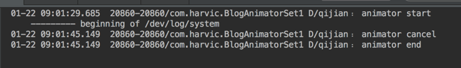

上几篇给大家分别讲了 ValueAnimator 和 ObjectAnimator,相比而言 ObjectAnimator 更为方便而且由于 set 函数是在控件类内部实现，所以封装性更好。而且在现实使用中一般而言都是使用 ObjectAnimator 的机率比较大。 
但 ValueAnimator 和 ObjectAnimator 都只能单单实现一个动画，那如果我们想要使用一个组合动画，比如边放大，边移动，边改变 alpha 值，要怎么办。对于这种组合型的动画，谷歌给我们提供了一个类 AnimatorSet;这篇我们就着重来看看组合动画的实现方法吧。

## 一、AnimatorSet——playSequentially,playTogether>
首先，AnimatorSet 针对 ValueAnimator 和 ObjectAnimator 都是适用的，但一般而言，我们不会用到 ValueAnimator 的组合动画，所以我们这篇仅讲解 ObjectAnimator 下的组合动画实现。 
在 AnimatorSet 中直接给为我们提供了两个方法 playSequentially 和 playTogether，playSequentially 表示所有动画依次播放，playTogether 表示所有动画一起开始。

### 1、playSequentially

我们先来看看 playSequentially 的声明：

```
public void playSequentially(Animator... items);
public void playSequentially(List<Animator> items);
```

这里有两种声明，第一个是我们最常用的，它的参数是可变长参数，也就是说我们可以传进去任意多个 Animator 对象。这些对象的动画会逐个播放。第二个构造函数，是传进去一个 List< Animator>的列表。原理一样，也是逐个去取 List 中的动画对象，然后逐个播放。但使用起来稍微麻烦一些。 
下面我们就举例来看一下 playSequentially 的使用方法，先来看下效果： 


从效果图中可以看到，首先改变了 textview1 的颜色，结束后移动 textview1，在移动结束后，开始移动黄色的 textview;所以这就是 playSequentially 的效果，即逐个播放动画，一个动画结束后，播放下一个动画 
下面我们来看实现代码：

**（1）、main.xml 布局**

从效果图中也可以看出布局非常简单，就三个控件。代码如下：

<?xml version="1.0" encoding="utf-8"?>
<RelativeLayout xmlns:android="http://schemas.android.com/apk/res/android"
                android:orientation="vertical"
                android:layout_width="fill_parent"
                android:layout_height="fill_parent">

    <Button
            android:id="@+id/btn"
            android:layout_width="wrap_content"
            android:layout_height="wrap_content"
            android:layout_alignParentLeft="true"
            android:padding="10dp"
            android:text="start anim"
            />

    <TextView
            android:id="@+id/tv_1"
            android:layout_width="wrap_content"
            android:layout_height="wrap_content"
            android:layout_alignParentRight="true"
            android:layout_marginRight="30dp"
            android:layout_centerVertical="true"
            android:background="#ff00ff"
            android:padding="10dp"
            android:text="textview1"
            />
    <TextView
            android:id="@+id/tv_2"
            android:layout_width="100dp"
            android:layout_height="wrap_content"
            android:layout_centerHorizontal="true"
            android:layout_centerVertical="true"
            android:gravity="center"
            android:padding="10dp"
            android:background="#ffff00"
            android:text="Hello qijian"/>

</RelativeLayout>
```

这里也没有什么需要注意的地方，下面我们就直接来看 MyActivity 的代码：

**(2)、MyActivity.java**

```
public class MyActivity extends Activity {
    private Button mButton;
    private TextView mTv1, mTv2;

    @Override
    public void onCreate(Bundle savedInstanceState) {
        super.onCreate(savedInstanceState);
        setContentView(R.layout.main);

        mButton = (Button) findViewById(R.id.btn);
        mTv1 = (TextView) findViewById(R.id.tv_1);
        mTv2 = (TextView) findViewById(R.id.tv_2);

        mButton.setOnClickListener(new View.OnClickListener() {
            @Override
            public void onClick(View v) {
                doPlaySequentiallyAnimator();
            }
        });
    }
    …………
}
```

这段代码也没什么难度，首先是初始化 textview1，textview2 和 btn 的对象，然后当点击按钮时执行 doPlaySequentiallyAnimator();函数。下面我们来看看 doPlaySequentiallyAnimator()的具体实现：

```
private void doPlaySequentiallyAnimator(){
    ObjectAnimator tv1BgAnimator = ObjectAnimator.ofInt(mTv1, "BackgroundColor",  0xffff00ff, 0xffffff00, 0xffff00ff);
    ObjectAnimator tv1TranslateY = ObjectAnimator.ofFloat(mTv1, "translationY", 0, 300, 0);
    ObjectAnimator tv2TranslateY = ObjectAnimator.ofFloat(mTv2, "translationY", 0, 400, 0);

    AnimatorSet animatorSet = new AnimatorSet();
    animatorSet.playSequentially(tv1BgAnimator,tv1TranslateY,tv2TranslateY);
    animatorSet.setDuration(1000);
    animatorSet.start();
}
```

这里首先构造了三个动画，针对 textview1 的是前两个 tv1BgAnimator 和 tv1TranslateY:分别是改变当前动画背景和改变控件 Y 坐标位置;针对 textview2 则只是通过 translationY 来改变控件 Y 坐标位置。有关动画的创建方式，我这里就不再讲了，不理解的同学请参考上篇《Animation 动画详解(七)——ObjectAnimator 基本使用》 
然后是利用 AnimatorSet 的 playSequentially 函数将这三个动画组装起来，逐个播放。代码比较简单，就不再细讲。这篇我们就会在这个 demo 的基础上来讲解本篇所有的知识点。 
**源码在文章底部给出**

## 2、playTogether

playTogether 表示将所有动画一起播放 
我们先来看看 playTogether 的声明：

```
public void playTogether(Animator... items);
public void playTogether(Collection<Animator> items);
```

同样这里也是有两个构造函数，他们两个的意义是一样的，只是传入的参数不一样，第一个依然是传可变长参数列表，第二个则是需要传一个组装好的 Collection<Animator>对象。 
下面我们在上面例子的基础上，看看 playTogether 函数的用法； 
先来看看效果图： 


从效果图中可以看到，所有动画是一起开始播放的，下面来看看代码： 
当点击控钮时，执行以下代码：

```
ObjectAnimator tv1BgAnimator = ObjectAnimator.ofInt(mTv1, "BackgroundColor",  0xffff00ff, 0xffffff00, 0xffff00ff);
ObjectAnimator tv1TranslateY = ObjectAnimator.ofFloat(mTv1, "translationY", 0, 400, 0);
ObjectAnimator tv2TranslateY = ObjectAnimator.ofFloat(mTv2, "translationY", 0, 400, 0);

AnimatorSet animatorSet = new AnimatorSet();
animatorSet.playTogether(tv1BgAnimator,tv1TranslateY,tv2TranslateY);
animatorSet.setDuration(1000);
animatorSet.start();
```

同样是上面的那三个动画，只是将 playSequentially 改为了 playTogether； 
**源码在文章底部给出**

## 3、playSequentially,playTogether 真正意义

想必大家都看到赛马，在赛马开始前，每个马都会被放在起点的小门后面，到点了，门打开，马开始一起往前跑。而假如我们把每匹马看做是一个动画，那我们的 playTogether 就相当于赛马场里每个赛道上门的意义（当比赛开始时，每个赛道上的门会打开，马就可以开始比赛了）；也就是说，playTogether 只是一个时间点上的一起开始，对于开始后，各个动画怎么操作就是他们自己的事了，至于各个动画结不结束也是他们自已的事了。所以最恰当的描述就是门只负责打开，打开之后马咋跑，门也管不着，最后，马回不回来跟门也没啥关系。门的责任只是到点就打开而已。放在动画上，就是在激活动画之后，动画开始后的操作只是动画自己来负责。至于动画结不结束，也只有动画自己知道。 
而 playSequentially 的意义就是当一匹马回来以后，再放另一匹。那如果上匹马永远没回来，那下一匹马也永远不会被放出来。 
放到动画上，就是把激活一个动画之后，动画之后的操作就是动画自己来负责了，这个动画结束之后，再激活下一个动画。如果上一个动画没有结束，那下一个动画就永远也不会被激活。 
我们首先用 playTogether 来看个例子：

```
ObjectAnimator tv1BgAnimator = ObjectAnimator.ofInt(mTv1, "BackgroundColor",  0xffff00ff, 0xffffff00, 0xffff00ff);

ObjectAnimator tv1TranslateY = ObjectAnimator.ofFloat(mTv1, "translationY", 0, 400, 0);
tv1TranslateY.setStartDelay(2000);
tv1TranslateY.setRepeatCount(ValueAnimator.INFINITE);

ObjectAnimator tv2TranslateY = ObjectAnimator.ofFloat(mTv2, "translationY", 0, 400, 0);
tv2TranslateY.setStartDelay(2000);

AnimatorSet animatorSet = new AnimatorSet();
animatorSet.playTogether(tv1BgAnimator,tv1TranslateY,tv2TranslateY);
animatorSet.setDuration(2000);
animatorSet.start();
```

在这个例子中，我们将 tv1TranslateY 开始延迟 2000 毫秒开始，并设为无限循环。tv2TranslateY 设为开始延迟 2000 毫秒。而 tv1BgAnimator 则是没有任何设置，所以是默认直接开始。我们来看效果图： 


在效果图中可以看到，在点击按钮以后，先进行的是 tv1 的颜色变化，在颜色变化完以后，tv2 的延时也刚好结束，此时两个 textview 开始位移变换。最后 textview1 的位移变换是无限循环的。 
所以从这个例子中也可以看到，playTogether 只是负责在同一时间点把门拉开，拉开门以后，马跑不跑，那是它自己的事了，回不回来，门也管不着。 
playSequentially 也是一样，只是一个回来结束以后，才打开另一个的门。如果上一个一直没回来，那下一个也是永远不会开始的。

> 通过这个例子，我想告诉大家：playTogether 和 playSequentially 在开始动画时，只是把每个控件的动画激活，至于每个控件自身的动画是否具有延时、是否无限循环，只与控件自身的动画设定有关，与 playTogether、playSequentially 无关。playTogether 和 playSequentially 只负责到点激活动画。
我们再来看一个例子：

```
ObjectAnimator tv1BgAnimator = ObjectAnimator.ofInt(mTv1, "BackgroundColor",  0xffff00ff, 0xffffff00, 0xffff00ff);
tv1BgAnimator.setStartDelay(2000);

ObjectAnimator tv1TranslateY = ObjectAnimator.ofFloat(mTv1, "translationY", 0, 300, 0);
tv1TranslateY.setRepeatCount(ValueAnimator.INFINITE);

ObjectAnimator tv2TranslateY = ObjectAnimator.ofFloat(mTv2, "translationY", 0, 400, 0);

AnimatorSet animatorSet = new AnimatorSet();
animatorSet.playSequentially(tv1BgAnimator,tv1TranslateY,tv2TranslateY);
animatorSet.setDuration(2000);
animatorSet.start();
```

同样是那三个动画，首先 tv1BgAnimator 设置了延时开始，tv1TranslateY 设置为无限循环；使用 playSequentially 来逐个播放这三个动画，首先是 tv1BgAnimator：在开始之后，这个动画会延时 2000 毫秒再开始。结束之后，激活 tv1TranslateY，这个动画会无限循环。无限循环也就是说它永远也不会结束。那么第三个动画 tv2TranslateY 也永远不会开始。下面来看看效果图： 


在效果图中也可以看出，textview1 先是等了一段时间然后开始背景色变化，然后开始无限循环的上下运动。另一个 textview 永远也不会开始动画了。 
**源码在文章底部给出**

> 通过上面两个例子，总结的时候到了： 
> - 第一：playTogether 和 playSequentially 在激活动画后，控件的动画情况与它们无关，他们只负责定时激活控件动画。 
> - 第二：playSequentially 只有上一个控件做完动画以后，才会激活下一个控件的动画，如果上一控件的动画是无限循环，那下一个控件就别再指望能做动画了。
**4、如何实现无限循环动画**

很多同学会一直纠结如何实现无限循环的组合动画，因为 AnimatorSet 中没有设置循环次数的函数！通过上面的讲解，我们也能知道是否无限循环主要是看动画本身，与门（playTogether）无关！ 
下面我们就实现三个动画同时开始并无限循环的动画：

```
ObjectAnimator tv1BgAnimator = ObjectAnimator.ofInt(mTv1, "BackgroundColor",  0xffff00ff, 0xffffff00, 0xffff00ff);
tv1BgAnimator.setRepeatCount(ValueAnimator.INFINITE);
ObjectAnimator tv1TranslateY = ObjectAnimator.ofFloat(mTv1, "translationY", 0, 400, 0);
tv1TranslateY.setRepeatCount(ValueAnimator.INFINITE);
ObjectAnimator tv2TranslateY = ObjectAnimator.ofFloat(mTv2, "translationY", 0, 400, 0);
tv2TranslateY.setRepeatCount(ValueAnimator.INFINITE);

AnimatorSet animatorSet = new AnimatorSet();
animatorSet.playTogether(tv1BgAnimator,tv1TranslateY,tv2TranslateY);
animatorSet.setDuration(2000);
animatorSet.start();
```

上面的代码很容易理解，我们为每个动画设置了无限循环，所以在 playTogether 指定开始动画之后，每个动画都是无限循环的。 
效果图如下： 


> 总之：playTogether 和 playSequentially 只是负责指定什么时候开始动画，不干涉动画自己的运行过程。换言之：playTogether 和 playSequentially 只是赛马场上的每个赛道的门，门打开以后，赛道上的那匹马怎么跑跟它没什么关系。 
**源码在文章底部给出**

## 二、自由设置动画顺序——AnimatorSet.Builder

### 1、概述

上面我们讲了 playTogether 和 playSequentially，分别能实现一起开始动画和逐个开始动画。但并不是非常自由的组合动画，比如我们有三个动画 A,B,C 我们想先播放 C 然后同时播放 A 和 B。利用 playTogether 和 playSequentially 是没办法实现的，所以为了更方便的组合动画，谷歌的开发人员另外给我们提供一个类 AnimatorSet.Builder; 
我们这里使用 AnimatorSet.Builder 实现下面这个效果： 
即两个控件一同开始动画 


我们直接来看实现的代码：

```
ObjectAnimator tv1BgAnimator = ObjectAnimator.ofInt(mTv1, "BackgroundColor",  0xffff00ff, 0xffffff00, 0xffff00ff);
ObjectAnimator tv1TranslateY = ObjectAnimator.ofFloat(mTv1, "translationY", 0, 400, 0);

AnimatorSet animatorSet = new AnimatorSet();
AnimatorSet.Builder builder = animatorSet.play(tv1BgAnimator);
builder.with(tv1TranslateY);
animatorSet.start();
```

关键部分在最后几句：

```
AnimatorSet animatorSet = new AnimatorSet();
AnimatorSet.Builder builder = animatorSet.play(tv1BgAnimator);
builder.with(tv1TranslateY);
```

首先是构造一个 AnimatorSet 对象。然后调用 animatorSet.play(tv1BgAnimator)方法生成一个 AnimatorSet.Builder 对象，直接调用 builder.with()就能实现两个控件同时做动画了，多么神奇，下面我们来看看这个 AnimatorSet.Builder 的定义！ 
**源码在文章底部给出**

### 2、AnimatorSet.Builder 函数

从上面的代码中，我们可以看到 AnimatorSet.Builder 是通过 animatorSet.play(tv1BgAnimator)生成的，这是生成 AnimatorSet.Builder 对象的唯一途径！

```
//调用 AnimatorSet 中的 play 方法是获取 AnimatorSet.Builder 对象的唯一途径
//表示要播放哪个动画
public Builder play(Animator anim)
```

在上面的例子中，我们已经接触 AnimatorSet.Builder 的 with(Animator anim)函数，其实除了 with 函数以外，AnimatorSet.Builder 还有一些函数，声明如下：

```
//和前面动画一起执行
public Builder with(Animator anim)
//执行前面动画前执行动画
public Builder before(Animator anim)
//执行前面的动画后执行该动画
public Builder after(Animator anim)
//延迟 n 毫秒之后执行动画
public Builder after(long delay)
```

上面每个函数的意义很好理解，这里要格外注意一点，他们每个函数的返回值都是 Builder 对象，也就是说我们有两种方式使用他们：

**方式一：使用 builder 对象逐个添加动画**

```
AnimatorSet.Builder builder = animatorSet.play(tv1TranslateY);
builder.with(tv2TranslateY);
builder.after(tv1BgAnimator);
```

**方式二：串行方式**

由于每个函数的返回值都是 Builder 对象，所以我们是依然可以直接调用 Builder 的所有函数的，所以就可以用串行的方式把他们一行串起来,所以上面的代码我们也可以写成下面的简化方式：

```
animatorSet.play(tv1TranslateY).with(tv2TranslateY).after(tv1BgAnimator);
```

下面我们就举个例子来看一下他们的用法,这里实现的效果是：在 tv1 颜色变化后，两个控件一同开始位移动画：

```
ObjectAnimator tv1BgAnimator = ObjectAnimator.ofInt(mTv1, "BackgroundColor",  0xffff00ff, 0xffffff00, 0xffff00ff);
ObjectAnimator tv1TranslateY = ObjectAnimator.ofFloat(mTv1, "translationY", 0, 400, 0);
ObjectAnimator tv2TranslateY = ObjectAnimator.ofFloat(mTv2, "translationY", 0, 400, 0);

AnimatorSet animatorSet = new AnimatorSet();
animatorSet.play(tv1TranslateY).with(tv2TranslateY).after(tv1BgAnimator);
animatorSet.setDuration(2000);
animatorSet.start();
```

上面的代码比较简单，就不再讲了，看下效果图： 


**源码在文章底部给出**

## 三、AnimatorSet 监听器

在 AnimatorSet 中也可以添加监听器，对应的监听器为：

```
public static interface AnimatorListener {
    /**
     * 当 AnimatorSet 开始时调用
     */
    void onAnimationStart(Animator animation);

    /**
     * 当 AnimatorSet 结束时调用
     */
    void onAnimationEnd(Animator animation);

    /**
     * 当 AnimatorSet 被取消时调用
     */
    void onAnimationCancel(Animator animation);

    /**
     * 当 AnimatorSet 重复时调用，由于 AnimatorSet 没有设置 repeat 的函数，所以这个方法永远不会被调用
     */
    void onAnimationRepeat(Animator animation);
}
```

添加方法为：

```
public void addListener(AnimatorListener listener);
```

好像这个 listenner 和 ValueAnimator 的一模一样啊。不错，确实是一模一样，因为 ValueAnimator 和 AnimatorSet 都派生自 Animator 类，而 AnimatorListener 是 Animator 类中的函数。 
监听器的用法并不难，难点在于，我们 AnimatorSet 中的监听器，监听的 AnimatorSet 本身的动作，还是它内部的每个动画的动作？在 AnimatorSet 代码注释中我们已经提到，它监听的是 AnimatorSet 的过程，所以只有当 AnimatorSet 的状态发生变化时，才会被调用。 
我们来看个例子： 
额外添加一个 Cancel 按钮，在点击 start 按钮时，开始动画，在点击取消按钮时取消动画

```
private AnimatorSet mAnimatorSet;
public void onCreate(Bundle savedInstanceState) {
    super.onCreate(savedInstanceState);
    setContentView(R.layout.main);

    mButton = (Button) findViewById(R.id.btn);
    mBtnCancel = (Button) findViewById(R.id.btn_cancel);
    mTv1 = (TextView) findViewById(R.id.tv_1);
    mTv2 = (TextView) findViewById(R.id.tv_2);

    mButton.setOnClickListener(new View.OnClickListener() {
        @Override
        public void onClick(View v) {
            mAnimatorSet = doListenerAnimation();
        }
    });

    mBtnCancel.setOnClickListener(new View.OnClickListener() {
        @Override
        public void onClick(View v) {
            if (null != mAnimatorSet) {
                mAnimatorSet.cancel();
            }
        }
    });
}
```

这段代码很简单，在点击开始时，执行 doListenerAnimation()函数， doListenerAnimation()会把构造的 AnimatorSet 对象返回，在点击取消时，取消 AnimatorSet; 
然后看一下 doListenerAnimation()的代码：

```
private AnimatorSet doListenerAnimation() {
    ObjectAnimator tv1BgAnimator = ObjectAnimator.ofInt(mTv1, "BackgroundColor", 0xffff00ff, 0xffffff00, 0xffff00ff);
    ObjectAnimator tv1TranslateY = ObjectAnimator.ofFloat(mTv1, "translationY", 0, 400, 0);
    ObjectAnimator tv2TranslateY = ObjectAnimator.ofFloat(mTv2, "translationY", 0, 400, 0);
    tv2TranslateY.setRepeatCount(ValueAnimator.INFINITE);

    AnimatorSet animatorSet = new AnimatorSet();
    animatorSet.play(tv1TranslateY).with(tv2TranslateY).after(tv1BgAnimator);
    //添加 listener
    animatorSet.addListener(new Animator.AnimatorListener() {
        @Override
        public void onAnimationStart(Animator animation) {
            Log.d(tag, "animator start");
        }

        @Override
        public void onAnimationEnd(Animator animation) {
            Log.d(tag, "animator end");
        }

        @Override
        public void onAnimationCancel(Animator animation) {
            Log.d(tag, "animator cancel");
        }

        @Override
        public void onAnimationRepeat(Animator animation) {
            Log.d(tag, "animator repeat");
        }
    });
    animatorSet.setDuration(2000);
    animatorSet.start();
    return animatorSet;
}
```

这里着重注意两点： 
第一：将动画 tv2TranslateY 设置为无限循环 
第二：在 animatorSet 添加的 Animator.AnimatorListener()中每个部分添加上 log 
我们看一下对应的动画及 Log 


对应的 Log 



从效果图和对应中的 Log 中也可以看到，虽然我们的 tv2TranslateY 动画在无限循环，但 Log 中没有打印出对应的 repeat 的日志，从日志中也可以看出，AnimatorSet 的监听函数也只是用来监听 AnimatorSet 的状态的，与其中的动画无关；

> 所以我们来总结一下 AnimatorSet 的监听： 
> 1、AnimatorSet 的监听函数也只是用来监听 AnimatorSet 的状态的，与其中的动画无关； 
> 2、AnimatorSet 中没有设置循环的函数，所以 AnimatorSet 监听器中永远无法运行到 onAnimationRepeat()中！ 
有关如何实现无限循环的问题，我们上面已经讲了，就不再赘述

**源码在文章底部给出**

## 四、通用函数逐个设置与 AnimatorSet 设置的区别

### 1、概述及简单示例

在 AnimatorSet 中还有几个函数：

```
//设置单次动画时长
public AnimatorSet setDuration(long duration);
//设置加速器
public void setInterpolator(TimeInterpolator interpolator)
//设置 ObjectAnimator 动画目标控件
public void setTarget(Object target)
```

这几个函数好像比较诡异，因为在 ObjectAnimator 中也都有这几个函数。那在 AnimatorSet 中设置与在单个 ObjectAnimator 中设置有什么区别呢？

> 区别就是：在 AnimatorSet 中设置以后，会覆盖单个 ObjectAnimator 中的设置；即如果 AnimatorSet 中没有设置，那么就以 ObjectAnimator 中的设置为准。如果 AnimatorSet 中设置以后，ObjectAnimator 中的设置就会无效。

下面我们简单举个例子来看下

```
ObjectAnimator tv1TranslateY = ObjectAnimator.ofFloat(mTv1, "translationY", 0, 400, 0);
tv1TranslateY.setDuration(500000000);
tv1TranslateY.setInterpolator(new BounceInterpolator());

ObjectAnimator tv2TranslateY = ObjectAnimator.ofFloat(mTv2, "translationY", 0, 400, 0);
tv2TranslateY.setInterpolator(new AccelerateDecelerateInterpolator());


AnimatorSet animatorSet = new AnimatorSet();
animatorSet.play(tv2TranslateY).with(tv1TranslateY);
animatorSet.setDuration(2000);
animatorSet.start();
```

在第这个例子中，我们通过 animatorSet.setDuration(2000);设置为所有动画单词运动时长为 2000 毫秒，虽然我们给 tv1TranslateY 设置了单次动画时长为 tv1TranslateY.setDuration(500000000);但由于 AnimatorSet 设置了 setDuration(2000)这个参数以后，单个动画的时长设置将无效。所以每个动画的时长为 2000 毫秒。 
但我们这里还分别给 tv1 和 tv2 设置了加速器，但并没有给 AnimatorSet 设置加速器，那么 tv1,tv2 将按各自加速器的表现形式做动画。 
同样，如果我们给 AnimatorSet 设置上了加速器，那么单个动画中所设置的加速器都将无效，以 AnimatorSet 中的加速器为准。 
效果图如下： 


从动画中也可以看到，这两个控件同时开始，同时结束，这说明他们两个的单次动画的时长是一样的。也就是以 animatorSet.setDuration(2000)为准的 2000 毫秒。 
其次，这两个动画在运动过程中的表现形式是完全不一样的，这说明他们的加速器是不一样的。也就是在 AnimatorSet 没有统一设置的情况下，各自按各自的来。

### 2、setTarget(Object target)示例

```
//设置 ObjectAnimator 动画目标控件
public void setTarget(Object target)
```

这里我们着重讲一下 AnimatorSet 的 setTartget 函数，这个函数是用来设置目标控件的，也就是说，只要通过 AnimatorSet 的 setTartget 函数设置了目标控件，那么单个动画中的目标控件都以 AnimatorSet 设置的为准 
我们来看个例子：

```
ObjectAnimator tv1BgAnimator = ObjectAnimator.ofInt(mTv1, "BackgroundColor", 0xffff00ff, 0xffffff00, 0xffff00ff);
ObjectAnimator tv2TranslateY = ObjectAnimator.ofFloat(mTv2, "translationY", 0, 400, 0);

AnimatorSet animatorSet = new AnimatorSet();
animatorSet.playTogether(tv1BgAnimator,tv2TranslateY);
animatorSet.setDuration(2000);
animatorSet.setTarget(mTv2);
animatorSet.start();
```

在这段代码中，我们给 tv1 设置了改变背景色，给 tv2 设置了上下移动。但由于我们通过 animatorSet.setTarget(mTv2);将各个动画的目标控件设置为 mTv2，所以 tv1 将不会有任何动画，所有的动画都会发生在 tv2 上。 
效果图如下： 


> 所以 AnimatorSet.setTarget()的作用就是将动画的目标统一设置为当前控件，AnimatorSet 中的所有动画都将作用在所设置的 target 控件上

**源码在文章底部给出**

## 五、AnimatorSet 之 setStartDelay(long startDelay)

```
//设置延时开始动画时长
public void setStartDelay(long startDelay)
```

上面我们讲了，当 AnimatorSet 所拥有的函数与单个动画所拥有的函数冲突时，就以 AnimatorSet 设置为准。但唯一的例外就是 setStartDelay。 
setStartDelay 函数不会覆盖单个动画的延时，而且仅针对性的延长 AnimatorSet 的激活时间，单个动画的所设置的 setStartDelay 仍对单个动画起作用。

**示例一：**

我们来看下面的一个例子：

```
ObjectAnimator tv1TranslateY = ObjectAnimator.ofFloat(mTv1, "translationY", 0, 400, 0);
ObjectAnimator tv2TranslateY = ObjectAnimator.ofFloat(mTv2, "translationY", 0, 400, 0);
tv2TranslateY.setStartDelay(2000);

AnimatorSet animatorSet = new AnimatorSet();
animatorSet.play(tv1TranslateY).with(tv2TranslateY);
animatorSet.setStartDelay(2000);
animatorSet.setDuration(2000);
animatorSet.start();
```

在这个动画中，我们首先给 AnimatorSet 设置了延时，所以 AnimatorSet 会在 2000 毫秒以后，才会执行 start()函数。另外我们还给 tv2 设置了延时 2000 毫秒，所以在动画开始后，tv1 会直接运动，但 tv2 要等 2000 毫秒以后，才会开始运动。 
这里要特别提醒大家注意一行代码：

```
animatorSet.play(tv1TranslateY).with(tv2TranslateY);
```

在这行代码中，我们 play 的是 tv1！而且 tv1 是没有设置延时的！这里要非常注意一下，下面我们会深入的探讨这个问题。 
我们来看看效果图： 


在这个效果图中可以看到在点击了 start anim 按钮以后，动画并没有立即开始，这是因为我们给 AnimatorSet 设置了延时；另外在 AnimatorSet 延时过了以后，可以看到 tv1 立刻开始动画，但此时 tv2 并没有任何动静。这是因为我们单独给 tv2 又设置了延时。 
所以从这里，我们可以得到一个结论：

> AnimatorSet 的延时是仅针对性的延长 AnimatorSet 激活时间的，对单个动画的延时设置没有影响。
**示例二：**

上面我们提示大家注意动画顺序，上面的动画顺序是

```
animatorSet.play(tv1TranslateY).with(tv2TranslateY);
```

我们这里将动画顺序翻倒一下，看会是什么结果呢？

```
ObjectAnimator tv1TranslateY = ObjectAnimator.ofFloat(mTv1, "translationY", 0, 400, 0);
ObjectAnimator tv2TranslateY = ObjectAnimator.ofFloat(mTv2, "translationY", 0, 400, 0);
tv2TranslateY.setStartDelay(2000);

AnimatorSet animatorSet = new AnimatorSet();
animatorSet.play(tv2TranslateY).with(tv1TranslateY);
animatorSet.setStartDelay(2000);
animatorSet.setDuration(2000);
animatorSet.start();
```

我们先来看一下动画效果： 


这个动画效果有没有感觉非常奇怪，这里的代码仅仅调换了 play 的顺序，却与上面的效果完全不一样！ 
按说这里的效果应该与上个的效果是一样的才对，即在 AnimatorSet 被激活以后，tv1 应该立即运行，等 2000 毫秒后 tv2 才开始运行。 
但这里的效果却是过了一段时间以后，tv1 和 tv2 一起运行！ 
这是因为：

```
AnimatorSet 真正激活延时 = AnimatorSet.startDelay+第一个动画.startDelay
```

也就是说 AnimatorSet 被激活的真正延时等于它本身设置的 setStartDelay(2000)延时再上第一个动画的延时； 
在真正的延时过了之后，动画被激活，这时相当于赛马场的每个跑道的门就打开了。每个动画就按照自己的动画处理来操作了，如果有延时就延时动画。但由于第一个动画的延时已经 AnimatorSet 被用掉了，所以第一个动画就直接运行。 
在这个例子中，由于只有 tv1 有延时，而在 AnimatorSet 被激活后，tv1 的延时被 AnimatorSet 用掉了，所以 tv1 直接运行;而在 AnimatorSet 激活后，由于 tv2 没有设置延时，所以 tv2 直接运动。 
下面我们再举个例子，同样是上面的代码，我们如果给 tv2 加上延时会怎样：

```
ObjectAnimator tv1TranslateY = ObjectAnimator.ofFloat(mTv1, "translationY", 0, 400, 0);
tv1TranslateY.setStartDelay(2000);
ObjectAnimator tv2TranslateY = ObjectAnimator.ofFloat(mTv2, "translationY", 0, 400, 0);
tv2TranslateY.setStartDelay(2000);

AnimatorSet animatorSet = new AnimatorSet();
animatorSet.play(tv2TranslateY).with(tv1TranslateY);
animatorSet.setStartDelay(2000);
animatorSet.setDuration(2000);
animatorSet.start();
```

代码与上面的一样，只是不仅给 tv2 添加了延时，而且给 tv1 添加了延时。 
效果图如下： 


从效果图中也可以看到，由于 AnimatorSet 激活延时 = AnimatorSet.startDelay+第一个动画.startDelay；所以在 4000 毫秒后，动画被激活，tv2 由于已经被用掉了延时，所以在激活后直接开始。但 tv1 则按照自己的设定，在动画激活后，延时 2000 毫秒后才开始动画；

> 经过上面的例子，我们可以得出以下结论： 
> - AnimatorSet 的延时是仅针对性的延长 AnimatorSet 激活时间的，对单个动画的延时设置没有影响。 
> - AnimatorSet 真正激活延时 = AnimatorSet.startDelay+第一个动画.startDelay 
> - 在 AnimatorSet 激活之后，第一个动画绝对是会开始运行的，后面的动画则根据自己是否延时自行处理。
**源码在文章底部给出** 
好了，这篇文章把 AnimatorSet 相关的知识都讲完了，看似简单的知识，其实比较复杂。尤其是最后的延时部分，大家可以多看看源码，多试试这些函数的用法，应该就能理解出来。下篇将带大家来看动画的 XML 实现方式。

**如果本文有帮到你，记得加关注哦**

> 源码下载地址： 
> csdn:http://download.csdn.net/detail/harvic880925/9446819 
> github:https://github.com/harvic/BlogResForGitHub 
> 请大家尊重原创者版权，转载请标明出处：http://blog.csdn.net/harvic880925/article/details/50759059 谢谢